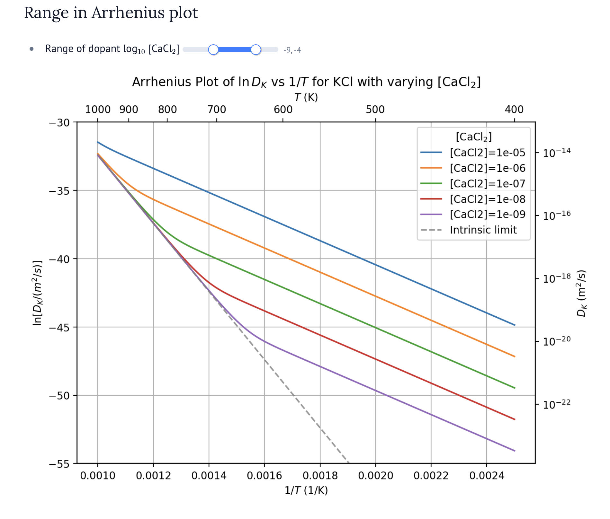

:::{.center}
# **Due Date: 2026-04-10 (Fri) 11:59 PM**
:::

:::{.callout-note}
You just need to submit solutions to a total of
**two (2)** questions from Assignments 3 and 4 before the deadline.
You are welcome to solve and submit more questions for bonus credit.
:::

## 1. Diffusion In Ionic Crystals

Consider the ionic crystal KCl, where intrinsically Schottky-type
defects ($V_{\text{K}}'$ & $V_{\text{Cl}}^•$) form. At equilibrium,
the intrinsic concentrations of $[V_{\text{K}}']_{\text{pure}}$ and
$[V_{\text{Cl}}^•]_{\text{pure}}$ are associated with the Schottky
vacancy formation free energy $G_{S}^f$. Extrinsic potassium vacancies
are introduced by adding CaCl$_2$ into the KCl crystal. We will use
this example to develop an expression for the diffusivity of K$^{+}$ species. 

a) Express the potassium vacancy concentration in pure crystal $[V_{\text{K}}']_{\text{pure}}$ using $G_{S}^f$

:::{.content-hidden unless-meta="answer"}

**Answer**:

When there are only intrinsic defects forming, the concentration for $V_{\text{K}}'$ and $V_{\text{Cl}}^•$ are the same.

```{=tex}
\begin{align}
[V_{\text{K}}'] [V_{\text{Cl}}^•] &= \exp\left(-\frac{G_{S}^f}{k_B T}\right) \\
[V_{\text{K}}']_{\text{pure}}^2 &= \exp\left(-\frac{G_{S}^f}{k_B T}\right)
\end{align}
```

We get $[V_{\text{K}}']_{\text{pure}} = \exp\left(-\frac{G_{S}^f}{2k_B T}\right)$

:::

b) Show that adding one CaCl$_2$ dopant will create one extrinsic K-vacancy $V_{\text{K}}'$ and one substitutional cation $\text{Ca}_\text{K}^•$


:::{.content-hidden unless-meta="answer"}

**Answer**:

Similar to the CdCl$_2$ dopant in NaCl case from
the lecture, we can show that each inserted Ca$^{2+}$ cation will
create one K-vacancy. The process involves a multi-step reaction:

1. 2 pairs of Schottky defects for $V_{\text{K}}'$ and $V_{\text{Cl}}^•$ are created

$$
2\text{null} \rightarrow 2V_{\text{K}}' + 2V_{\text{Cl}}^•
$$

2. The CaCl$_2$ dopant dissociates into one Ca$^{2+}$ and two $Cl^-$

$$
\text{CaCl}_2 \rightarrow \text{Ca}^{2+} + 2\text{Cl}^{-}
$$

3. The Ca$^{2+}$ cation and Cl$^{-}$ anions occupy K- and Cl-vacancies, respectively

$$
\text{Ca}^{2+} + \text{V}_{\text{K}}' \rightarrow \text{Ca}_{\text{K}}^•
$$

and

$$
2 V_{\text{Cl}}^• + 2 \text{Cl}^{-} \rightarrow 2\text{Cl}_{\text{Cl}}^{\times}
$$

The overall effect is that the defect reaction leaves 1 extra $V_{\text{K}}'$ vacancy. Summing all reactions together we get the net generation of extrinsic vacancies

$$
\text{CaCl}_2 \rightarrow \text{Ca}_{\text{K}}^• + \text{V}_{\text{K}}' + 2 \text{Cl}_{\text{Cl}}^{\times}
$$


:::

c) Show that after adding the CaCl$_2$ dopant, the total K-vacancy concentration follows:

$$
[V_\text{K}'] = [V_\text{Cl}^•] + [\text{Ca}_\text{K}^•]
$$

:::{.content-hidden unless-meta="answer"}

**Answer**:


The above equation is basically the charge neutrality equation for
extrinsic species (L.H.S. is the total negative charge and R.H.S. is the total positive charge). We note $[V_\text{K}']$ becomes higher than $[V_\text{Cl}^•]$ because the former contains both intrinsic and extrinsic terms.

:::

d) The values for $[V_\text{K}']$ and $[V_\text{Cl}^•]$ after adding the CaCl$_2$ still follow the chemical equilibrium of vacancy formation, such that:

$$
[V_\text{K}'][V_\text{Cl}^•] = K_{\text{eq}} = \exp(-\frac{G_S^f}{k_B T})
$$

Show that the exact expression for the K-vacancy concentration $[V_\text{K}']$ follows (equation 8.51 in KoM textbook) :

$$
[V_\text{K}'] = \frac{[\text{CaCl2}]}{2}
\left(
1 + \sqrt{1 +
\left(
\frac{2 [V_\text{K}']_{\text{pure}}}{[\text{CaCl2}]}
\right)^2}
\right)
$$

_Hint: you need to solve a quadratic equation and find the correct root_

:::{.content-hidden unless-meta="answer"}

**Answer**:

From charge neutrality in Q1-c:

$$
[V_\text{K}’] = [V_\text{Cl}^•] + [\text{Ca}_\text{K}^•]
$$

Since each CaCl$_2$ produces one substitutional $\text{Ca}\text{K}^•$,

$$
[\text{Ca}_\text{K}^•] = [\text{CaCl}_2]
$$

so

$$
[V_\text{Cl}^•] = [V_\text{K}'] - [\text{CaCl}_2]
$$

Schottky equilibrium still holds after doping:

$$
[V_\text{K}’][V_\text{Cl}^•] = K_{\text{eq}}=\exp!\left(-\frac{G_S^f}{k_B T}\right)
$$

Substitute $[V_\text{Cl}^•] = [V_\text{K}'] - [\text{CaCl}_2]$:

```{=tex}
\begin{align}
[V_\text{K}']\left([V_\text{K}']-[\text{CaCl}_2]\right) &= K_{\text{eq}} \\
[V_\text{K}']^2 - [\text{CaCl}_2]\,[V_\text{K}'] - K_{\text{eq}} &= 0
\end{align}
```

This is a quadratic equation in $[V_\text{K}']$. Using the quadratic formula $x_{1,2} = \frac{-b \pm \sqrt{b^2 - 4 ac}}{2a}$:

```{=tex}
\begin{align}
[V_\text{K}'] &=
\frac{[\text{CaCl}_2] \pm \sqrt{[\text{CaCl}_2]^2 + 4K_{\text{eq}}}}{2}
\end{align}
```

Choose the **positive root**, because we must have $[V_\text{Cl}^•]=[V_\text{K}']-[\text{CaCl}_2]\ge 0$, and use the relation $K_{\text{eq}}=\exp(-G_S^f/k_B T)=\left([V_\text{K}’]_{\text{pure}}\right)^2$ from Q1-a:

```{=tex}
\begin{align}
[V_\text{K}'] &=
\frac{[\text{CaCl}_2]}{2}
\left(
1+\sqrt{1+\frac{4([V_\text{K}']_{\text{pure}})^2}{[\text{CaCl}_2]^2}}
\right) \\
&=
\frac{[\text{CaCl}_2]}{2}
\left(
1+\sqrt{1+\left(\frac{2[V_\text{K}']_{\text{pure}}}{[\text{CaCl}_2]}\right)^2}
\right)
\end{align}
```

:::

e) From the lecture notes an f.c.c. lattice like KCl, the diffusivity for potassium species is

```{=tex}
\begin{align}
D_{K} = [V_{\text{K}}'] f \lambda^2 \nu \exp(-\frac{G_K^m}{k_B T})
\end{align}
```

According to [Fuller, et al. _Physical Review_, **1968**, 176(3),
1036–1045.](https://doi.org/10.1103/PhysRev.176.1036), the following thermodynamic properties were determined for KCl:

- Schottky defect formation enthalpy $H_S^f = 2.49$ eV
- Schottky defect formation entropy $S_S^f = 7.64 k_B$
- Cation (K$^+$) migration enthalpy $H_K^m = 0.76 eV$
- Cation (K$^+$) migration entropy $S_K^m = 2.56 k_B$
- Jumping frequency $\nu = 6.95\times 10^12$ s$^{-1}$
- Lattice constant for KCl $a = 629.2$ pm

The jumping distance between 2 closest K-sites is $\lambda = a / \sqrt{2}$. As a rule of thumb the correlated jump correction factor $f=0.7$.


Show the Arrhenius plot of $\ln D_{K}$ vs $1/T$ when $[\text{CaCl}_2]$
varies from $10^{-9}$ to $10^{-3}$. Do you observe two regimes in the Arrhenius plot?

You can use our [demo code](https://tiangroup-uofa.github.io/mate664-kinetics-of-materials/scripts/EX03-dual-regime-arrhenius.html) to draw the plots, but feel free to change the code or develop your own.

:::{.content-hidden unless-meta="answer"}

**Answer**:

See a sample plot in . When the
dopant concentration increases, the temperature required to overcome the extrinsic concentration becomes higher, thus moving the intrinsic $1/T$ range to the left.


:::


f) Based on the plots in e), evaluate the slope of the $\ln D_K - 1/T$ plot in the **intrinsic** regime. Is the relation $\text{slope} \propto [\frac{1}{2} H_S^f + H_K^m]$ valid?

:::{.content-hidden unless-meta="answer"}

**Answer**:

You can either manually measure the slope or use numerical linear regression. The slope in each linear regime is $\text{slope} = -k_B H^{a}$.

From the intrinsic limit line, the activation enthalpy is measured to be 2.0 eV, which is just $\frac{1}{2} H_S^f + H_K^m$.

:::


## 2. Effective Diffusivity In Mixed Geometry

In this question, you will compare two idealized geometries for mass
transport in heterogeneous materials. Although the geometry is simple,
the analysis captures important ideas for diffusion through
imperfections such as dislocations, grain boundaries, coatings, and
layered barriers. Consider steady-state one-dimensional diffusion
between two reservoirs with concentrations $c_L$ and $c_R$, separated by a
distance $L$. Assume Fick’s first law applies locally:

$$
J_i = -D_i \frac{dc}{dx}
$$

where $J_i$ and $D_i$ are the flux and diffusivity in material $i$, respectively.

We define the effective diffusivity $D_{\mathrm{eff}}$ of the whole
system through

$$
J_{\mathrm{tot}} = D_{\mathrm{eff}} \frac{\Delta c}{L}
$$

where $\Delta c = c_L - c_R$.

{width="85%" #fig-eff-med}

### Part 1. Parallel diffusion paths

A sample contains two parallel diffusion paths connecting the same two
reservoirs (@fig-eff-med a). Path 1 has cross-sectional area $A_1$ and diffusivity
$D_1$, while path 2 has cross-sectional area $A_2$ and diffusivity
$D_2$. 

a) Write the flux through each path $J_1$ and $J_2$.

:::{.content-hidden unless-meta=“answer”}

Answer:

Since the two paths connect the same reservoirs, they experience the
same concentration difference $\Delta c = c_L - c_R$ over the same
length $L$. By Fick’s first law,

$$
J_1 = - D_1 A_1 \frac{\Delta c}{L}
$$

and

$$
J_2 = - D_2 A_2 \frac{\Delta c}{L}.
$$

:::


b) Total flux $J_{\mathrm{tot}}$ would be $J_1 + J_2$ in this case, show that 

$$
D_{\mathrm{eff}}^{\text{parallel}} =
\frac{D_1 A_1 + D_2 A_2}{A_1 + A_2}
$$

:::{.content-hidden unless-meta=“answer”}

Answer:

The total flux is the sum of the two parallel contributions:

$$
J_{\mathrm{tot}} = J_1 + J_2
= -\left(D_1 A_1 + D_2 A_2\right)\frac{\Delta c}{L}.
$$

Now define the effective diffusivity through the total area
$A_1 + A_2$:

$$
J_{\mathrm{tot}} = - D_{\mathrm{eff}}^{\text{parallel}} (A_1+A_2)\frac{\Delta c}{L}.
$$

Comparing the two expressions gives

$$
D_{\mathrm{eff}}^{\text{parallel}} (A_1+A_2)
= D_1 A_1 + D_2 A_2,
$$

therefore

$$
D_{\mathrm{eff}}^{\text{parallel}} =
\frac{D_1 A_1 + D_2 A_2}{A_1 + A_2}.
$$

This is the weighted average of the two diffusivities.

:::

### Part 2. Series diffusion paths

Now consider diffusion through two slabs connected in series (@fig-eff-med b). Slab 1
has thickness $L_1$ and diffusivity $D_1$, while slab 2 has
thickness $L_2$ and diffusivity $D_2$. The total thickness is
$L=L_1+L_2$, and both slabs have the same cross-sectional area
$A$.

c) Let the concentration at the interface between the two slabs be the
same value $c_i$. Write the steady-state flux $J_1$ and $J_2$ through each slab.

:::{.content-hidden unless-meta=“answer”}

Answer:

For slab 1, the concentration changes from $c_L$ to $c_i$ across a
distance $L_1$, so the steady-state flux is

$$
J_1 = - D_1 A \frac{c_i - c_L}{L_1}.
$$

For slab 2, the concentration changes from $c_i$ to $c_R$ across a
distance $L_2$, so

$$
J_2 = - D_2 A \frac{c_R - c_i}{L_2}.
$$

Equivalently, these may be written as

$$
J_1 = D_1 A \frac{c_L - c_i}{L_1},
\qquad
J_2 = D_2 A \frac{c_i - c_R}{L_2}.
$$

:::

d) At the interface, the continuity must ensure $J_1 = J_2$, prove that in this case:

$$
D_{\mathrm{eff}}^{\mathrm{series}} =
\frac{L_1 + L_2}{\dfrac{L_1}{D_1} + \dfrac{L_2}{D_2}}
$$

:::{.content-hidden unless-meta=“answer”}

Answer:

At steady state, mass cannot accumulate at the interface, so the flux
must be continuous:

$$
J_1 = J_2 = J.
$$

Using the expressions above,

$$
J = D_1 A \frac{c_L - c_i}{L_1}
= D_2 A \frac{c_i - c_R}{L_2}.
$$

Rearrange each term to isolate the concentration drops:

$$
c_L - c_i = \frac{J L_1}{D_1 A},
\qquad
c_i - c_R = \frac{J L_2}{D_2 A}.
$$

Add the two equations:

$$
c_L - c_R
= \frac{J L_1}{D_1 A} + \frac{J L_2}{D_2 A}.
$$

Thus,

$$
J = \frac{A(c_L-c_R)}{\dfrac{L_1}{D_1}+\dfrac{L_2}{D_2}}.
$$

Now define the effective diffusivity across the total thickness
$L=L_1+L_2$ by

$$
J = D_{\mathrm{eff}}^{\mathrm{series}} A \frac{c_L-c_R}{L_1+L_2}.
$$

Comparing with the previous expression gives

$$
D_{\mathrm{eff}}^{\mathrm{series}} =
\frac{L_1 + L_2}{\dfrac{L_1}{D_1} + \dfrac{L_2}{D_2}}.
$$

This is a harmonic-type average, so the slowest slab has the strongest
influence.

:::

### Part 3. Implications

d) Heterogeneous systems are often interpreted
using analogies such as transport resistance or capacitance. Based on
your results above, does diffusion through heterogeneous media behave
more similarly to resistors or capacitors in series and parallel?
Briefly explain your reasoning.

:::{.content-hidden unless-meta=“answer”}

Answer:

Diffusion through heterogeneous media behaves more similarly to
electrical resistance than to capacitance.

In the parallel case,

$$
D_{\mathrm{eff}}^{\text{parallel}} =
\frac{D_1 A_1 + D_2 A_2}{A_1 + A_2},
$$

so the total transport is the sum of contributions from each path.
This is analogous to multiple conductive channels acting in parallel.

In the series case,

$$
D_{\mathrm{eff}}^{\mathrm{series}} =
\frac{L_1 + L_2}{\dfrac{L_1}{D_1} + \dfrac{L_2}{D_2}},
$$

so the inverse transport contributions add, and the slowest layer
dominates the overall flux. This is analogous to resistances in
series.

Therefore, diffusion is best understood using a transport resistance
analogy: fast paths enhance transport in parallel, while slow layers
strongly limit transport in series.

:::

e) Qualitatively
explain why material imperfections such as dislocations or grain
boundaries can act as fast diffusion shortcuts, whereas thin coating
layers or oxide films can strongly limit the overall diffusion rate.

:::{.content-hidden unless-meta=“answer”}

Answer:

Dislocations and grain boundaries often provide fast diffusion paths
because atoms can move more easily along these defective regions than
through the well-ordered crystal lattice. In the language of this
problem, they behave like parallel channels with a much larger local
diffusivity. Even if their area fraction is small, they can
significantly increase the total flux.

In contrast, thin coating layers or oxide films often lie directly
across the diffusion direction. In that geometry, diffusion must pass
through them in series with the bulk material. Since the series
effective diffusivity is controlled most strongly by the slowest
region, even a very thin but low-diffusivity layer can strongly reduce
the overall transport rate.

Thus, fast defects act as diffusion shortcuts, while blocking layers
act as transport bottlenecks.

:::

f) The parallel and series cases above represent two ideal limits,
while in real materials, diffusion is often not
oriented along these special directions. How would you approach the
diffusion problem in such cases? Briefly discuss what kind of
mathematical description would be needed.

:::{.content-hidden unless-meta=“answer”}

Answer:

In real materials, diffusion paths are usually not perfectly aligned
parallel or perpendicular to the macroscopic diffusion direction.
Therefore, the transport cannot in general be described by a single
scalar diffusivity.

A more general approach is to use an effective diffusivity tensor
$\mathbf{D}$ and write

$$
\mathbf{J} = - \mathbf{D} \nabla c.
$$

In this description, the parallel and perpendicular cases correspond
to principal directions of transport, and their effective
diffusivities can be viewed as principal values of the tensor. For an
arbitrary diffusion direction, the flux depends on both the
orientation and connectivity of the heterogeneous paths.

To solve such problems, one would typically use the diffusion equation
with tensorial diffusivity,

$$
\frac{\partial c}{\partial t} = \nabla \cdot \left(\mathbf{D}\nabla c\right),
$$

together with the appropriate boundary conditions and material
geometry. In complex microstructures, numerical methods or effective
medium approximations are often needed.

:::