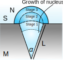
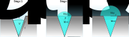
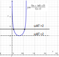

:::{.center}
# **Due Date: 2026-04-10 (Fri) 11:59 PM**
:::

:::{.callout-note}
You just need to submit solutions to a total of
**two (2)** questions from Assignments 3 and 4 before the deadline.
You are welcome to solve and submit more questions for bonus credit.
:::

## 1. Heterogeneous nucleation in a conical geometry

Consider the formation of a nucleus (N) from solution (S) in a
conically shaped pit in the bulk material (M) that was formed during a
corrosion process as illustrated in @fig-pit-1. The cross-sectional
angle of the pit is $\alpha$. The contact angle of the nucleus on
the material is $\theta$. Let the interfacial tensions for the
nucleus/material, solution/material, and solution/nucleus interfaces be
$\gamma_{\mathrm{NM}}$, $\gamma_{\mathrm{SM}}$, and
$\gamma_{\mathrm{SN}}$, respectively. 

{width="45%" #fig-pit-1}

a) If $\gamma_{\mathrm{NM}} = \gamma_{\mathrm{SM}}$, what is the
contact angle $\theta$ based on the Young's equation introduced in Lecture 15?

:::{.content-hidden unless-meta="answer"}

**Answer**:

Apply the Young's equation to this model system. We get:

```{=tex}
\begin{equation}
\label{eq:1}
\gamma_{\mathrm{SM}} - \gamma_{\mathrm{NM}} = \gamma_{\mathrm{SN}} \cos \theta
\end{equation}
```

In the case when $\gamma_{\mathrm{SM}} = \gamma_{\mathrm{NM}}$, we get $\theta$ = 90°.

:::

b) Consider the case in (a), using the classical nucleation model you
learned in Lecture 15, find an expression for the free energy of
heterogeneous nucleation to occur within the pit, $\Delta
G_{\text{het}}$, and compare it to the free energy for homogeneous
nucleation $\Delta G_{\text{homo}}$.  Assume that the pit is deep
enough to allow a critical heterogeneous nucleus to form within
it. What is the ratio between $\Delta G_{\text{het}}$ and $\Delta
G_{\text{homo}}$?


:::{.content-hidden unless-meta="answer"}

**Answer**:

From the classical heterogeneous nucleation model, the total free energy change is:
```{=tex}
\begin{equation}
\label{eq:2}
\Delta G_{\mathrm{het}} = \Delta G^{\mathrm{V}} V_{\mathrm{S}} 
  + \gamma_{\mathrm{SN}} A_{\mathrm{M}} + (\gamma_{\mathrm{NM}} - \gamma_{\mathrm{SM}}) A_{\mathrm{C}}
  \end{equation}
```

where $\Delta G^{\mathrm{V}} V_{\mathrm{S}}$ is the volumetric free
energy change during crystallization. $A_{\mathrm{M}}$ and
$A_{\mathrm{C}}$ are the area of meniscus and the contact area between
the pit and the melt, respectively. Let's derive these values. Assume
the radius of the pit is $R$, when $\theta=90^{\circ}$, the pit is
just a cone with apex. The solid angle of the pit is $\Omega = 2 \pi
     (1 - \cos (\alpha/2))$ we have:

```{=tex}
\begin{align}
\label{eq:4}
V_{\mathrm{S}} &= \displaystyle {\frac{\Omega}{4 \pi} \frac{4 \pi}{3} R^{3} = \frac{2\pi (1 - \cos (\alpha / 2))}{3} R^{3} }    \\
S_{\mathrm{M}} &= {\displaystyle \frac{\Omega}{4 \pi} 4 \pi R^{2} = 2 \pi (1 - \cos(\alpha / 2)) R^{2}} \\
S_{\mathrm{C}} &= {\displaystyle \pi \sin (\alpha / 2) R \cdot R = \pi \sin(\alpha/2) R^{2}}   
\end{align}
```

Here we can ignore the $S_{\mathrm{C}}$ since $\gamma_{\mathrm{NM}} =
     \gamma_{\mathrm{SM}}$, therefore:

```{=tex}
\begin{equation}
\label{eq:5}
\begin{aligned}
\Delta G_{\mathrm{het}} = \frac{\Omega}{4 \pi} \left[\Delta G^{V} V_{\mathrm{R}} + \gamma_{\mathrm{SN}} S_{\mathrm{R}} \right]
\end{aligned}   
\end{equation}
```

where $V_{\mathrm{R}}$ and $S_{\mathrm{R}}$ are the volume and surface
area of a complete sphere with radius $R$. The part in the brackets
are exactly the free energy of homogeneous nucleation with radius $R$.

We have then:

```{=tex}
\begin{equation}
\label{eq:6}
{\displaystyle 
\frac{\Delta G_{\mathrm{het}}}{ \Delta G_{\mathrm{homo}}} = \frac{\Omega}{4 \pi} = \frac{1 - \cos \frac{\alpha}{2}}{2}
}
\end{equation}
```

and this result is now independent of $R$. The heterogeneous
nucleation energy is always smaller than the homogeneous nucleation of
same radius. 


:::

c) From your result in (b), if we compare the radii of the critical
nucleus in hetero- and homogeneous nucleation, $R_{\text{het}}^c$,
$R_{\text{homo}}^c$, respectively, please briefly /  qualitatively explain that
$R_{\text{het}}^c = R_{\text{homo}}^c$.

:::{.content-hidden unless-meta="answer"}

**Answer**:

When measuring the whole in-pit nucleus using the radius $R$, our
results in (b) shows that $\Delta G_{\text{het}} / \Delta
G_{\text{homo}}$ is a constant value $\frac{1 - \cos
\frac{\alpha}{2}}{2}$ which is independent of $R$. Therefore if the
nucleus grows inside the pit, the critical nucleus $R_c$ which is the
radius that $\partial \Delta G / \partial R | R_c = 0$, should remain the same.

Of course, there will be less nucleating material accumulated inside
the cone for heterogeneous nucleation compared with homogeneous
nucleation at the same $R_c$, you can expect $n_c$ is smaller for
heterogeneous nucleation.

:::

d) In reality, the size of the nucleus can often be larger than the
pit. Consider the same case as before ($\gamma_{\mathrm{NM}} =
\gamma_{\mathrm{SM}}$), while the length of the slit wall is $L$. When
the nucleus grows, the meniscus gradually shift up and continues to
grow out of the slit (@fig-pit-2), in a 3-stage process. We assume
that in stage 2, the contact points of the meniscus will be "pinned"
at the pit opening, until the contact angle on the top surface reaches
$\theta$. Please briefly / qualitatively explain why the multi-stage growth may cause additional kinetic barrier to the nucleation.

{width="45%" #fig-pit-2}

:::{.content-hidden unless-meta="answer"}

**Answer**:

It is possible to have the stages 2 and 3 contributing to the overall kinetic
barrier, when the pit size is very small. From textbook Problem 19.7,
the radius of the spherical cap that bulges out in stage 2, must have
a radius larger than $R_c$ to be able to grow of the pit. 

:::

e) We will see how the 3-stage growth in part (d) can be actually
calculated. We provide an online demo [https://tiangroup-uofa.github.io/mate664-kinetics-of-materials/scripts/EX04_hetero_nuc.html](https://tiangroup-uofa.github.io/mate664-kinetics-of-materials/scripts/EX04_hetero_nuc.html) to demonstrate the change
of $\Delta G_{\text{het}}$ as a function of total nucleus size $n$
(measured in amount of material). You can tune the geometry of the pit
to see how the critical $n_c$ differs. When will you observe a secondary kinetic barrier in the free energy curve?


:::{.content-hidden unless-meta="answer"}

**Answer**:

The growth of the nucleus can be categorized into 3 stages:

1.  the nucleus grows within the pit, with the length on the wall as
$l$ ($l < L$);
2. the pit is fully filled, and the meniscus
keeps rising until the contact angle on the flat surface is
90°
3. the nucleus grows on the flat surface with
increasing radius. The 3 stages are illustrated in @fig-3-stages.

{#fig-3-stages}

For stage 2, the contact line sits at a singular point, and the
contact angle is not well-defined. Here we take the assumption
that the contact line is pinned until the meniscus becomes a
hemisphere, after which the nucleus can further grow. We also
assume that the shape of the meniscus is part spherical cap. Note
that this assumption is only used for a model study, since such
sharp edge may not exit at nanoscale surface. For each stage, the
volume of the nucleus, $V_{\mathrm{n}}$, can be divided into the
volumes of the cone $V_{\mathrm{cone}}$ and spherical cap
$V_{\mathrm{cap}}$. The surface area is contributed solely by the
spherical cap, $S_{\mathrm{cap}}$. All components can be
parameterized by:

- **Volume of cone**

```{=tex}
\begin{equation}
\label{eq:3}
V_{\mathrm{cone}} = \frac{1}{3} \pi (1 - \cos^{2} \frac{\alpha}{2}) 
                    \cos \frac{\alpha}{2} l^{3}
\end{equation}
```

where $l$ is the lateral side length of the cone.

- **Volume of cap**

```{=tex}
\begin{equation}
\label{eq:8}
V_{\mathrm{cap}} = \frac{1}{3} \pi r^{3} (2 + \cos \frac{\alpha}{2})
                      (1 - \cos \frac{\phi}{2})^{2}
\end{equation}
```

where $r$ is the radius of the spherical cap, and $\phi$ is the
cross-sectional angle of the cap.

- **Area of cap**

```{=tex}
\begin{equation}
\label{eq:18}
S_{\mathrm{cap}} = 2 \pi (1 - \cos \frac{\phi}{2}) r^{2}
\end{equation}
```

The 3 stages corresponding to different choices of $l$, $r$ and $\phi$:

- **Stage 1**: $0 < l \leq L$; $r = l$; $\phi = \alpha$

- **Stage 2**: $l=L$; $r = L \dfrac{\sin(\alpha / 2)}{\sin(\phi / 2)}$; $\alpha < \phi \leq \pi$

- **Stage 3**: $l=L$; $r > L \sin(\alpha / 2)$; $\phi = \pi$

By having $n = (V_{\mathrm{cone}} + V_{\mathrm{cap}}) /
     V^{\mathrm{m}}$ as the amount (size) of the nucleus, we can plot
the free energy $\Delta G = \Delta G_{\mathrm{V}}
     (V_{\mathrm{cone}} + V_{\mathrm{cap}}) + \gamma_{\mathrm{SN}}
     S_{\mathrm{cap}}$ as a function of $n$.
Here we use dimensionless
analysis to simplify the problem. The free energy $\Delta G$ is
normalized against the homogeneous nucleation energy barrier
$\Delta G_{\mathrm{c, homo}}$, and the size $n$ is normalized
against the homogeneous critical nucleation size $n_{\mathrm{c,
     homo}}$. The curve of $\Delta G$ has a complex behavior, which
depends on the volume of the cone, as shown in @fig-q2-2.

{#fig-q2-2}


As can be seen, the free energy is a mixed process with
nucleation in pit (low barrier) and nucleation on planar surface
(higher barrier). When the volume of cone is small (small pit
limit), the nucleation free energy resembles that on a flat
surface @fig-q2-2 a, while when the volume of cone is
much larger than 0.06 $n_{\mathrm{c}}$ (critical nucleation size
inside the pit), we reach the large pit limit and nucleation
barrier is much smaller @fig-q2-2 d. At an
intermediate state, we can see the competition between the two
processes, and two barriers can co-exist during the nucleation
process @fig-q2-2 b-c.

:::


## 2. Simulating Cahn-Hilliard Equation For Phase Transformation

In Lecture 20 we see that the Cahn-Hilliard equation is a powerful
tool to incorporate interface contribution to the overall
thermodynamic free energy when solving the flux equations. We will
deal with some fundamental topics in this problem. For simplification,
we will write the Cahn-Hilliard equation for an A-B binary mixture
with a homogeneous Gibbs free energy $g^{\text{homo}}(x_B)$ with
respect to the mole fraction of B, $x_B$:

```{=tex}
\begin{align}
\frac{\partial x_B}{\partial t} &= \nabla \cdot \left(M \nabla \mu_B \right) \\
\mu_B &= \frac{\partial g^{\text{homo}}}{\partial x_B} - 2\kappa \nabla^2 x_B
\end{align}
```

Instead of the double well potential in Lecture 20, we can
formulate $g^{\text{homo}}$ by mixing enthalpy and entropy for regular
solution in Lecture 13. The mixing enthalpy per atom $h(x_B)$
and mixing entropy per atom $s(x_B)$ can be written as:

```{=tex}
\begin{align}
h(x_B) &= \omega x_B (1 - x_B) \\
s(x_B) &= -k_B \left[ (1-x_B)\ln\!(1 -x_B) + x_B\ln\!x_B \right]
\end{align}
```

where $\omega$ is a parameter measuring the degree of mixing energy
between A and B.  Hopefully this formalism will making solving the
Cahn-Hilliard equation more physically intuitive.

a) What is the equation for $g^{\text{homo}}(x_B)$ in this case?

:::{.content-hidden unless-meta="answer"}

**Answer**:

The homogeneous Gibbs free energy per atom is

```{=tex}
\begin{align}
g^{\text{homo}}(x_B) &= h(x_B)-Ts(x_B)
\end{align}
```

```{=tex}
\begin{align}
g^{\text{homo}}(x_B)
&=
\omega x_B(1-x_B)
+
k_B T \left[(1-x_B)\ln(1-x_B)+x_B\ln x_B\right]
\end{align}
```


:::

b) By solving $\partial g^{\text{homo}}(x_B) / \partial x_B = 0$, we can determine the $x_B$ values for minima on the free energy curve. Prove that in order to have a miscibility gap (i.e. there is a spinodal region), the following condition should be met

$$
\frac{\omega}{k_B T} > 2
$$

:::{.content-hidden unless-meta="answer"}

**Answer**:

The expression can be rewritten as:

```{=tex}
\begin{align}
\frac{\partial g^{\text{homo}} }{\partial x_B}
&=
\omega(1 - 2 x_B)
+ k_B T (\ln x_B - ln(1-x_B)) \\
&= 0
\end{align}
```

The root $x_B = 0.5$ is always a solution. For the miscibility gap to
exhist, two non-trivial roots must also be found, which is equivalent to find
$x_B$ that satisfies:

$$
\frac{\omega}{k_B T} = \frac{\ln x_B - \ln (1 - x_B)}{2 x_B - 1}
$$

Graphically, the shape of the function $y = \frac{\ln x_B - \ln (1 - x_B)}{2 x_B - 1}$ is always above $y=2$, and for any horizontal line $y = \frac{\omega}{k_B T} > 2$, it will have 2 insect points with the curve $y = \frac{\ln x_B - \ln (1 - x_B)}{2 x_B - 1}$, as shown in @fig-misc-gap.

{width="45%" #fig-misc-gap}.


We can also verify that the second derivative of $g^{\text{homo}}$ is

$$
\frac{\partial^2 g^{\text{homo}}}{\partial x_B^2} = \frac{k_B T}{x_B (1-x_B)} - 2\omega
$$

when $\frac{\omega}{k_B T} > 2$, $\frac{\partial^2 g^{\text{homo}}}{\partial x_B^2} <0$, meaning the maximum at $x_B = 0.5$ is indeed unstable.
:::

c) One more caveat in the original Cahn-Hilliard equation is that the
mobility $M$ is a constant value. In reality the mobility can vary
locally in the mixture. From irreversible thermodynamics, we know that
the mobility is linked to the apparent (inter)-diffusivity $\tilde{D}$ by:

$$
\tilde{D} = M \frac{\partial \mu}{\partial x_B}
$$

where $\mu = \frac{\partial g^{\text{homo}}{\partial c}$ is the
chemical potential. Using previous knowledge of interdiffusivity that
$\tilde{D} = D_A x_B + D_B x_A$, prove that in this case we have:

$$
M = \frac{[D_A x_B + D_B (1 - x_B)]x_B(1-x_B)}{k_B T - 2\omega x_B (1 - x_B) }
$$

where $M$ is no longer a constant.

:::{.content-hidden unless-meta="answer"}

**Answer**:

From previous derivations, $\partial \mu/\partial x_B$ is:

$$
\frac{\partial \mu}{\partial x_B} = - 2 \omega + k_B T (\frac{1}{x_B (1 - x_B)})
$$

Using the Darken's equation for $\tilde{D}$, we get

$$
M = \frac{[D_A x_B + D_B (1 - x_B)]}{\frac{k_B T}{x_B(1-x_B)} - 2\omega}
$$

Rearrange this equation gives the final answer. Notice that for binary
mixture phase transformation, neither $x_B$ nor $1 -x_B$ are close to
1, so we cannot use the simplification $\ln (1 -x) \approx 1 -x$. In
other words, this also explains the non-linear behaviour inside the spinodal region.

:::


d) Simulating the Cahn-Hilliard equation with regular solution free energy

We will modify our interactive demo from Lecture 20 in the
Cahn-Hilliard example so that it uses the regular solution free energy
$g^{\text{homo}}$. 
