::: {.content-visible when-format="html" unless-format="revealjs"}

::: {.callout-note}
- Slides 👉  [Open presentation🗒️](./slides.html)
- PDF version of course note  👉 [Open in pdf](./L01.pdf)
- Handwritten notes 👉 [Open in pdf](./public/L01_annotated.pdf)
:::

:::

## Land acknowledgement {.center}

#### The University of Alberta acknowledges that we are located on Treaty 6 territory, and respects the histories, languages, and cultures of the First Nations, Métis, Inuit, and all First Peoples of Canada, whose presence continues to enrich our vibrant community.

## Learning outcomes {.center}

After this lecture, you will be able to:

- **Identify** the key components of the course syllabus, content and grading schemes.
- **Recall** common interaction methods and resources available in the course.
- **Recall** basic concepts in thermodynamics and kinetics
- **Recall** the assumptions of equilibrium
- **Describe** the influence of entropy in kinetic systems

## Course information

- **Course:** MAT E 664 – Kinetics of Materials
- **Term:** Winter 2026
- **Lectures:** Mon & Wed
- **Time:** 14:00 – 15:20
- **Location:** HC 2-14

## Meet the instructor

- **Office**: DICE 12-245

- **Email**: tian.tian@ualberta.ca

- **Office hour**: by appointment

- I joined CME in 2025 as assistant professor.
- Research fields: machine learning, multiscale materials simulations, computational tools
- Let’s enjoy learning together!

## TAs & seminar sessions

- **Teaching Assistant**
  - Hanlin Wang — hanlin7@ualberta.ca

- **Course & Assignment Questions**
  - No formal seminar or lab sessions
  - Questions related to course content or assignments
  - Please book an appointment with the TA (and instructor) as needed

- **Support Format**
  - One-on-one or small-group discussions
  - Concept clarification and guidance
  
## Course grading
- **Assignments:** 25%
  - 4 assignments (best 3 counted)
  - Submission via Canvas

- **Final Project:** 30%
  - Research-related topic
  - In-class oral presentation

- **Final Exam:** 45%
  - In person, open book
  - **Apr 20, 2026 · 1:00 p.m.**

_Details please see the [course syllabus](../../syllabus/assets/MATE664-winter-2026-course-syllabus.pdf)_

## Textbook and references

Our primary textbooks for this course are:

:::{.columns}
:::{.column width="50%"}
- **Kinetics of Materials** by R.W. Balluffi, S.M. Allen, and W.C. Carter.

  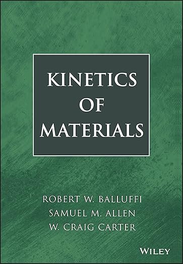

:::

:::{.column width="50%"}
- **Materials Kinetics: Transport and Rate Phenomena** by John C. Mauro.

  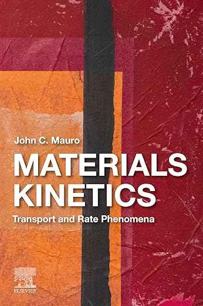

:::
:::

---

## What will we learn in MAT E 664 (1)?

Theory: irreversible thermodynamics & driving forces

$$
    \text{Flux} = \text{Kinetic coefficients} \times \text{Driving Force}
$$

   
---

## What will we learn in MAT E 664 (2)?

Mass transport on solid material interfaces: $v_{step} = \beta (c - c_{eq})$

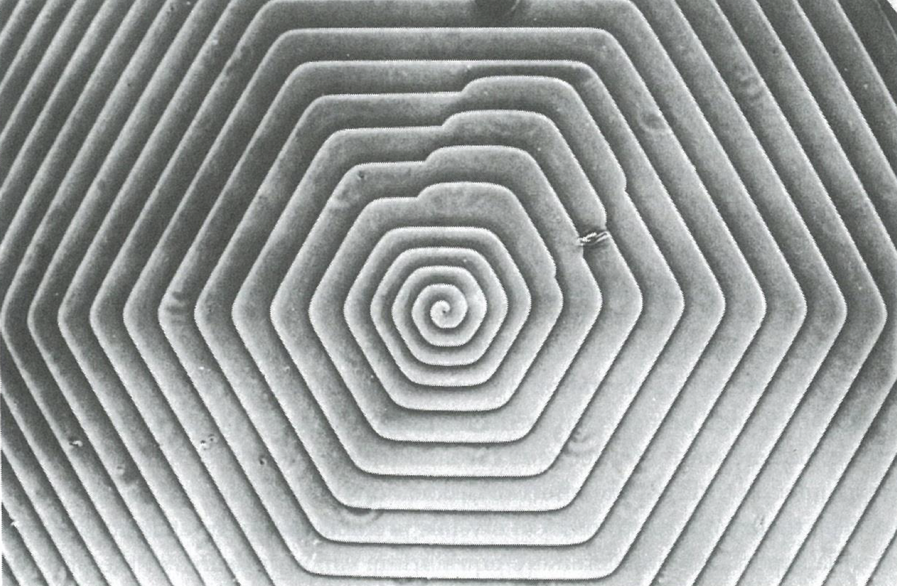

^[_Image credit: A.R. Verma_]

---

 ## What Will We Learn in MAT E 664 (3)?

Nucleation theory: $r_{c} = -\dfrac{2\gamma}{\Delta G_v}$

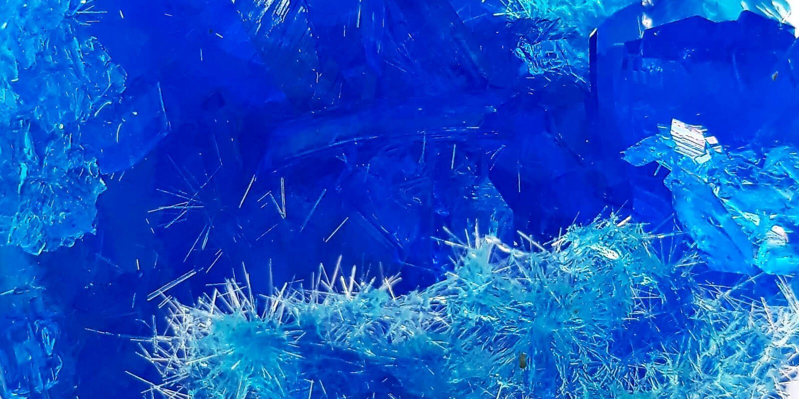

^[_Image credit: crystalverse.com_]

---

## What will we learn in MAT E 664 (4)?

Spinodal Decomposition (Pattern Formation)
$$
    \dfrac{\partial c}{\partial t}
    =
    \nabla \cdot
    \left(
    M \nabla
    \left[
    \dfrac{\partial f(c)}{\partial c}
    -
    \kappa \nabla^{2} c
    \right]
    \right)
$$

^[_Image credit: Mathis Plapp, École Polytechnique (FR)_]

---

## Interaction time!

We will use Wooclap in this course for real-time interactions.

Participation link 👉 [https://app.wooclap.com/664L01?from=instruction-slide](https://app.wooclap.com/664L01?from=instruction-slide)

*Results to be published after the class*
  
---

## Thermodynamics vs. Kinetics

| Feature          | Thermodynamics                           | Kinetics                                |
|:-----------------|:-----------------------------------------|:----------------------------------------|
| **Greek Name**   | *Therme* (heat) + *dynamis* (power)      | *Kinetikos* (of motion)                 |
| **Focus**        | **Eventually**: Predicts the final state | **Rate**: How fast a process occurs     |
| **General Form** | Free energy change ($\Delta G$)          | Reaction rates, flux, activation energy |
| **Condition**    | Equilibrium                              | Non-equilibrium                         |

--- 

## The true meaning of equilibrium

Equilibrium is a balance of time scales:
$$
\tau_{\text{observation}} \gg \tau_{\text{process}}
$$

- **Thermodynamic descriptions** are relevant when the observation time scale is much larger than the time scale of the processes reaching equilibrium.
- It's about **specific processes** reaching a steady state, not necessarily the entire system.

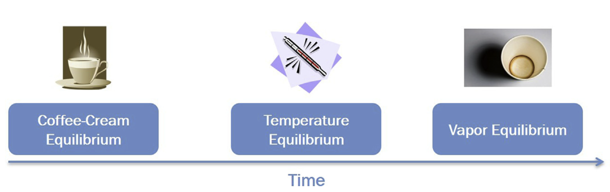

^[_Image credit: John C. Mauro_]

--- 

## Kinetic processes

Kinetic processes are distinct from thermodynamic equilibrium:

1.  **Conditions:** Occur away from equilibrium.
2.  **Cause** Require a thermodynamic **driving force**.
3.  **Rate:** Coupled with a **rate parameter** or **coefficient**.

**Irreversible Thermodynamics** is key to understanding these processes ([Lecture 2](../L02/)).

--- 

## Classical thermodynamics revisited

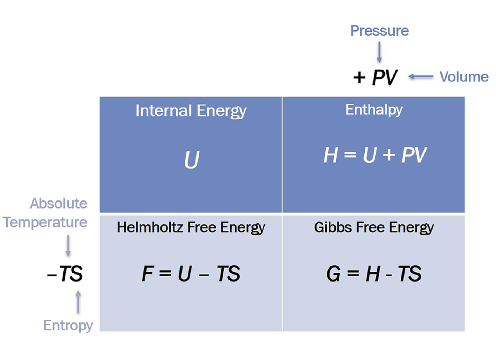

^[_Image credit: John C. Mauro_]

--- 

## Thermodynamic interplay between $H$ and $S$

Whether a process from A → B is **spontaneous** or **non-spontaneous** depends on the sign of free energy difference, $\Delta G = G_{B} - G_{A}$.

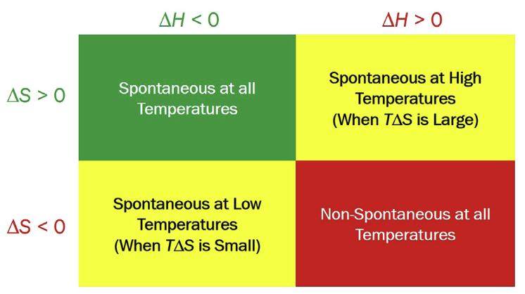

^[_Image credit: John C. Mauro_]

- What is $\Delta G$ for a reversible process at equilibrium?: $\Delta G = 0$,
- How can we check the stability of a certain material at $P, T$?: Use the phase diagram!

## How stable is diamond?

- Which phase is the most stable at r.t. & 1 atm?
- Should we worry our diamond rings turn into pencil?

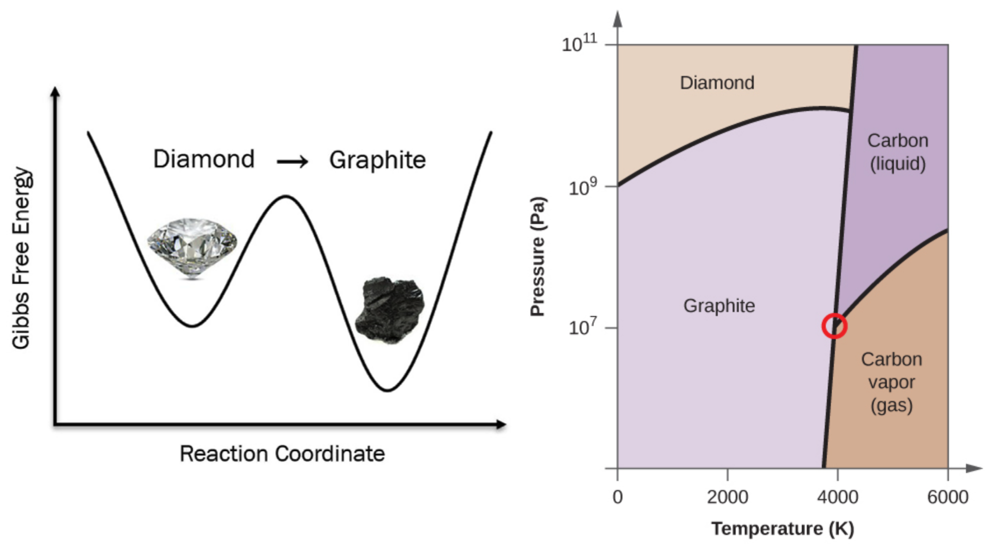

## Two-state model of thermodynamics vs kinetics

- $\Delta G^0$: Free energy of **reaction** → will reaction happen? (**Thermodynamics**)
- $\Delta G^*$: Free energy of **activation** → how likely / fast? (**Kinetics**)

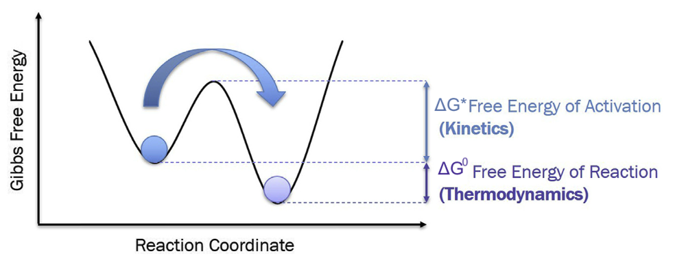

## Arrhenius plot demo

<iframe
  width="100%"
  height="800px"
  src="../../scripts/L01_ea.html"
  >
</iframe>

## Where does entropy $S$ come from?

- Claussius (1865) **Classical thermodynamics**.
  - Entropy is a state variable of internal energy.
  - $dU(S, V) = TdS - pdV$

- Boltzmann (1877) **Statistical mechanics**.
  - Entropy is a measure of accessible microstates (atoms + probability!)
  - $S = k_B \log(\Omega)$

	
## Why the logarithm?

- $S$ as an **extensive** quantity → **Additive** $S_T = S_1 + S_2$
- $\Omega$ as microstates is **multiplicative** → $\Omega_T = \Omega_1 \cdot \Omega_2$
- If $S = f(\Omega)$, then
      $S_T = f(\Omega_T) = f(\Omega_1 \cdot \Omega_2)$
      →
      $f(\Omega_1 \cdot \Omega_2) = f(\Omega_1) + f(\Omega_2)$
- $f(x) = C \log(x)$ is the unique solution using Cauchy's functional equation results

## Entropy *IS NOT* Disorder!

- Common statement of entropy is measure of *disorder*
- Boltzmann equation measures **how many possibilities** of arrangement
- Disorder is not uniquely linked to number of microstates!

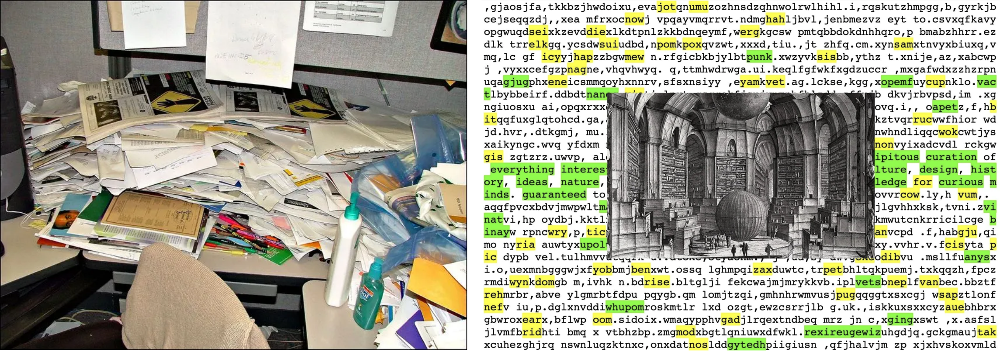

## Entropy *IS NOT* Disorder -- II!

- **High entropy alloys** (**HEAs**): Example of high configurational entropy material
- Many HEAs have much more ordered lattice than binary alloys

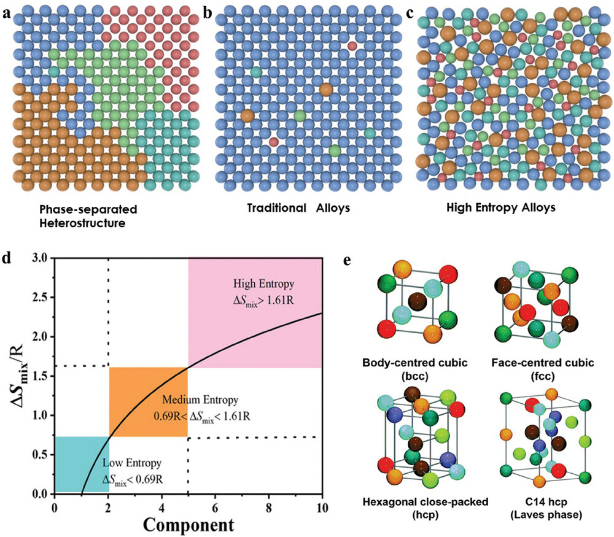

^[_Small_ **2024**, 20, 2311929]

## What should we really think of entropy

- **Arrow of time**: mixed cream and coffee cannot be demixed
  - Newtonian dynamics is time-reversible
  - We cannot rewind to low entropy state from Newtonian dynamics!

- **Loss of information**:
  - **Shannon entropy**: $S_{info} = -k_B \sum_i p_i \log(p_i)$
  - Shannon entropy **can be measured** on the exact state!

- **Uncertainty**:
  - Link to Heisenberg's principle $\Delta x \Delta p \leq \hbar/2$
  -  See Hirschman *Am. J. Math.*, **1957** 79, 152
  
## Where can we go from here?

- **Irreversible thermodynamics**
  
  Real processes occur away from equilibrium, where entropy is **produced**.

- **Entropy generation as a driving force**
  
  **Gradients** in temperature, concentration, and chemical potential drive fluxes by increasing total entropy.

- **From equilibrium to dynamics**
  
  Entropy provides the unifying language for diffusion, heat flow, chemical reactions, and transport phenomena.

**Stay Tuned!**

## Brief introduction to course AI helper

- A Socratic Gemini chatbot aiming to help course learning and key concepts
- **Access the AI helper here:**
👉 [https://gemini.google.com/gem/1c118102b2d1](https://gemini.google.com/gem/1c118102b2d1)

## Summary

What we learned today:

- Syllabus / course contents of MATE 664
- Kinetic rate and equilibrium
- Concept of entropy revisited
- Laws of thermodynamics revisited

**See you next time!**

