::: {.content-visible when-format="html" unless-format="revealjs"}

::: {.callout-note}
- Slides 👉  [Open presentation🗒️](./slides.html)
- PDF version of course note  👉 [Open in pdf](./L11.pdf)
- Handwritten notes 👉 [Open in pdf](./public/L11_annotated.pdf)
:::

:::


## Recap of Lecture 10 {.center}
Key ideas from last lecture:

- Diffusion equations for solids
- Link Einstein's equation to Arrhenius equation
- Emergence of activation enthalpy / entropy
- Vacancy formation free energy and diffusion


## Learning outcomes {.center}

After this lecture, you will be able to:

- Apply the free energy-dependent diffusion equations to systems with defects and material imperfections
- Understand how intrinsic and extrinsic defect in ionic materials are formed
- Analyze intrinsic / extrinsic diffusion regimes in ionic materials
- Understand material imperfections as the diffusion shortcuts

## What does diffusion in real materials look like?

- Real solids are not perfect crystals
- Defects control transport properties
- Ionic diffusion shows rich temperature dependence
- Same Einstein framework, new physics inside

## Base line: vacancy-mediated diffusion in metals

- Diffusion = random walk of atoms via vacancies
- Diffusivity related to both vacancy density (controlled by $G_v^f$) and vacancy jumping (controlled by $G_v^m$)

```{=tex}
\begin{align}
D_A
&= \frac{z \langle r^2 \rangle \nu}{6}
\exp\!\left(\frac{S_v^{f} + S_v^{m}}{k_B}\right)
\exp\!\left(-\frac{H_v^{f} + H_v^{m}}{k_B T}\right)
\, f
\end{align}
```

## Defect-mediated diffusion in ionic crystals

- Defects in ionic crystals are more complex than in metal
- Charge neutrality has to be conserved
- More than one single defect species are involed
- In other words, defects always come in **pairs** in ionic solids

## Schottky and Frenkel defects in ionic crystals

- Schottky defects: missing both positive and negative species
- Frenkel defects: one charged species moved to other site

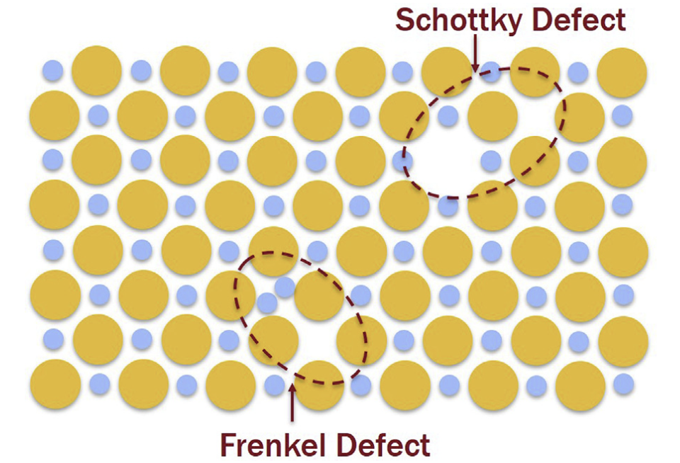{width="65%"}

## Ionic defects: Kröger-Vink (KV) notation

- Formula $X^Z_Y$
 - X = what is at the site (Element or Vacancy)
 - Y = what site is defective (Element or i)
 - Z = effective charge at the site (• = +; '= –)

{width="60%"}

## KV notation for Schottky defects

Example: Schottky defects in MgO (anion + cation vacancies)

- Formation reaction

  $$
  \text{null} \rightarrow V_{\mathrm{Mg}}^{''} + V_{\mathrm{O}}^{\bullet\bullet}
  $$

- Equilibrium condition
  - $G_S^f$: formation free energy for Schottky defects (per reaction)

  $$
  K_S = [V_{\mathrm{Mg}}^{''}][V_{\mathrm{O}}^{\bullet\bullet}]
  = \exp\!\left(-\dfrac{G_S^{f}}{kT}\right)
  $$

- Charge neutrality

  $$
  [V_{\mathrm{Mg}}^{''}] = [V_{\mathrm{O}}^{\bullet\bullet}]
  $$


## KV notation for Frenkel defects

Example: Frenkel pairs in LiF (Lithium escaping to interstitial sites)

- Formation reaction

  $$
  \mathrm{Li}_{\mathrm{Li}}^{\times} \rightarrow V_{\mathrm{Li}}^{'} + \mathrm{Li}_i^{\bullet}
  $$

- Equilibrium condition
  -  $G_F^f$: formation free energy for Schottky defects (per reaction)
  
  $$
  K_F = [V_{\mathrm{Li}}^{'}][\mathrm{Li}_i^{\bullet}]
  = \exp\!\left(-\dfrac{G_F^{f}}{kT}\right)
  $$

- Charge neutrality  
  $[V_{\mathrm{Li}}^{'}] = [\mathrm{Li}_i^{\bullet}]$

## Intrinsic vs extrinsic defects

- **Intrinsic** defects are those controlled by thermodynamics $G_S^f$, $G_F^f$ or $G_V^f$
- **Extrinsic** defects are those defects added to the ionic crystal via doping

Example of Extrinsic defects: CdCl$_2$ in NaCl

- Dopant incorporation reaction  
  $$
  \mathrm{CdCl}_2 \rightarrow \mathrm{Cd}_{\mathrm{Na}}^{\bullet}
  + 2\,\mathrm{Cl}_{\mathrm{Cl}}^{\times}
  + V_{\mathrm{Na}}^{'}
  $$

- Extrinsic defect concentration  
  $$
  [V_{\mathrm{Na}}^{'}]_{\text{ext}}
  = [\mathrm{Cd}_{\mathrm{Na}}^{\bullet}]
  = [\mathrm{CdCl}_2]
  $$

- Total vacancy concentration  
  $$
  [V_{\mathrm{Na}}^{'}]
  \approx [V_{\mathrm{Na}}^{'}]_s + [V_{\mathrm{Na}}^{'}]_{\text{ext}}
  = \frac{\exp\!(-\dfrac{G_S^{f}}{k_B T})}{ [\mathrm{CdCl}_2]} + [\mathrm{CdCl}_2]
  $$


## Diffusivity of ionic species

- We can still use the vacancy exchange mechanism for the diffusivity of ionic species
- For f.c.c. lattice the neighbor sites of same charge, the multiplicity $z=6$.
- E.g. Na$^+$ exchanges with its own vacancy $V_{\mathrm{Na}}^{'}$
- $[V_{\mathrm{Na}}^{'}]$ depends on the $T$-regime!

```{=tex}
\begin{align}
D_{\mathrm{Na}}
&= [V_{\mathrm{Na}}^{'}]\,
f\,\lambda^2\,\nu\,
\exp\!\left(-\frac{G_{\mathrm{Na}}^{m}}{kT}\right) 
\end{align}
```

## Intrinsic vs extrinsic regimes

- Extrinsic: vacancy dominated by doped materials
  - Low-$T$ regime (high $1/T$)

```{=tex}
\begin{align}
D_{\mathrm{Na,ext}}
&= [\mathrm{CdCl}_2]\,
f\,\lambda^2\,\nu\,
\exp\!\left(\frac{S_{\mathrm{Na}}^{m}}{k}\right)
\exp\!\left(-\frac{H_{\mathrm{Na}}^{m}}{kT}\right)
\end{align}
```

- Intrinsic: vacancy dominated by thermal dissociation
  - High-$T$ regime (low $1/T$)

```{=tex}
\begin{align}
D_{\mathrm{Na,int}}
&= f\,\lambda^2\,\nu\,
\exp\!\left(\frac{S_{S}^{f}}{2k}\right)
\exp\!\left(\frac{S_{\mathrm{Na}}^{m}}{k}\right)
\exp\!\left(-\frac{H_{S}^{f}}{2kT}\right)
\exp\!\left(-\frac{H_{\mathrm{Na}}^{m}}{kT}\right)
\end{align}
```

## Two-regimes in the Arrhenius plot

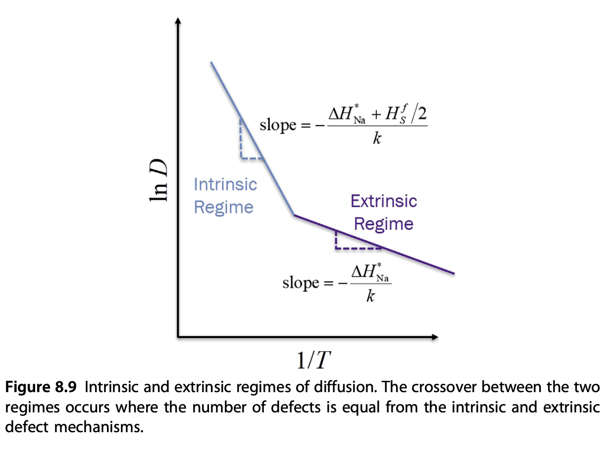

## More regimes in Arrhenius plot

- Example: cation diffusion in FeO during oxidation
- Equilibrium depends on both $G^f$ and $p(O_2)$
- Multiple regimes!

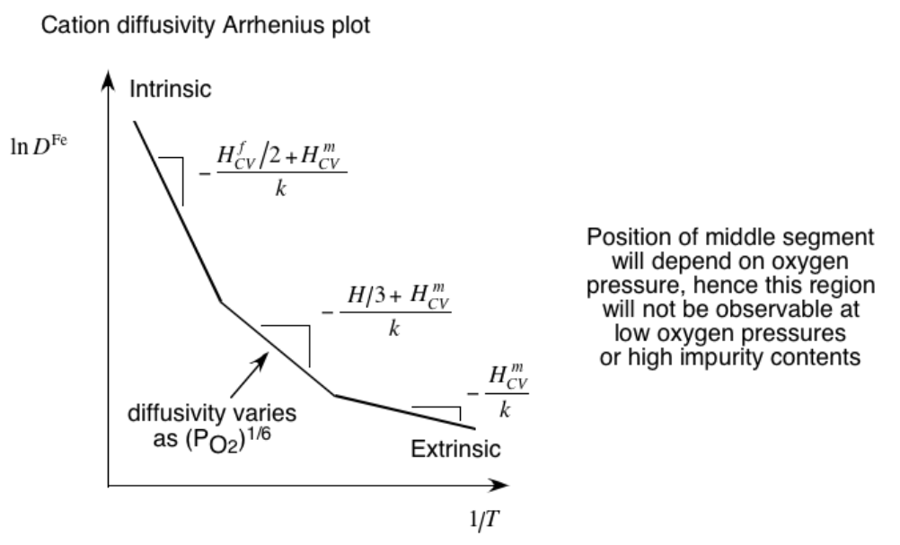

## Multiple-regime diffusion in polycrystalline materials

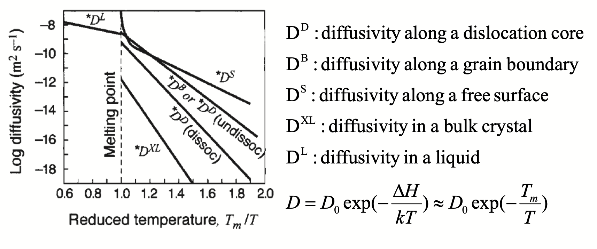

## Diffusion paths at crystal imperfections

- Diffusion can occur along non-bulk pathways
- Typical crystal imperfections
  - Grain boundary and interface diffusion: 2D
  - Free surface diffusion: 2D
  - Dislocation (pipe) diffusion: 1D
  - Vacancy / defect: 0D
- Imperfections are associated with lower migration / activation energy!
- Think as "shortcuts" during diffusion

## Imperfection 1: grain boundaries

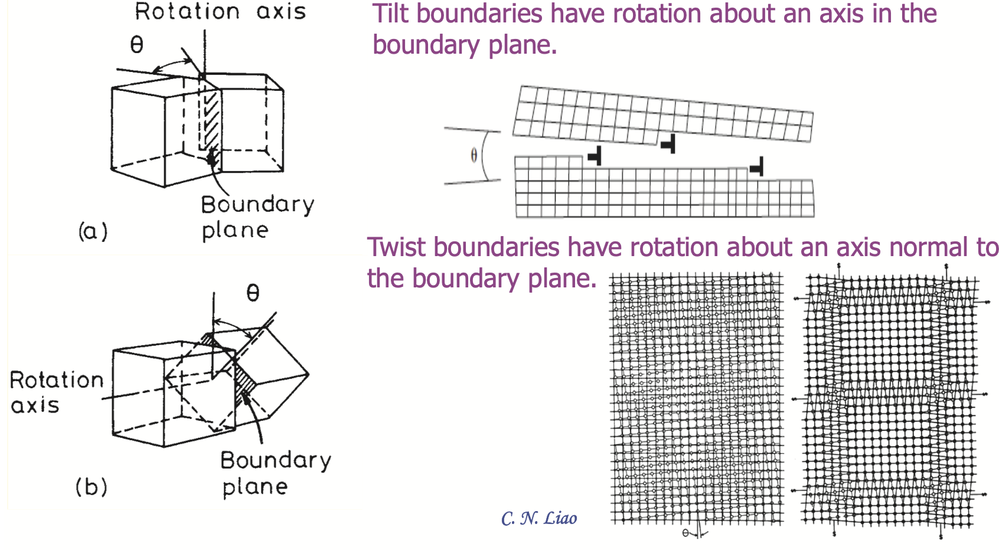

## Grain boundary diffusion

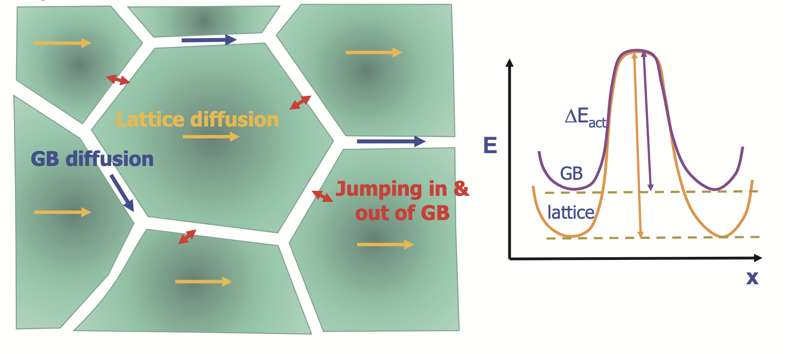

## Harrison's ABC model for GB diffusion

A foreign material is coated on the top of a polycrystalline
metal. The degree of penetration can be studied by comparing the
timescale $t$, interatomic distance $\lambda$ and grain size $s$

:::{.columns}
:::{.column width="50%"}
- **A**ll regime
  - $D_{XL} t > s^2$  
  - $D_B t > s^2$  

- **B**oundary regime  
  - $D_{XL} t \approx \lambda^2$  
  - $D_B t > \lambda^2$  
  - coupled short-circuit and bulk diffusion  

- **C**ore regime  
  - $D_{XL} t < \lambda^2$  
  - $D_B t > \lambda^2$  
  - diffusion confined to imperfections  

:::

:::{.column width="50%"}
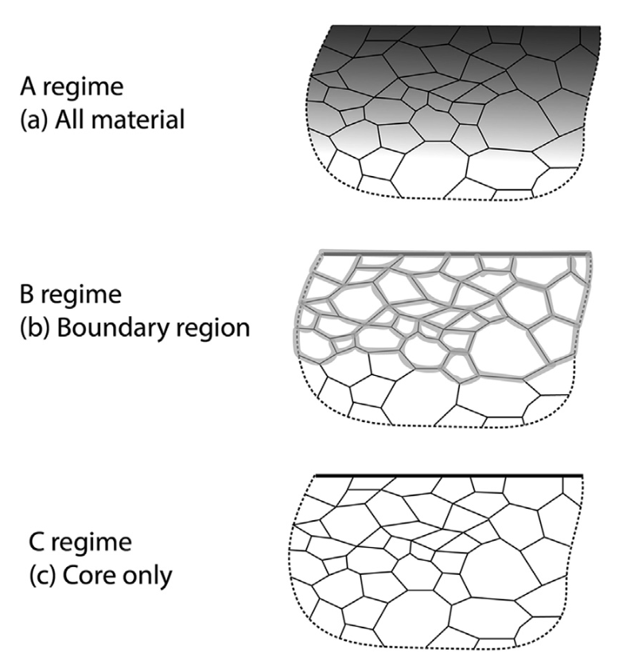
:::
:::

## Dislocation imperfections (line defect)

:::{.columns}
:::{.column width="50%"}

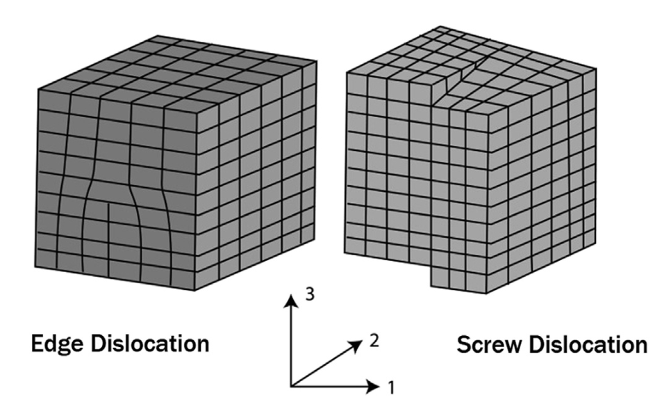

:::

:::{.column width="50%"}

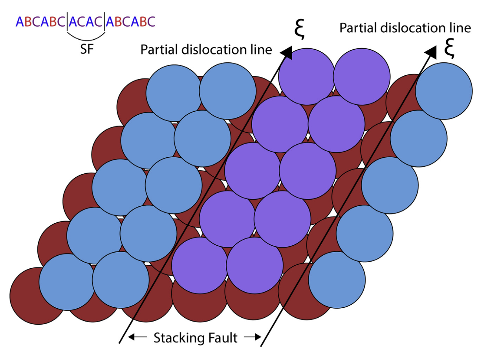

:::
:::

## Example of diffusion along imperfection: deposition on graphene

- See Vagli and Tian et al. _Nat Commun_ 2025, 16, 7726.
- Diffusivity change on free graphene surface can be probed by deposition geometry!

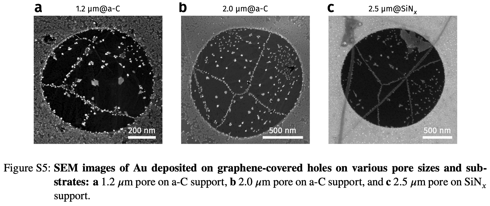

## Deposition on Graphene - theoretical simulations

- Kinetic Monte Carlo (kMC) assuming different diffusion barrier on imperfections
- Faster diffusion direction --> lower density

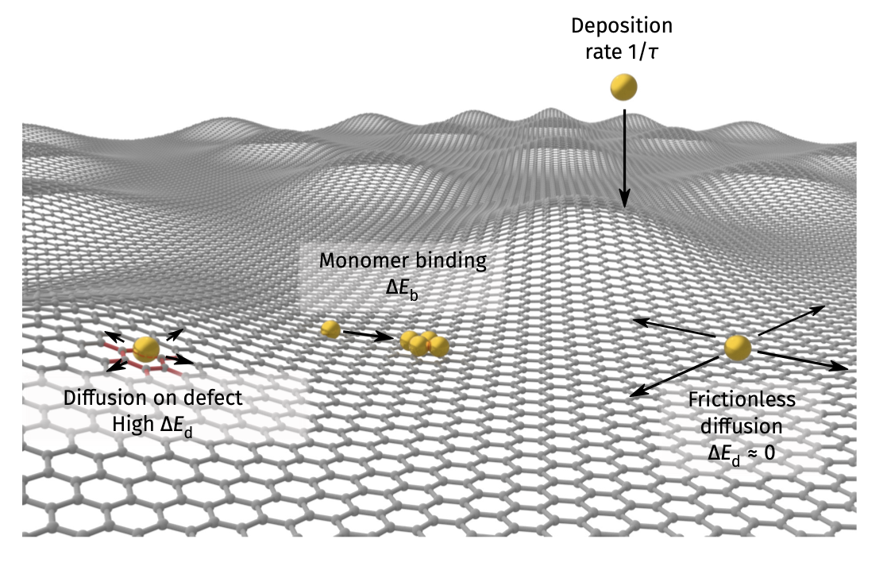

## Deposition on Graphene - theoretical simulations

- Kinetic Monte Carlo (kMC) assuming different diffusion barrier on imperfections
- Faster diffusion direction --> lower density

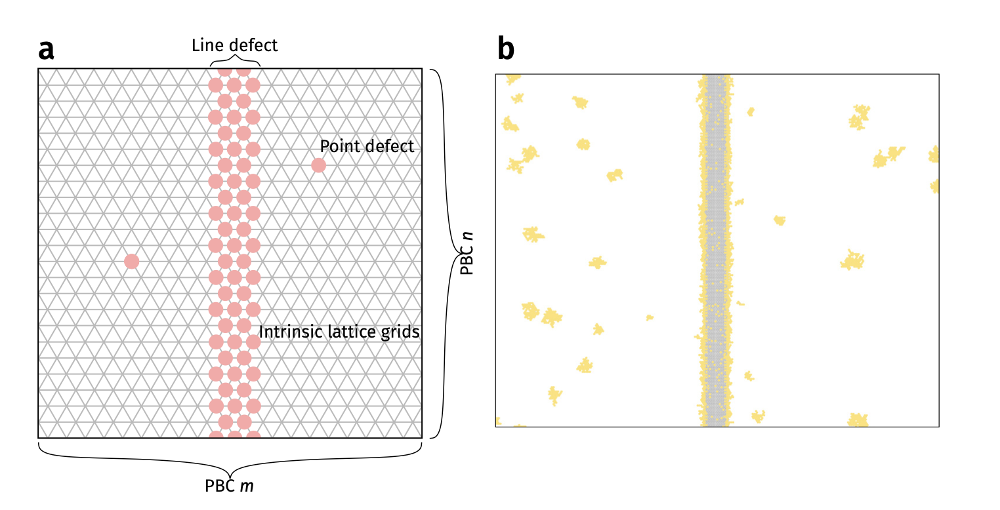

## Deposition on Graphene - KMC vs experiments


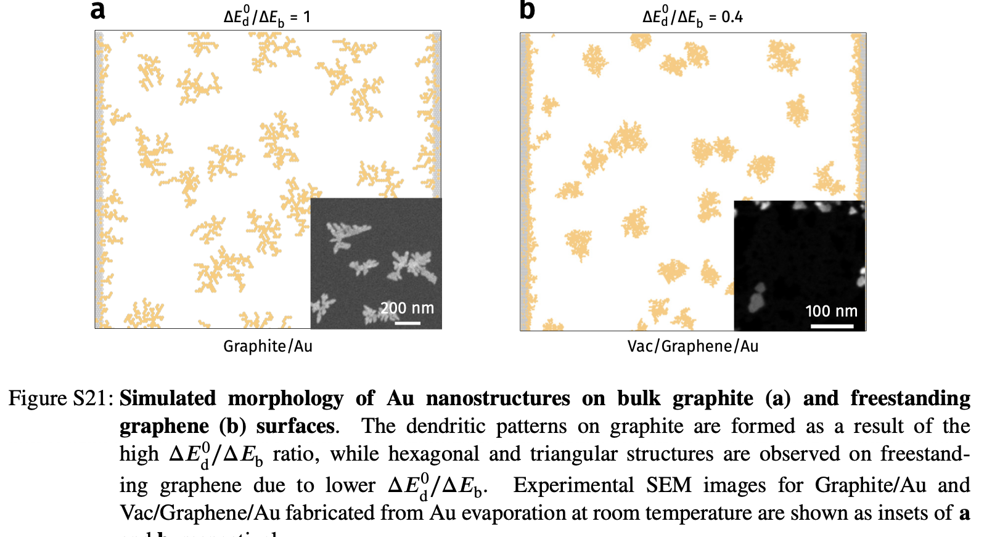

## Summary

In this lecture, we reviewed a few sample cases where diffusion is dominated by crystal defects and imperfections

- Diffusion by ionic defects -- multiple Arrhenius regimes
- Diffusion by imperfections -- shortcut diffusion compared with bulk diffusion
- Example of interface mediated diffusion -- 2D material
