::: {.content-visible when-format="html" unless-format="revealjs"}

::: {.callout-note}
- Slides 👉  [Open presentation🗒️](./slides.html)
- PDF version of course note  👉 [Open in pdf](./L13.pdf)
- Handwritten notes 👉 [Open in pdf](./public/L13_annotated.pdf)
:::

:::

# Kinetics of Materials Part II

## What topics have we learned so far?

- How to describe kinetic process: **irreversible thermodynamics**
- What causes nonequilibrium mass transfer: **chemical potential** as driving force
- Diffusion in materials: **Fick's equations**
- Determine diffusivity $D$: **Macroscopic** and **Microscopic** models

## What do we study in Part II?

Insights from assignments 1 and 2

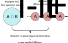{.center}

## Topic 1: phase transformation

**Key question**: how do materials evolve when chemical potentials are not at equilibrium?

:::{.columns}
:::{.column width="50%"}

- In-depth study of **phase diagrams**
- Continuous phase transformation: **spinodal decomposition**
- Phase transformation with barrier: **nucleation**

:::

:::{.column width="50%"}

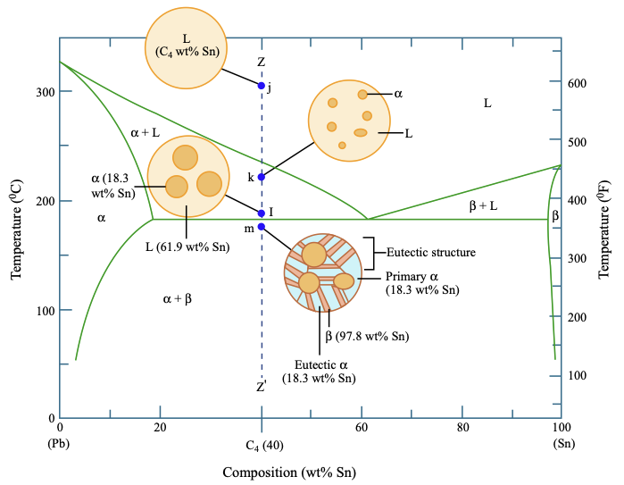

:::

:::


## Topic 2: interfacial phenomena

**Key question**: how do material interfaces change in non-equilibrium process?

:::{.columns}
:::{.column width="50%"}

- **Solidification**: heat / mass-transfer at interfaces: 
- **Sintering**: surface-energy-mediated transformation: 

:::

:::{.column width="50%"}

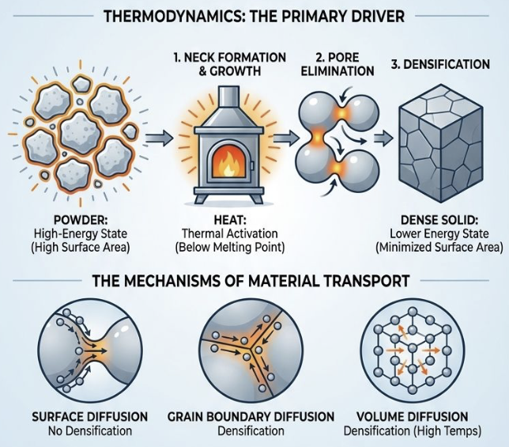

:::

:::


## Topic 3: analysis of kinetic process in materials

**Key question**: how do the competition between different effects change the material behaviour?

:::{.columns}
:::{.column width="50%"}

- **Aggregation phenomena**: diffusion & reaction of soft materials
- **Dendrite formation**: morphological control in battery electrodes
- **Carrier transport**: designing optical materials

:::


:::{.column width="50%"}

::: {.content-visible when-format="html"}


:::

:::

:::


## Topic 4: simulating kinetic problems

**Key question**: what methods can we use to simulate kinetic systems, and how good are they?

- Macroscopic transport: **phase-field method**
- Kinetic Monte-Carlo (**KMC**)
- Molecular dynamics (**MD**)
- Thermodynamic parameters from **first principles** and **machine learning**

# Introduction to phase transformation

## Learning outcomes {.center}

After this lecture, you will be able to:

- **Recall** key components of a phase diagram
- **Distinguish** the meaning of axes in a phase diagram
- **Identify** key thermodynamic relations from a phase diagram
- **Analyze** phase transformation regions in a phase diagram

This lecture is adapted from Porter et al. _Phase Transformations in Metals and Alloys_

## What is phase transformation?

Before introducing any fancy terminologies, let's define a few concepts:

:::{.columns}
:::{.column width="50%"}

- **Phase**:
  - a region with uniform structure and properties

- **Transformation**
  - a kinetic process to reduce total free energy
    by turning phases α --> β

- **Interface**
  - a boundary separating two phases

:::

:::{.column width="50%"}
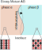{width="85%"}
:::

:::

## What can be considered as a phase?

- Mathematically (Landau & Lifshitz 1963), different phases are distinguished by _order parameter_ $\xi$
- The molar free energy $F(T, \xi)$ can be written as a series expansion of $\xi$
- $F$ can be Helmholtz or Gibbs free energy

```{=tex}
\begin{align}
F(T, \xi) = a_0(T) + a_1(T)\xi + a_2(T)\xi^2 + \cdots{}
\end{align}
```

- **1st order** phase transition
  - $F$ is continuous at phase interfaces, 
  - $\xi$ has abrupt jump

## General picture of phase transformation (1st-order)

- Example of solid-liquid transformation (KOM book)
- Order parameter $\xi$ can be arbitrary
- $\xi$ always lower on the high-T phase

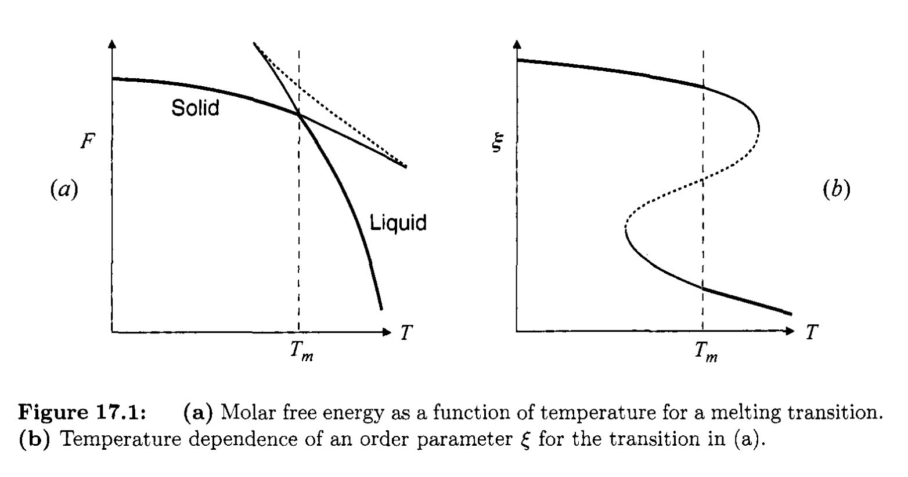

## What quantity can be an order parameter?

:::{.columns}
:::{.column width="50%"}

Examples of order parameters $\xi$ (what changes across a phase boundary)

- **structure**: e.g., fcc $\leftrightarrow$ bcc
- **molar volume** $V_m$: liquid $\leftrightarrow$ solid
- **magnetization** $M$: paramagnetic $\leftrightarrow$ ferromagnetic
- **superconducting** order parameter $\psi$: normal $\leftrightarrow$ superconducting

:::

:::{.column width="50%"}

Magnetization as order parameter (second-order transition)
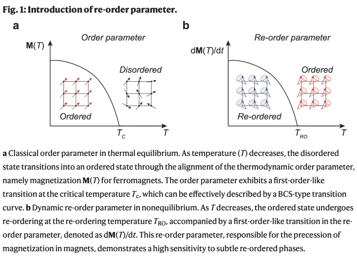
:::

:::

## Dissecting the solid-liquid free energy diagram

- Typical $H$ and $G$ diagrams for the single-component system
- $G$ is continuous while $H$ is discontinuous
- Difference in liquid-solid enthalpy: latent heat $L$

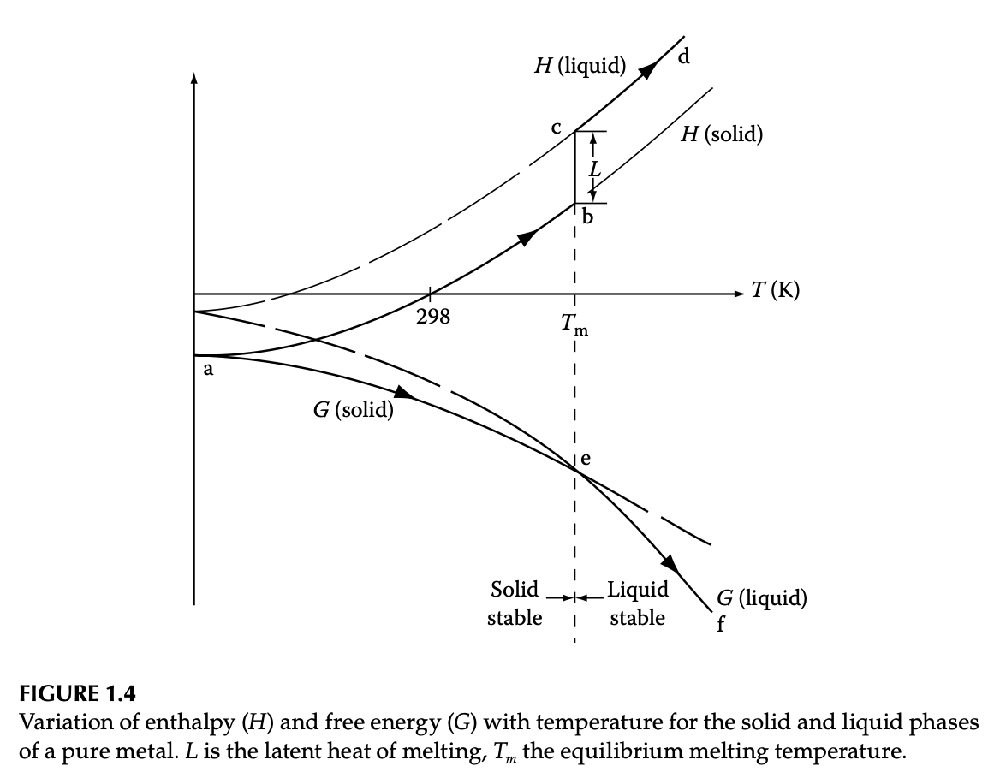

## How do we get here?

- Enthalpy from specific heat $C_p$: $C_p = \left(\dfrac{\partial H}{\partial T}\right)\vert_{p}$
- Entropy from specific heat: $\dfrac{C_p}{T} = \left(\dfrac{\partial S}{\partial T}\right)\vert_{p}$

## Single-component system: including pressure

- Left to right: increasing $T$ (melting / evaporation)
- Lower to upper: increasing $p$ (condensation)
- How do free energy profile look like?

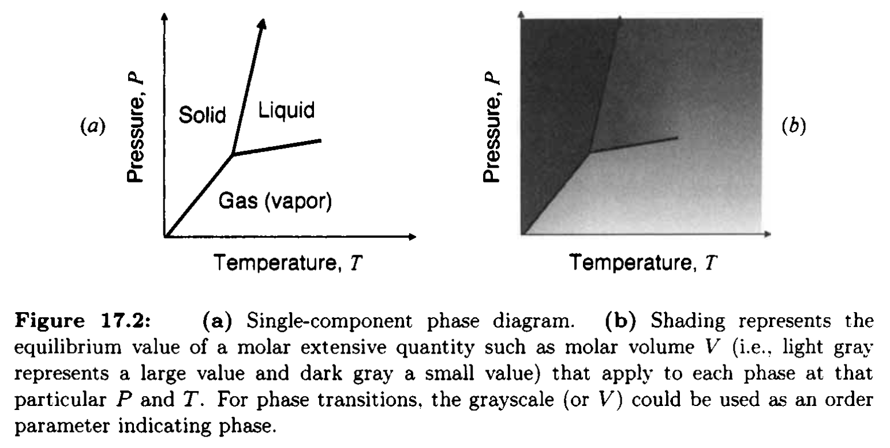

## Single-component system: slope of phase boundary

- Phase boundary equilibrium $G^{\alpha} = G^{\beta}$
- Slope of $p-T$ diagram: Clausius-Clapeyron equation

```{=tex}
\begin{align}
\left(\frac{\partial p}{\partial T}\right)\vert_{\text{eq}} &=
\frac{\Delta H}{T_{\text{eq}} \Delta V_m}
\end{align}
```

## Reading single-component phase diagram (Fe)

- What can we say about the lattice structure about Fe allotropes?

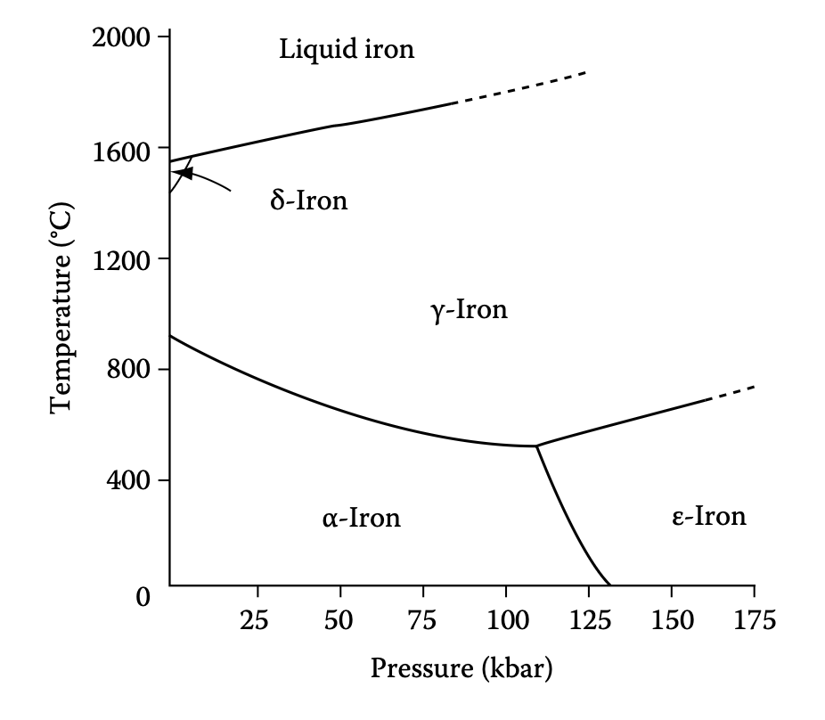{width="55%"}

## Free energy diagrams of binary mixture

- Mixing of two materials A and B causes free energy to change
- Before mixing, **molar** free energies $G_A$, $G_B$
- After mixing, molar free energy becomes

```{=tex}
\begin{align}
G = X_A G_A + X_B G_B + \Delta G_{\text{mix}}
\end{align}
```

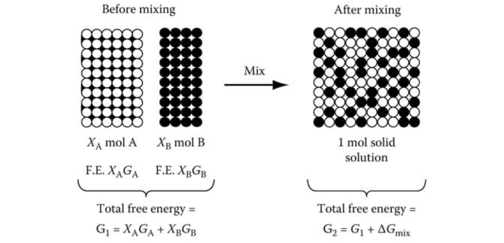

## Ideal solution: mixing entropy

- In ideal solution $\Delta G_{\text{mix}} = -T \Delta S_{\text{mix}}$
- Ideal mixing entropy

$$
\Delta S_{\text{mix}} = -R (X_A \ln X_A + X_B \ln X_B)
$$

## Chemical potential on molar free energy diagram

- Chemical potential from $G$: $\mu_A = \left(\frac{\partial G}{\partial X_A}\right)\vert_{T, p, X_B}$
- Ideal solution: $\mu_A = G_A + RT \ln X_A$

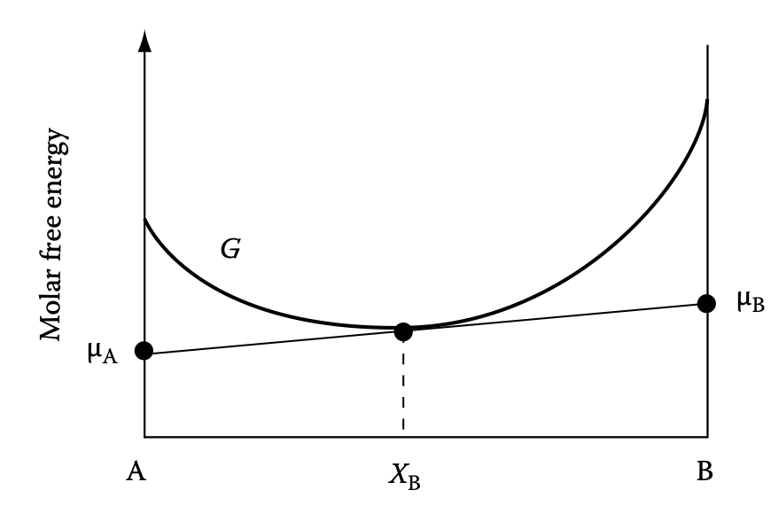{width="50%"}

## Regular solution: mixing enthalpy

- Generally $\Delta H_{\text{mix}} \neq 0$
- Can be expressed by "likeliness" between A-B

$$
\Delta H_{\text{mix}} = N_A z (\varepsilon_{AB} - \frac{1}{2} (\varepsilon_{AA} + \varepsilon_{BB})) X_A X_B
$$

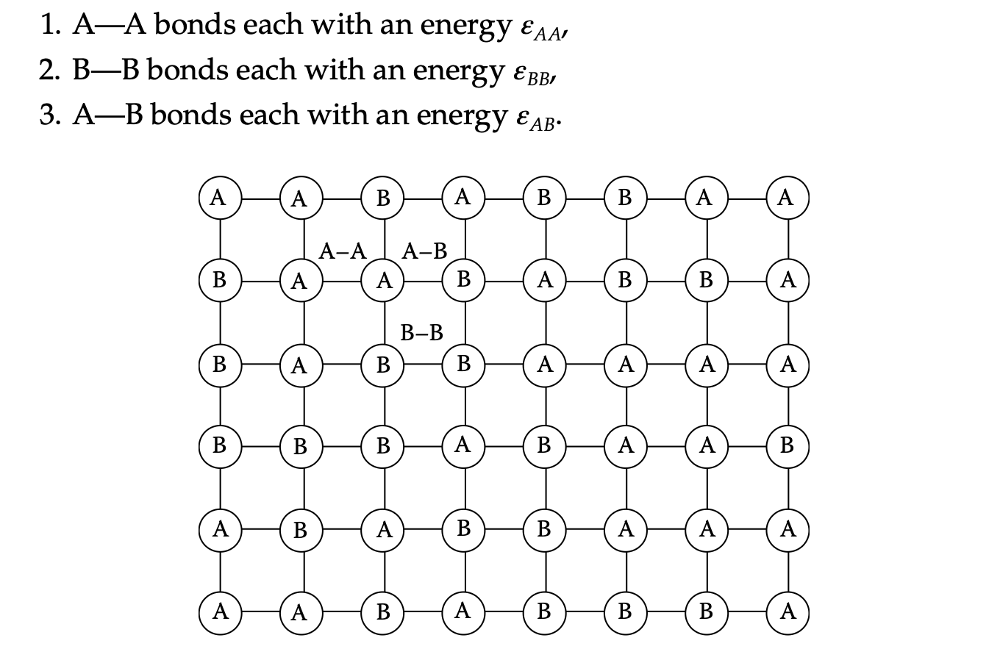{width="60%"}

## Enthalpic and entropic contributions to mixing

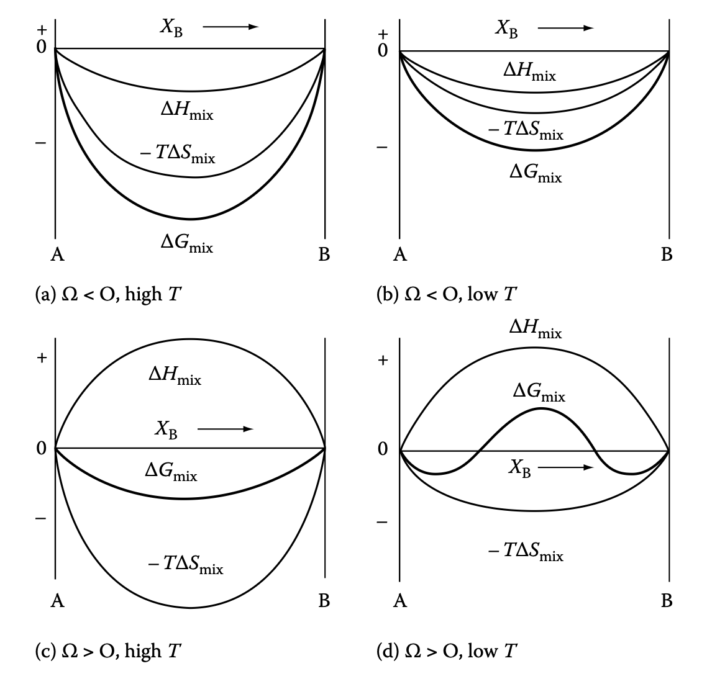{width="60%"}

## Heterogeneous phase diagram

- At each $T$, molar free energy of 2 phases are calculated separately
- Imaginary "unstable lattice" for incompatible crystals
- What is the most stable phase at each $X$?

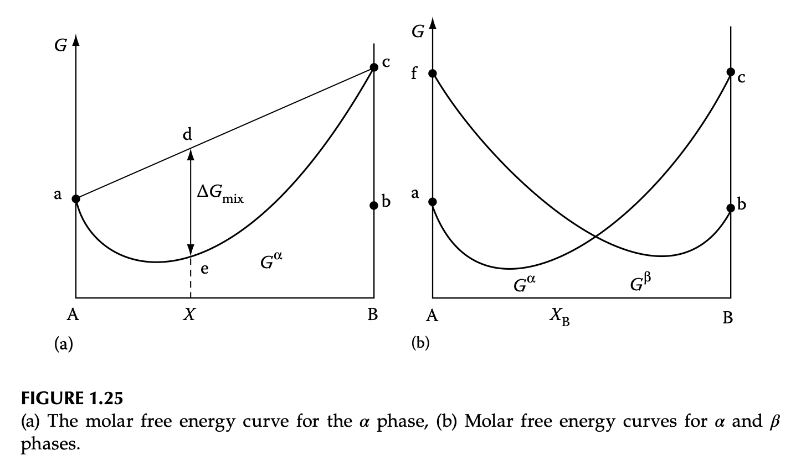

## Heterogeneous system: equilibrium

- Equilibrium condition (common tangent): $\mu_A^\alpha = \mu_A^\beta$ & $\mu_B^\alpha = \mu_B^\beta$
- Lever rule: graphical explanation

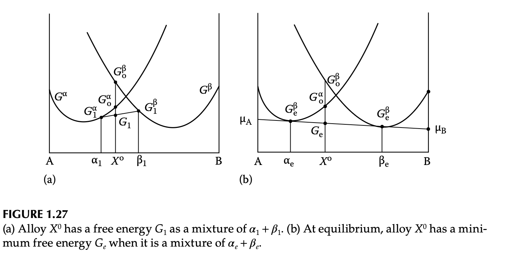

## Phase diagram example 1: completely miscible solid & liquid

- E.g. Cu–Ni alloy (fcc)

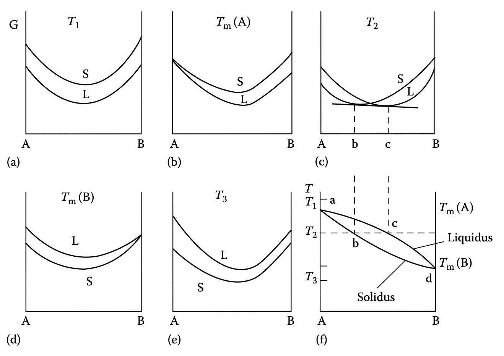

## Phase diagram example 2: miscibility gap

- Solid state $\Delta H_{\text{mix}} > 0$
- Will be our example for spinodal decomposition

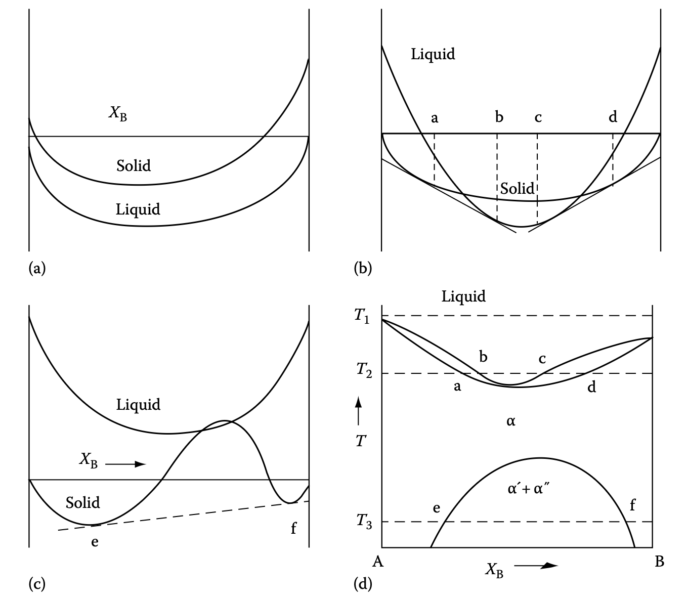

## Phase diagram example 3: eutectic alloy (same lattice)

- Eutetic formation due to dominant solid-phase

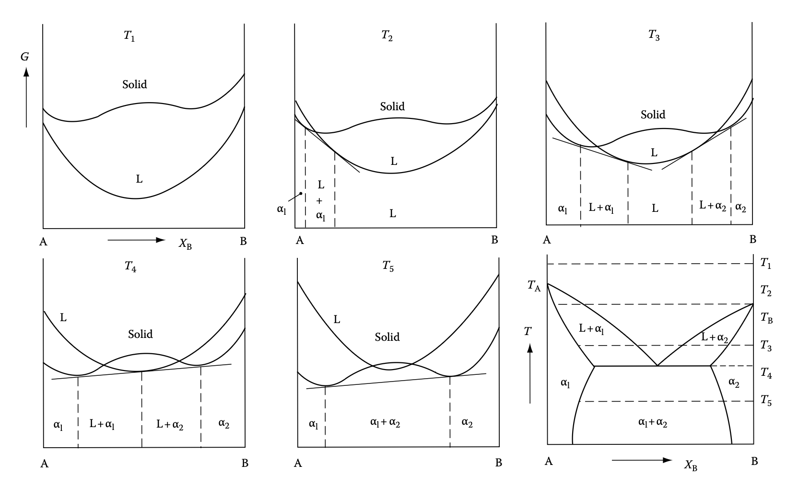

## Additional effects for phase stability

- Phase diagram does not tell everything!
- Stability of a phase depends on
  - Molar free energy (what phase diagram tell)
  - Interfacial energy (extra work to stablize interface)
  - Kinetic stability (metastable & unstable regions)
- Actual important issue for kinetic course
  - Interface influence: **nucleation theory**
  - Kinetic stability: **spinodal decomposition**

## Preview: influence of interfacial energy

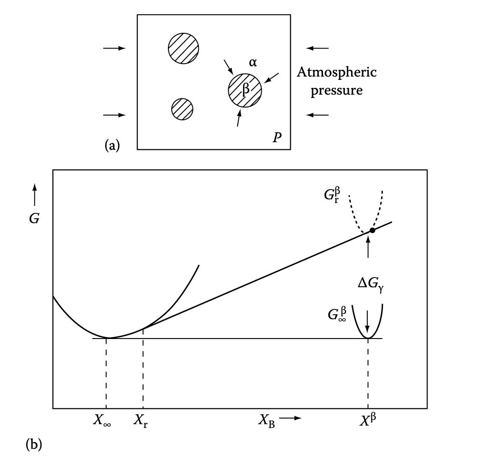

## Preview: second-order stability in spinodal decomposition

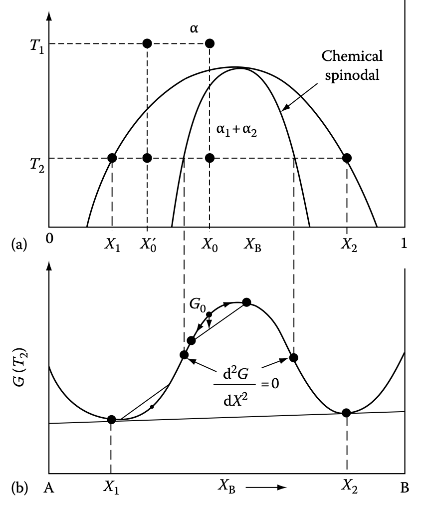

## Summary

In today's lecture, we overviewed the origin of phase transformation and phase diagram.

- Phase transformation can be described by free energy as function of an ordered parameter
- Equilibrium phase diagram is constructed by the lowest free energy phase
- Free energy of mixing --> chemical potential --> constructing phase diagram
- Basic literacy in phase diagram reading!


