::: {.content-visible when-format="html" unless-format="revealjs"}

::: {.callout-note}
- Slides 👉  [Open presentation🗒️](./slides.html)
- PDF version of course note  👉 [Open in pdf](./L14.pdf)
- Handwritten notes 👉 [Open in pdf](./public/L14_annotated.pdf)
:::

:::


## Learning outcomes {.center}

After this lecture, you will be able to:

- **Identify** the driving force when a system becomes supercooled or supersaturated
- **Describe** the difference between discontinuous and continuous phase transformations
- **Analyze** the nucleation free energy barrier $\Delta G_c$
- **Describe** the role of surface and interfacial energy in nucleation
- **Describe** the pseudo-steady-state kinetic model for nucleation

## Phase-Diagram In Non-Equilibrium Region

- How to induce phase transformation from a phase diagram?
- Going low in temperature --> (super)cooling

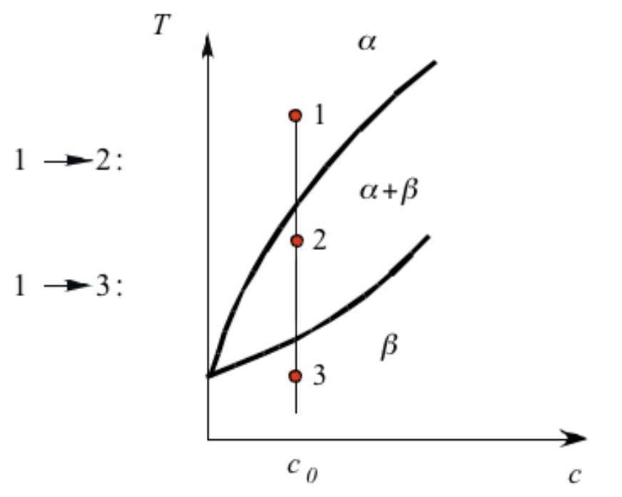

## Transformation Driving Force in Single-Component Phase Diagram 

- Cooling from liquid to solid provides driving force

$$
\Delta G^{\text{L->S}} = \frac{\Delta H^{\text{L->S}}(T_m - T )}{T_m} < 0
$$

- Why doesn't ice form spontaneously?

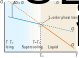

## Phase Transformation in Binary Phase Diagram ($T-X_B$)

**Ways to introduce driving force**:

- (Super)saturation
- (Super)cooling

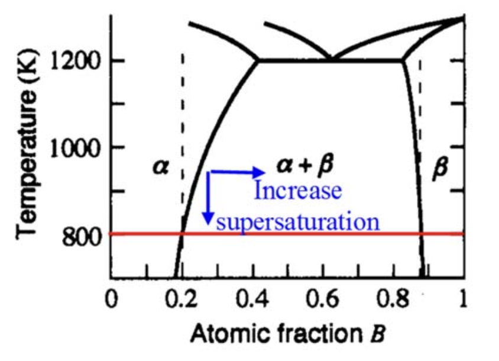

## Phase Transformation in Binary Phase Diagram ($G-X_B$)

- Metastable regions in binary phase diagram (nucleation)
- Unstable regions (spinodal decomposition)

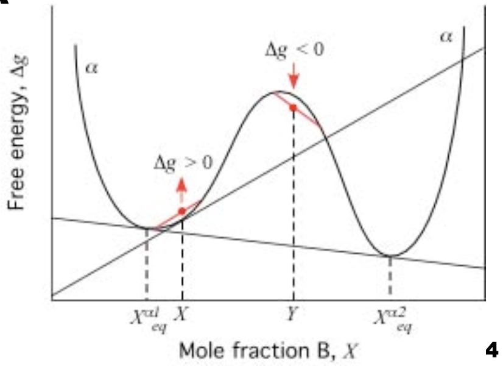

## Phase Transformation in Binary Phase Diagram ($G-X_B$)

- Metastable regions in binary phase diagram
- _Tangent-to-line_ method: driving force $\Delta G_B$ (molar)

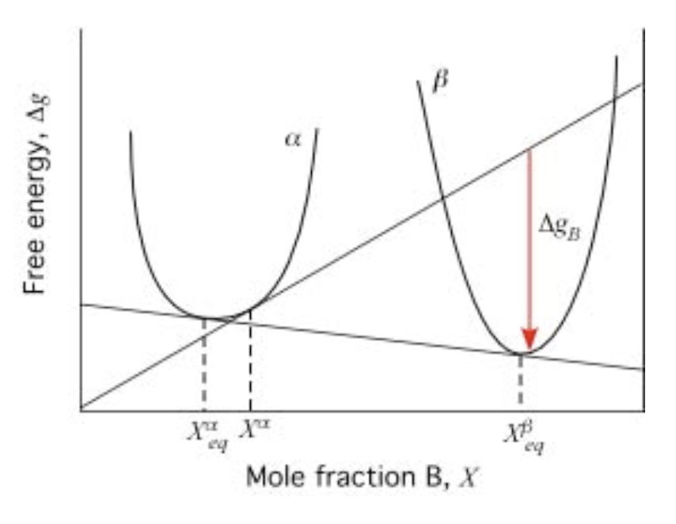

## Nucleation Theory In a Nutshell

- Crystal growth can be divided in 4 regions
- Nucleation theory deals with regions I and II (incubation & pseudo-steady-state)

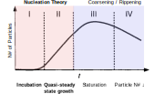

## Introducing Interfacial Energy (1)

- Creating interfaces between different atoms causes energy to change!

- Surface energy $\gamma_A$ (vacuum, unit J/m$^2$ or N/m)

$$
\gamma_A = \frac{1}{2 a_0} w_{AA} (Z_s - Z_b)
$$

:::{.columns}
:::{.column width="50%"}

Interactomic energy in bulk

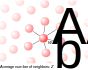

:::

:::{.column width="50%"}

Creation of surface

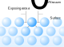

:::

:::


## Introducing Interfacial Energy (2)

- Interfacial energy $\gamma_{AB}$ can be calculated using $\gamma_A$ $\gamma_B$ and $\Delta W_{AB}$

- If adhesion between A and B are not strong, interface unlikely to form!

$$
\gamma_{AB} = \gamma_A + \gamma_B - \Delta W_{AB}
$$

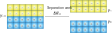

## Nucleation Theory: Overall Nucleation Free Energy

- Nucleation free energy has bulk and interface parts

```{=tex}
\begin{align}
\Delta G_N &= \Delta G_N^{\text{bulk}} + \Delta G_N^{\text{interfacial}} \\
&= n (\mu^\beta - \mu^\alpha) + \eta n^{2/3} \gamma_{\alpha \beta} \\
\end{align}
```

- Shape factor $\eta = (36 \pi)^{1/3} \Omega^{2/3}$

## Different Scaling Between Bulk & Interfacial F.E

:::{.columns}
:::{.column width="50%"}

- $\Delta G^{\text{bulk}} \propto -n^{1.0}$
- $\Delta G^{\text{interfacial}} \propto +n^{2/3}$
- Maximum $\Delta G_c$ at $n_c$.
- $\partial G_c/\partial n |_{n=n_c} = 0$

:::

:::{.column width="50%"}

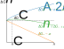

:::
:::


## The Critical Nucleus Size $n_c$

Classical homogeneous nucleation gives

- Critical nucleus size

$$
n_c = -\frac{8}{27} \left[\frac{\eta \gamma_{\alpha \beta}}{\mu_\beta - \mu_\alpha}  \right]^3
$$

- Nucleation free energy barrier

$$
\Delta G_c = \frac{4}{27} \frac{(\eta \gamma)^3}{(\mu_\beta - \mu_\alpha)^2}
$$

## Pseudo-Steady-State Nucleation Theory

- Consider the "quasi-diffusion" in $n$-landscape!

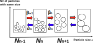

## Q.S.S. Governing Equations

- "Quasi flux" of $n \rightarrow n+1$: $J_n$
- Can also model $\partial N_n/\partial t$ from assignment 2
- At equilibrium, detailed balance follows:

$$
J_n(t) = \beta_n N_n(t) - \alpha_{n+1} N_{n+1}(t) = 0
$$

- The nucleation rate at quasi-pseudo-state can be computed using a known $N_n$ distribution

## Q.S.S. Assumptions

- In a constrained equilibrium system, $N_n$ follows the Boltzmann distribution

$$
\frac{N^{\text{ceq}}_n}{N_t} \approx \exp \left( -\frac{\Delta G_n}{k_B T} \right)
$$

- Result:

$$
J_n(t) = - \beta_n \left[ \frac{\partial N_n}{\partial n} + \frac{N_n}{k_B T} \frac{\partial \Delta G_n}{\partial n} \right]
$$

- Analog: diffusion in external potential

$$
J = -L_{11} \nabla (\mu_1 + \phi) = -D_1 \left( \frac{\partial c}{\partial x} + \frac{c}{k_B T}\frac{\partial \phi}{\partial x} \right)
$$


## Q.S.S. Nucleation Rate: Final Results

- Assuming the nucleation rate is determined by $J \approx J_{n_c}$
- $Z$ is the Zeldovich factor (~0.1)

```{=tex}
\begin{align}
J &= Z \beta_c n_t \exp(-\frac{\Delta G_c}{k_B T}) \\
Z &= \sqrt{\frac{\Delta G_c}{3 \pi n_c^3 k_B T}} 
\end{align}
```

## Implication of Q.S.S. Nucleation Rate

- Zeldovich factor is around 0.1
- Particles can shrink when they are not reaching $n_c$!
- Rule of thumb: $\Delta G_c \leq 76 k_B T$, otherwise no detectable nucleation
- At $T=298$ K, $\Delta G_c \leq 1.95$ eV

```{=tex}
\begin{align}
J &= Z \beta_c n_t \exp(-\frac{\Delta G_c}{k_B T}) \\
Z &= \sqrt{\frac{\Delta G_c}{3 \pi n_c^3 k_B T}} 
\end{align}
```


## Summary

- Nucleation is a type of discontinuous phase transformation that is triggered by the difference in free energy at supercooling / supersaturation
- At unsteady-state conditions, nucleation free energy barrier is caused by the positive interfacial energy
- Nucleation free energy barrier is characterized by $\Delta G_c$, giving critical nucleus size $n_c$
- The evolution of particle number at each size $N_n$ can be described by a "diffusion-like" analog


## What To Learn Next

Is homogeneous nucleation the whole picture? Maybe not. Consider the following examples

:::{.columns}
:::{.column width="50%"}
**Sugar crystal formation**

- _Heterogeneous nucleation_


:::

:::{.column width="50%"}
**Snow formation**

- _Diffusion-controlled growth_


:::

:::
