::: {.content-visible when-format="html" unless-format="revealjs"}

::: {.callout-note}
- Slides 👉  [Open presentation🗒️](./slides.html)
- PDF version of course note  👉 [Open in pdf](./L15.pdf)
- Handwritten notes 👉 [Open in pdf](./public/L15_annotated.pdf)
:::

:::


## Learning outcomes {.center}

After this lecture, you will be able to:

- **Compare** heterogeneous nucleation with homogeneous nucleation
- **Analyze** the driving-force terms in both cases
- **Derive** the ratio between heterogeneous and homogeneous nucleation barriers and rates
- **Recall** methods for determining the equilibrium nucleation shape


## Recall: key results from homogeneous nucleation

Homogeneous (spherical) nucleus gives the following results:

- Critical nucleus size

$$
n_c = -\frac{8}{27} \left[\frac{\eta \gamma_{\alpha \beta}}{\mu_\beta - \mu_\alpha}  \right]^3
$$

- Nucleation free energy barrier

$$
\Delta G_c = \frac{4}{27} \frac{(\eta \gamma)^3}{(\mu_\beta - \mu_\alpha)^2}
$$


- Nucleation rate

```{=tex}
\begin{align}
J &= Z \beta_c n_t \exp(-\frac{\Delta G_c}{k_B T}) \\
Z &= \sqrt{\frac{\Delta G_c}{3 \pi n_c^3 k_B T}} 
\end{align}
```

## Recall: homogeneous nucleation implications

- $\Delta G_c \propto \gamma^3$: very sensitive to the interfacial free energy
- Zeldovich factor $Z$ is around 0.1
- Particles can shrink when they are not reaching $n_c$!
- Rule of thumb: $\Delta G_c \leq 76 k_B T$, otherwise no detectable nucleation
- At $T=298$ K, $\Delta G_c \leq 1.95$ eV

## What's the missing picture?

_Can we really treat the nuclei as spheres?_

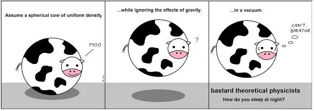

## Practical considerations: heterogeneous nucleation

- General idea: can we have smaller $\Delta G_c$ if other competing energies exist in the system?
- Analog: nucleation of crystals on a beaker wall
- Need to consider the free energy change before and after wall surface is covered by the nucleus


## Triple interface balance: the Young's equation

Analogous to the classical wetting theory, the "contact angle" on a droplet can be described by the Young's equation


$$
\gamma_{\mathrm{S}} = \gamma_{\mathrm{L}} \cos \theta + \gamma_{\mathrm{SL}}
$$


## Heterogeneous nucleation on a wall: volume vs surface

The geometry of the
droplet gives:

- Volume of nucleus: $V_{\mathrm{n}} = \frac{\pi R^{3}}{3} (2 - 3 \cos \theta + \cos^{3} \theta)$
- Interfacial area of nucleus with solution: $A_{\mathrm{s}} = 2 \pi R^{2} (1 - \cos \theta)$
- Interfacial area of nucleus with wall: $A_{\mathrm{c}} = \pi R^{2} \sin^{2} \theta$

Final solution to heterogeneous nucleation barrier:

$$
\Delta G_c^{\text{het}} = V_{\mathrm{n}} \Delta G_{\mathrm{V}} + \gamma_{\mathrm{sn}} A_{\mathrm{s}}
           + (\gamma_{\mathrm{nw}} - \gamma_{\mathrm{sw}}) A_{\mathrm{c}}
$$

## Heterogeneous nucleation on a wall: results

We can compare the hetero- and homogeneous barriers:

$$
\frac{\Delta G_{\mathrm{het}}}{\Delta G_{\mathrm{homo}}}
= \frac{2 - 3 \cos \theta + \cos^{3} \theta}{4} = f
$$

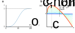


## Heterogeneous in binary alloys: geometry

- At triple-interface, we have the balance

$$
\gamma_{\alpha\alpha} = 2 \gamma_{\alpha \beta} cos \psi
$$

- Gain boundary $\gamma_{\alpha\alpha} \neq 0$
- What does $\gamma_{\alpha\alpha} = 0$ mean? Homogeneous nuclation!

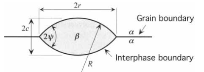


## Heterogeneous in binary alloys: $\Delta G_c^{\text{het}}$ results


- Volume $V = \frac{2 \pi R^3}{3} (2 - 3 \cos \psi + \cos^3 \psi)$
- Area of cap $A_c = 4 \pi R^2 (1 - \cos \psi)$
- Area below the cap: $A_b = \pi r^2 = \pi R^2 (1 - \cos^2 \psi)$

Overall heterogeneous nucleation barrier:

$$
\Delta G_c^{B} = (\frac{2 \pi R^3}{3} \Delta G_m + 2\pi R^2 \gamma_{\alpha\beta})(2 - 3 \cos \psi + \cos^3 \psi)
$$


## Ratio between hetero- and homogeneous nucleation energy barriers

Compare the two barriers, they are quite similar

```{=tex}
\begin{align}
\Delta G_c^{H} &= (\frac{4 \pi R^3}{3} \Delta G_m + 4\pi R^2 \gamma_{\alpha\beta}) \\
\Delta G_c^{B} &= (\frac{2 \pi R^3}{3} \Delta G_m + 2\pi R^2 \gamma_{\alpha\beta})(2 - 3 \cos \psi + \cos^3 \psi)
\end{align}
```

Ratio:

```{=tex}
\begin{align}
\frac{\Delta G_c^{B}}{\Delta G_c^{H}} = \frac{1}{2}(2 - 3 \cos \psi + \cos^3 \psi)
\end{align}
```

This is similar to our case of heterogeneous nucleation on a wall, but with different coefficient (why?)!


## Heterogeneous nucleation barrier

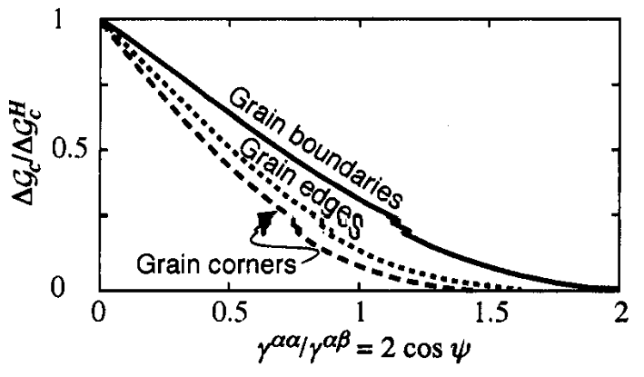

## Heterogeneous nucleation in alloys: other nucleus dimensionalities

- From previous figure we see that $\Delta G_c$ on defect becomes smaller for lower-dimensionality defects
- But do low dimensional defects always win? Not essentially.
- Number of sites available also decreases.

Assume the average grain size is $L$, with grain boundary thickness $\delta$, available sites follows

$$
n^{\text{defect}} \propto n_t (\frac{\delta}{L})^{3 - d}
$$


## Competition between hetero- and homogeneous nucleation rates

When considering the rates, **two** factors matter in the overall $J$ equation:

- Free energy barrier $\exp( - \Delta G_c/k_B T)$ (hetero > homo)
- Total available sites $n_t$ (hetero < homo)

$$
\ln\!(\frac{J^B}{J_H}) = \ln\!(\frac{\delta}{L}) + \frac{\Delta G_c^H - \Delta G_c^B}{k_B T}
$$


## Overall nucleation regimes

- $R_B = k_B T\ln(\frac{L}{\delta})$
- Homogeneous nucleation favours when $R_B > \Delta G_c^H - \Delta G_c^B$

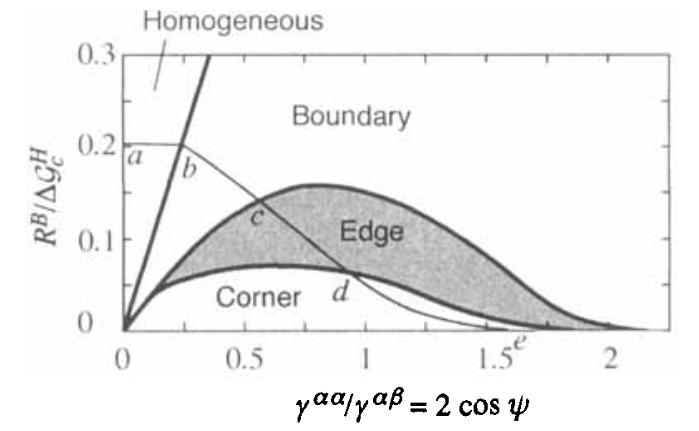

## What else may be missing?

- The nucleation geometry may be very different from spherical or curved!
- Different facets have distinct surface free energy
- Overall goal: when the volume $V$ is fixed, can we know the equilibrium shape of a crystal, so that surface energy is minimized?
- Wulff construction: optimizing the geometry of equilibrium shape
- Higher energy facet would have longer distance to the center!

## Wulff construction for equilibrium crystal shape

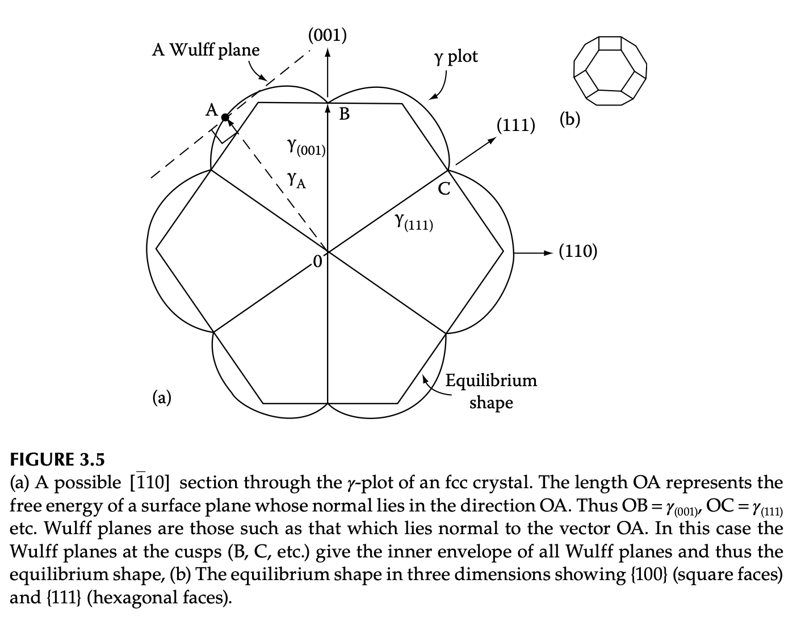

## Theoretical Wulff construction for elements

[Crystalium demo](http://crystalium.materialsvirtuallab.org)

_Tran et al. Scientific Data, 2016, 3:160080_

## Nucleation: example demo


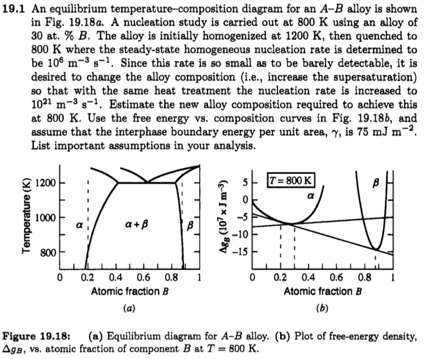

## Nucleation demo: how do we get the values?

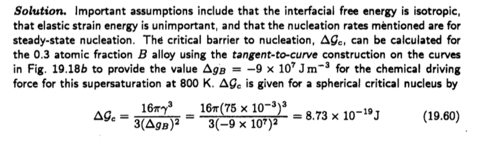

## Nucleation demo: supersaturation limit

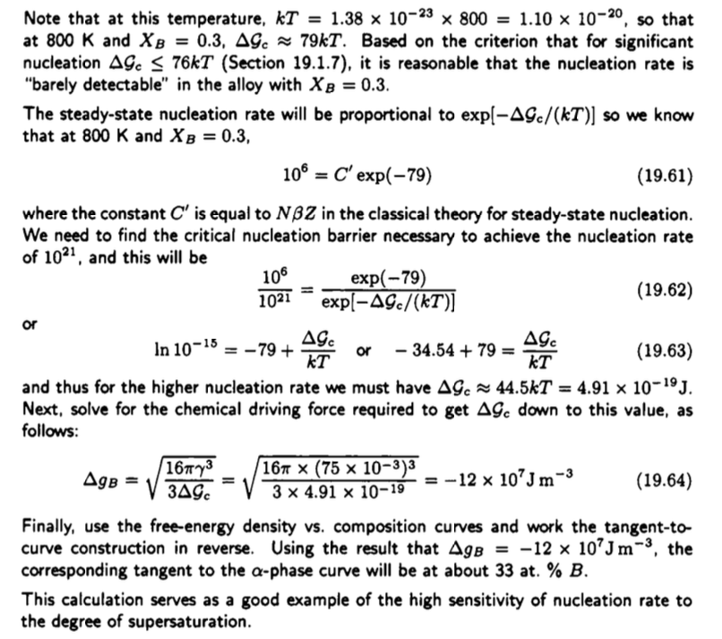


## Summary

- Nucleation is a type of discontinuous phase transformation that is triggered by the difference in free energy at supercooling / supersaturation
- At unsteady-state conditions, nucleation free energy barrier is caused by the positive interfacial energy
- Nucleation free energy barrier is characterized by $\Delta G_c$, giving critical nucleus size $n_c$
- The evolution of particle number at each size $N_n$ can be described by a "diffusion-like" analog


<!-- ## What To Learn Next -->

<!-- Is homogeneous nucleation the whole picture? Maybe not. Consider the following examples -->

<!-- :::{.columns} -->
<!-- :::{.column width="50%"} -->
<!-- **Sugar crystal formation** -->

<!-- - _Heterogeneous nucleation_ -->

<!-- 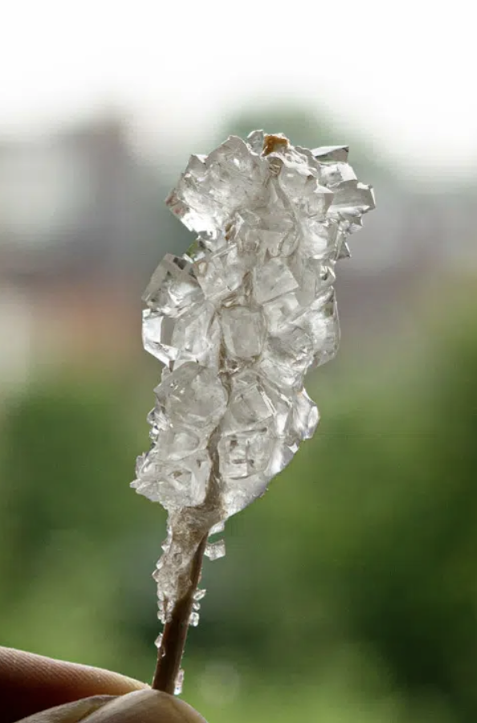 -->

<!-- ::: -->

<!-- :::{.column width="50%"} -->
<!-- **Snow formation** -->

<!-- - _Diffusion-controlled growth_ -->

<!-- 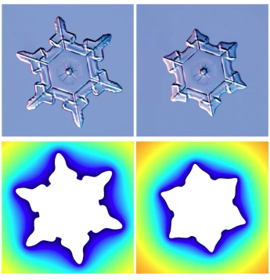 -->

<!-- ::: -->

<!-- ::: -->
