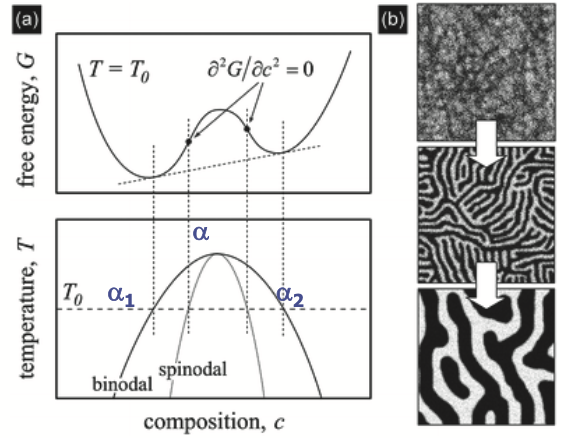
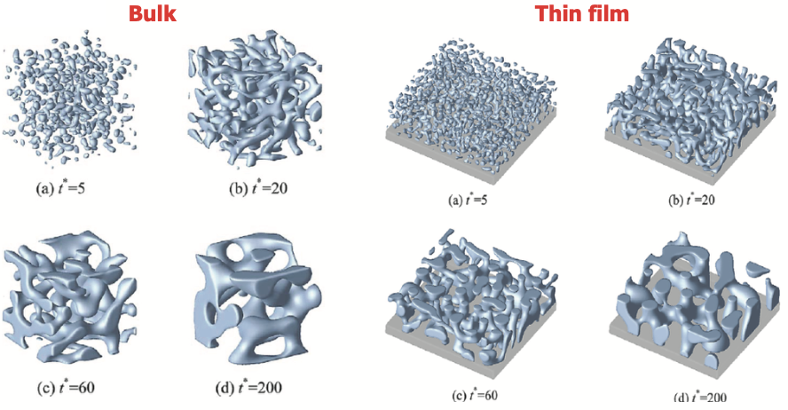
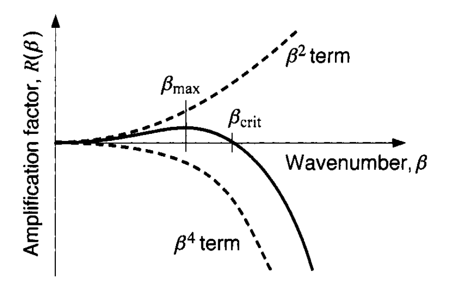
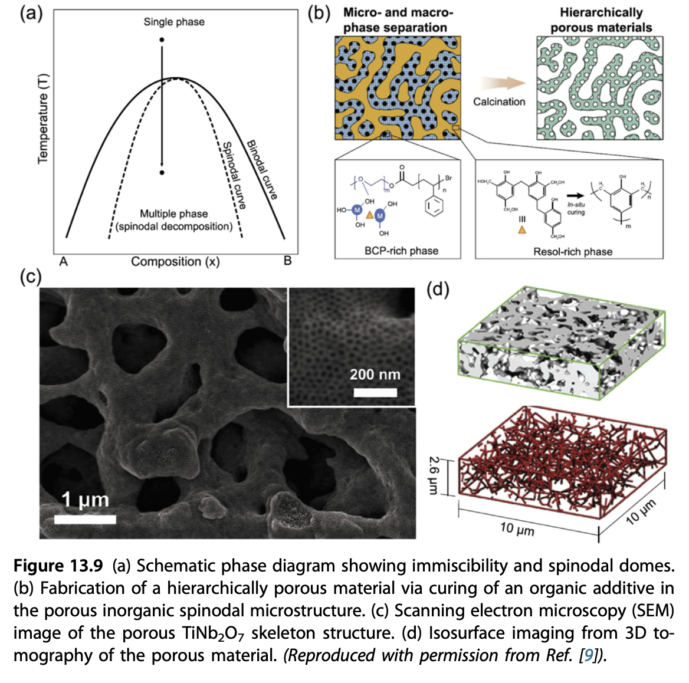

::: {.content-visible when-format="html" unless-format="revealjs"}

::: {.callout-note}
- Slides 👉  [Open presentation🗒️](./slides.html)
- PDF version of course note  👉 [Open in pdf](./L16.pdf)
- Handwritten notes 👉 [Open in pdf](./public/L16_annotated.pdf)
:::

:::


## Learning Outcomes {.center}

After this lecture, you should be able to:

- Recall the difference between continuous and discontinuous phase transformation
- Understand spinodal decomposition as a key continuous phase transformation process
- Identify the chemical potential driving force in spinodal decomposition
- Analysis of the Cahn-Hilliard equation and gradient driving force

## Recall: General Picture of Phase Transformation

Stability regions in $T-X_{B}$ and $G-X_{B}$ plots
- spinodal: "spine-like" shape in the free energy diagram




## Stability of Phase Transformation: Second Derivative of Free Energy

Talor expansion of the Gibbs free energy

```{=tex}
\begin{align}
G\!\left(x_B^{0}+\delta x_B\right)
&= G\!\left(x_B^{0}\right)
+ \left.\frac{\partial G}{\partial x_B}\right|_{x_B^{0}}\,\delta x_B
+ \frac{1}{2}\left.\frac{\partial^{2}G}{\partial x_B^{2}}\right|_{x_B^{0}}(\delta x_B)^2 \nonumber\\
&= G\!\left(x_B^{0}\right)
+ \frac{1}{2}\left.\frac{\partial^{2}G}{\partial x_B^{2}}\right|_{x_B^{0}}(\delta x_B)^2
\end{align}
```

## Key Questions To Be Answered For Continuous Transformation

- **Where**: which region in a phase diagram does continuous phase transformation occur?
- **How**: how does the continuous transfromation differ from discontinuous one (e.g. nucleation)?
- **Why**: why do we see the continuous behaviour?

## Comparision: Nucleation vs Spinodal Decomposition


## Continuous Transformation: Irreversible Thermodynamics View (1)

From [Lecture 08](../L08) we know the fluxes between an A-B binary mixture follows:

- C-frame: $J_A^C$ & $J_B^C$

- V-frame: $J_A^V$ & $J_B^V$

- Conservation equations

## Continuous Transformation: Irreversible Thermodynamics View (2)

Expanding the flux conservation and Gibbs-Duhem equation we get the $J_B^V$ as

```{=tex}
\begin{align}
J_B^V &= -\Omega^2 (c_A^2 L_B + c_B^2 L_A)(\nabla \mu_B - \nabla \mu_A) \\
&= -\Omega^2 (c_A^2 L_B + c_B^2 L_A)\nabla(\mu_B - \mu_A) \\
&= - M \nabla(\mu_B - \mu_A)
\end{align}
```

So far this is just a formal diffusion equation using chemical potential driving force

## Meaning of $J_B^V$ Equation

- Mobility $M>0$ satisfies the $\dot{\sigma}\geq 0$ postulate
- What is $\mu_B - \mu_A$? 👉 Slope $\partial G/\partial X_B$ on the free energy diagram!
- What is $\nabla(\mu_B - \mu_A)$? Spatial variation of the $\partial G/\partial X_B$ driving force


```{=tex}
\begin{align}
J_B^V &= - M \nabla(\mu_B - \mu_A) \\
      &= - \frac{M\Omega}{N_0} \frac{\partial^2 G}{\partial X_B^2} \nabla c_B \\
      &= -\tilde{D} \nabla c_B
\end{align}
```

## Negative Interdiffusivity?

From previous analysis we see that the apparent interdiffusivity $\tilde{D}$ follows:

$$
\tilde{D} = \frac{M\Omega}{N_0} \frac{\partial^2 G}{\partial X_B^2}
$$

- $\tilde{D} < 0$ 👉 uphill diffusion
- In continuous transformation, we see the local concentration difference amplifies!
- In contrast, normal diffusion $\tilde{D} > 0$ tries to smoothen the concentration curvature.

## Diffusion (homogenization) vs Phase separation

Very rough estimation of the composition change using Fick's second law

$$
\frac{\partial c_B}{\partial t} = \tilde{D}\nabla^2 c_B
$$

## Summary For "Where" and "Why" Questions

- Continuous phase transformation occurs **where** the second derivative of free energy is **negative**
- The continuous phase separation is dominated by **barrierless** diffusion
- The process is triggered by infinitesimal spatial fluctuation
- Amplification of concentration fluctuation is enhanced by **negative interdiffusivity** $\tilde{D} = \frac{M\Omega}{N_0} \frac{\partial^2 G}{\partial X_B^2} < 0$

## The "How" Question: Evolution of Patterns In Spinodal Decomposition

Let's still use the 1D Fick's second law, assuming $\tilde{D}$ is constant everywhere

$$
\frac{\partial c_B}{\partial t} = \tilde{D}\frac{\partial^2 c_B}{\partial x^2}
$$

From [Lecture 07](../L07) we know that the diffusion equation can be
decomposed into spatial and temporal parts. Use a wave form $c_B(x, t)
= \overline{c_B} + \exp(i \beta x) A(t)$, we can solve the $c_B(x, t)$ profile.

## Amplification In Continuous Transformation

The general solution to the waveform $c_B$ is:

```{=tex}
\begin{align}
c_B - \overline{c_B} &= A(\beta, 0) \exp(-\beta^2 \tilde{D}) exp(i \beta x) \\
&= A(\beta, 0) \exp(-R(\beta))  exp(i \beta x)
\end{align}
```

- Wavelength $\lambda = 2\pi / \beta$
- $R(\beta) = -\beta^2 \frac{M \Omega}{N_0} \frac{\partial^2 G}{\partial X_B^2}$: amplification factor
- $\beta \rightarrow \infty$ should give maximal amplification ?! 👉 We always end up with noise ?!
- Not the case in real scenario 👉 **stablization** by interfaces!

## Example: Spinodal Decomposition In Computer Simulations

- See Seol, et al. _Acta Materialia_ 51, 5173–5185 (2003)
- Final pattern always has a principal wavelength, why?



## Interfacial Energy As Stablization Term

- The term $R(\beta) = -\beta^2 \frac{M \Omega}{N_0} \frac{\partial^2 G}{\partial X_B^2}$ uses _homogeneous_ free energy of a mixture
- In reality creating a new phase always increase the free energy by surface energy (similar to nucleation in [Lecture 14](../L14))
- In spinodal decomposition, surface energy acts as "stablization" for pattern formation!

## Energy at Gradient Interfaces

- Unlike in nucleation where sharp interface can be defined (thus $\gamma$), spinodal decomposition usually accompanies **diffuse interface**
- $c_{B}$ has a finite gradient, not sharp step function

Additional term for interface gradient to Helmholtz free energy density

$$
f_{\gamma} = \kappa \left(
\frac{\partial c_B}{\partial x}
\right)^2
$$

- $\kappa >0$ is the gradient energy coefficient that penalizes the creation of sharp interface
- At interface $\left(
\frac{\partial c_B}{\partial x}
\right)^2$ becomes large!

## Cahn-Hilliard Equation For Spinodal Decomposition

- It is just Fick's second law with a more precise $\tilde{D}$ counting the interfacial term
- Total Helmholtz free energy comes from both homogeneous free energy density $f^{\text{homo}}$ and $\kappa (\partial c_B/\partial x)^2$

Define a general "diffusion potential" for inhomogeneous system:

```{=tex}
\begin{align}
\Phi(x) &= \frac{\partial F}{V \partial cB} \\
        &= \frac{\partial f^{\text{homo}}}{\partial c_B}
	- 2 \kappa \nabla^2 c_B
\end{align}
```

## Cahn-Hilliard Equation (2)

Instead of chemical potential $\mu_B - \mu_A$, we use $\Phi$ as the overall potential

- Fick's 1st law

```{=tex}
\begin{align}
J_B &= -L \nabla \Phi \\
    &= -\frac{\tilde{D}}{(\partial^2 f^{\text{homo}} / \partial X_B^2)} \nabla \{\frac{\partial f^{\text{homo}}}{\partial c_B}
	- 2 \kappa \nabla^2 c_B \}
\end{align}
```

- Fick's 2nd law

```{=tex}
\begin{align}
\frac{\partial c_B}{\partial t} &= - \nabla\cdot J_B\\
    &= \nabla \cdot \{\frac{\tilde{D}}{(\partial^2 f^{\text{homo}} / \partial X_B^2)} \nabla \{\frac{\partial f^{\text{homo}}}{\partial c_B}
	- 2 \kappa \nabla^2 c_B \}\}
\end{align}
```

## Cahn-Hilliard Equation (3)

Final format of Cahn-Hilliard equation

```{=tex}
\begin{align}
\frac{\partial c_B}{\partial t} = M_0 \left[
\frac{\partial^2 f^{\text{homo}}}{\partial c_B^2}
\nabla^2 c_B
- 2 \kappa \nabla^4 c_B
\right]
\end{align}
```

## Perturbation Analysis For Cahn-Hilliard Equation

Toy model for the Helmholtz free energy

$$
f^{\text{homo}} = 16 \frac{f^{m}}{(c^\beta - c^\alpha)^4}
\left[
(c_B - c^\alpha)(c_B - c^\beta)
\right]^2
$$

How will the amplitude change?

$$
\frac{d A(t)}{dt}
=
\frac{M_0 \beta^2}{(c^\beta - c^\alpha)}
\left[
16 f^{m} - 2 \kappa \beta^2 (c^\beta - c^\alpha)
\right] A(t)
$$

## Amplification Factor $R(\beta)$ In Cahn-Hilliard Equation

$$
R(\beta) = -M_0 \left( \frac{\partial^2 f}{\partial c_B^2} \beta^2 + 2 \kappa \beta^4 \right)
$$

The $\beta^4$ term now stablizes $R(\beta)$!



## Cahn-Hilliard Equation: Critical Wavelength

- Critical wavelength $\lambda_c = \frac{\pi}{2} (c^\beta - c^\alpha) \sqrt{\frac{\kappa}{f^m}}$
- $\lambda > \lambda_c$ --> Growth
- Fastest growing wavelength $\lambda_{\text{max}} = \sqrt{2} \lambda_c$


## Applications of Spinodal Decomposition: Pattern Formation




## Summary

- Continuous phase transformation is caused by initial composition inside the spinodal line (unstable region)
- Negative $\tilde{D}$ causes spatial fluctuation to amplify
- Cahn-Hilliard equation describes the driving force
- Continuous phase separation occurs in many material systems and give rise to rich phase separation patterns