::: {.content-visible when-format="html" unless-format="revealjs"}

::: {.callout-note}
- Slides 👉  [Open presentation🗒️](./slides.html)
- PDF version of course note  👉 [Open in pdf](./L17.pdf)
- Handwritten notes 👉 [Open in pdf](./public/L17_annotated.pdf)
:::

:::


## Learning Outcomes {.center}

After this lecture, you should be able to:

- Recall another surface-energy induced growth phenomenon: coarsening
- Recall the main assumptions in the coarsening theory
- Identify the competition between diffusion and reaction rate
- Analysis of particle size distribution function

## Recap: continuous and discontinuous phase transformation


## Recap: growth barrier comparison

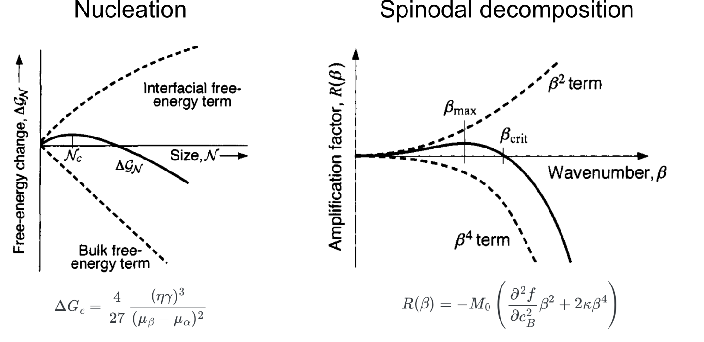

## Recap: growth stages in a nucleation process

- What happens to stages III and IV? 👉 Coarsening process


## Coarsening: growth mechanism involving particle size distribution

Pb-Sn alloy coarsening experiment shows that particle distribution remains almost constant (Stage III)

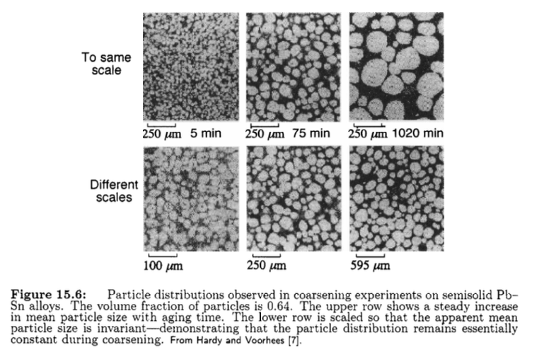

## Another angle: Ostwald rippening

Experimental observation of small Pt particles are "absorbed" by the larger particles (Stage IV)

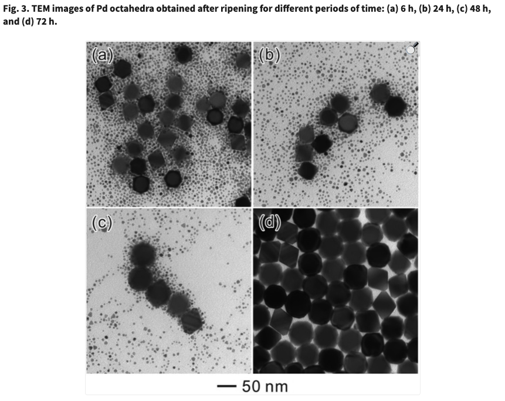


## Analog: two-baloon experiment

- The effect of curvature on the total free energy is analogous to the two-baloon experiment
- The driving force is **capillarity**
- [YT Video](https://www.youtube.com/watch?v=1ftn09RBv74)

## Capillarity as a driving force

The term "capilarity" refers to a broad variety of phenomena involving the interface

- Excess free energy caused by surface energy + curvature
- Driving force: minimizing interfacial area
- Morphology change: interfaces will move during the optimization process
  - **Coarsening**: large particles "absorbes" small particles; particles _do not touch_
  - **Coalescence/sintering**: interface between close-contact particles disappear; particles _touch and merge_

## Crash course: interfacial coordinate system

For the interface between A and B that has no parallel movement, the curvature $H$ depends on the direction of the normal vector $\mathbf{n}$, so that

$$
 p_{\mathrm{A}} - p_{\mathrm{B}} + 2 H \gamma = 0
$$

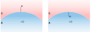

in either definition, $p_A > p_B$ (makes sense?)

## Crash course: interfacial curvature

The surface curvature \(H\) can be expressed using the two
principle radii \(R_{1}\) and \(R_{2}\) of the surface:

```{=tex}
\begin{align}
|H| &= \frac{1}{2}(\frac{1}{R_{1}} + \frac{1}{R_{2}}) \\
              &= \frac{1}{2}(\kappa_1 + \kappa_2)
\end{align}	   
```

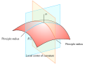


## Capillary force: water droplet situation

Nanoscale droplet will have excessive pressure!

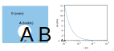


## Capillarity as driving force: high level description

The driving force from capillarity $\delta f$ is generally the energy
change caused by the volume swept out by the interface, so that

```{=tex}
\begin{align}
\delta f = \gamma (\kappa_1 + \kappa_2)
\end{align}	   
```

The driving force has 2 factors:

- non-zero surface energy $\gamma$: 
- curvatures $\kappa_1$, $\kappa_2$ ($\propto 1/R$)

## Coarsening (Ostwald Ripening)

The evolution of an inhomogeneous structure in a solid
solution or a colloidal system (stages III and IV)

- **Feature**: small particulates dissolve,
and redeposit onto large particulates.
- **Driving force**: minimization of total interfacial energy.
- **Mass transport**: driven by curvature-dependent surface
potential.
- **Size** and **number** of particles change with time.

## Classical mean-field theory of coarsening

- Most prominent theory LSW theory (**L**ifshitz-**S**lyozov-**W**agner, 1961)
- Spherical $\beta$ particles embedded in $\alpha$ matrix in A-B mixture

:::{.columns}
:::{.column width="50%"}
Key take-aways:

1. Eq. concentration at interface: increase on smaller particles
2. B atoms: small particle --> matrix --> large particle
3. Smaller particles shrink; larger particles grow
:::

:::{.column width="50%"}

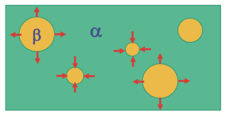
:::

:::

## Influence of curvature on free energy: Gibbs-Thompson effect

From our baloon analog, curvature-induced pressure for an isotropic sphere is:

$$
\Delta p = p_A - p_B = \gamma(\kappa_1 + \kappa_2) = 2 \frac{\gamma}{R}
$$

By adding an B particle in to the $\beta$ phase, the change of volume is $\Omega_B$ and there is an increase of free energy $2 \frac{\gamma \Omega_B}{R}$. The interfacial concentration $c_B^{\text{eq}}(R)$ is then higher than $c_B^{\text{eq}}(\infty)$

```{=tex}
\begin{align}
c_B^{\text{eq}}(R) &= c_B^{\text{eq}}(\infty) \exp(\frac{2 \gamma\Omega}{k_B T R}) \\
&\approx c_B^{\text{eq}}(\infty) \left[ \exp(\frac{2 \gamma\Omega}{k_B T R})\right]
\end{align}	   
```

This is known as the Gibbs-Thompson effect

## Gibbs-Thompson effect in a phase diagram

- Gibbs-Thompson effect will shift $\mu_B$ to higher values when particles are smaller
- Difference between interfacial concentration creates a diffusion field!

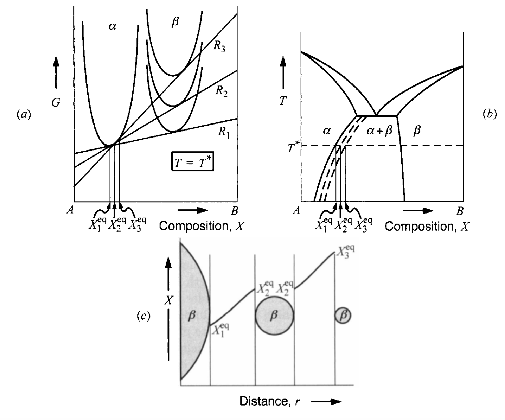

## LSW theory: the particle distribution picture

Similar to the nucleation theory where $J_n$ measures the flux of
particle size distribution function $N(n, t)$, we're also interested
in the particle size distribution over time, $f(R, t)$, with following components


- distribution (density) function of particle size $R$: $f(R, t)$
- radial particle density between $R \to R+dR$: $dN(R\to R+dR, t) = f(R, t)dR$
- conservation of volume: $\sum_i R_i^2 \dfrac{dR_i}{dt} = 0$

## The radial distribution function

Compare with the quasi-steady state picture of nucleation in [Lecture
14](../L14). The R has no cutoff compared with the QSS treatment in
constrained growth.

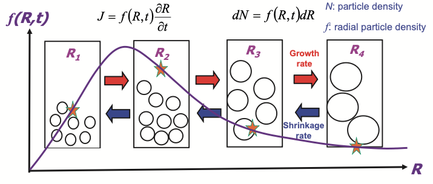

## Diffusion-controlled coarsening kinetics

In the diffusion-controlled regime of coarsening, the rate of growth for particles is associated with the surface flux from excess concentration to the bulk.

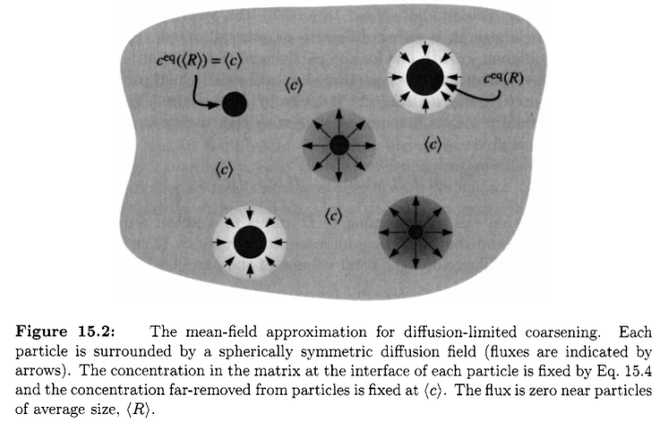

## Rate equations in diffusion-controlled regime

- Growth rate from flux onto a sphere

$$
\frac{dR}{dt} = - \tilde{D} \frac{(c^{\text{eq}}(R) - <c>)}{R}\omega_B
$$

- Excess surface concentration:

$$
c_B^{\text{eq}}(R) \approx c_B^{\text{eq}}(\infty) \left[ \exp(\frac{2 \gamma\Omega}{k_B T R})\right]
$$

- Conservation

$$
\sum_i R(c^{\text{eq}}(R) - <c>) = 0
$$

## Diffusion-controlled regime: final results

The growth rate at each $R$ is:

```{=tex}
\begin{align}
\frac{d R}{d t} &=
\frac{2 \tilde{D} \gamma \Omega_B^2 c^{\text{eq}}(\infty)}{k_B T R}
\left(\frac{1}{<R>} - \frac{1}{R}\right)
\end{align}
```

- $<R>$: average radius of particles. $f(<R>) = 0$
- $R < <R>$: $dR/dt<0$ 👉 shrink!
- $R_{\text{max}} = 2 <R>$

## The steady-state particle size distribution

The radius distribution has a very nice feature that even if $<R>$
grows over time, at steady state, the normalized radius $R/<R>$ has
the same distribution:

- most frequent size $R \approx 1.13 <R>$
- no particle larger than $1.5<R>$ (cutoff)

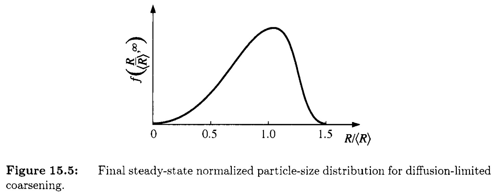

## Diffusion-controlled regime rate law

**Power-of-3** law: particle size growth rate

```{=tex}
\begin{align}
<R(t)>^3 - <R(0)>^3 = \frac{8 \tilde{D} \gamma \Omega^2 c^{\text{eq}}(\infty)}{9 kB T} = K_D t
\end{align}
```

See previous example of Pb-Sn alloy

## Source-limited growth regime

Another regime is the source-limited coarsening. Diffusion in matrix is very fast and rate limiting step is the source / sink at interface. 

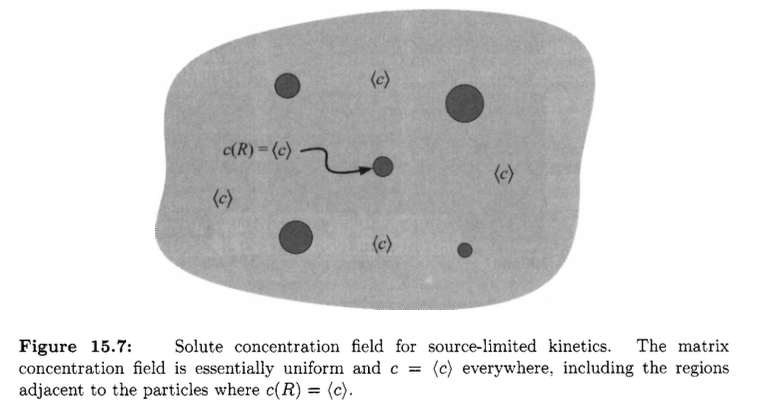

## Source-limited growth: change of formula

Again, we have curvature-dependent interfacial concentration difference, but the growth rate is purely controlled by the concentration difference!

$$
\frac{d R}{d t} = \frac{2 K c^{\text{eq}}(\infty) \Omega^2 \gamma}{k_B T}
(\frac{<R>}{<R^2>} - \frac{1}{R})
$$

- Particle will shrink if $R < <R^2>/<R>$

## Source-limited growth: change of power law

For source-limited growth, we will have the radius grow in a **power-of-2** fashion

$$
<R^{2}(t)> - <R^{2}(0)>  = K_D t
$$

## Summary

- Driving force for coarsening: capillarity (surface energy + curvature)
- Key take away from coarsening: particle growth kinetics & size distribution
- Diffusion and rate-limit regimes