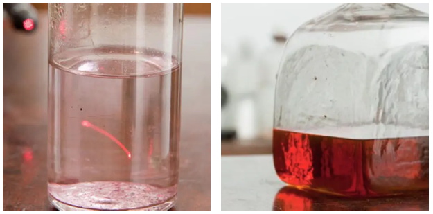
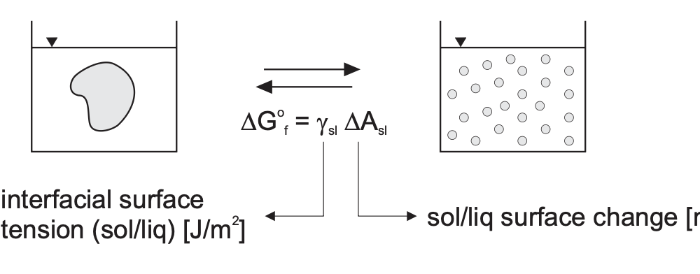
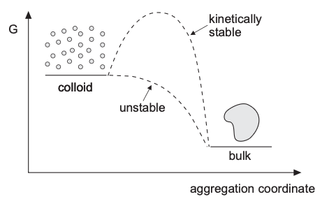
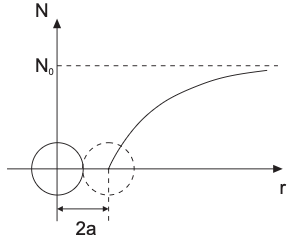
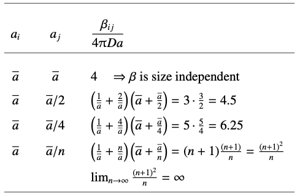
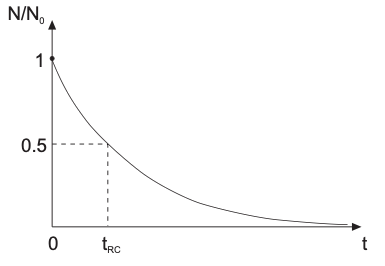
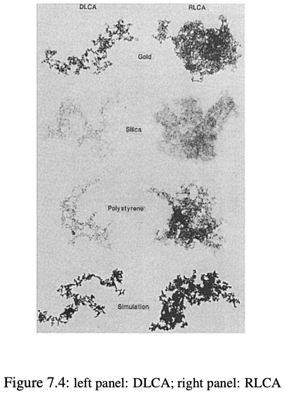
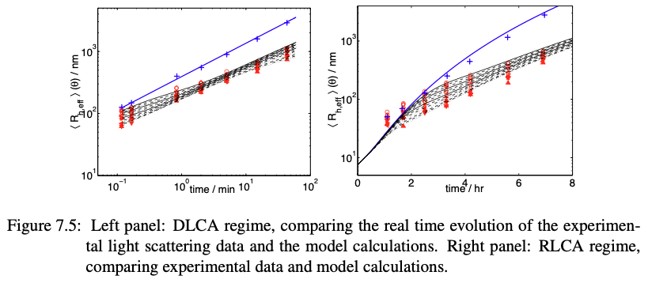

::: {.content-visible when-format="html" unless-format="revealjs"}

::: {.callout-note}
- Slides 👉  [Open presentation🗒️](./slides.html)
- PDF version of course note  👉 [Open in pdf](./L18.pdf)
- Handwritten notes 👉 [Open in pdf](./public/L18_annotated.pdf)
:::

:::


## Learning outcomes {.center}

After this lecture, you will be able to:

- **Describe** the thermodynamic and kinetic stability of colloids
- **Recall** the balance between thermodynamic and kinetic factors
- **Identify** aggregation phenomena in colloids, including DLCA and RLCA
- **Analyze** the dimensionality of DLCA and RLCA aggregates
- **Describe** the stability and kinetic barrier of charged colloids

## Recap: surface-energy related growth mechanism

We studied **coarsening** in last lecture, with key features:

1. Surface energy $\gamma$ and curvature $\kappa$ 👉 increase of free energy
2. Meanfield theory (LSW): 👉 radius $R \downarrow \quad \rightarrow \quad c^{\text{eq}}(R) \uparrow$
3. Thermodynamic driving force: reducing total area $A$ ↔ reducing $\mu_B$
4. Kinetic counter-balancing effect: $R$ compared with $\langle R \rangle$?
5. Competing factors: diffusion ($\langle R \rangle \propto t^{1/3}$) and reaction ($\langle R^{2} \rangle/\langle R \rangle \propto t^{1/2}$)
5. Coarsening size distribution $f(R, t)$ has self-similarity across different length scales!

## Growth mechanism in colloids

Colloids serve as a good platform for studying the kinetic phenomena
we learned in this course:

- Stability: colloids may be thermodynamically unstable but kinetically stable (why?)
- Growth: can we use our kinetic theory of **coarsening** to predict size distribution of colloidal particles?
- Aggregation: similar to the **coalescence** in solid materials, how do colloidal particles merge with each other?

## Colloidal example 1: Faraday's gold solution

In 1850s, Faraday found that chemical treatment of thin gold films
produced **ruby** colored liquid that **scattered** light. The liquid,
kept in the basement of the Faraday Museum in London, is still stable
up to toady!



## Colloidal example 2: milk curdling / casein coagulation

All the cheese we eat today comes from the same procedure when the
colloidal suspension in milk **aggregates** into a dense cluster due
to lactic acid produced by bacteria.


## The stability statement of colloids

Making a bulk material (solid-state or polymer) into small particles increases the total surface area. The thermodynamic stability is determined solely by $\gamma_{SL}$

- $\gamma_{SL} > 0$: unstable colloid state (lyophobic). E.g. Faraday's solution
- $\gamma_{SL} < 0$: colloid state (lyophilic). E.g. micelles



## Topic 1: how can unstable colloids become kinetically stable?

Lyophobic (unstable) colloids can be made kinetically stable by
building an **energy barrier** sufficiently large with respect to $k_BT$.

:::{.columns}
:::{.column width="50%"}

Two stabilization mechanisms are
possible:

- electrostatic: the particles are electrically charged (DLVO theory)
- steric: the particles are coated with some material (e.g. polymer) which prevents their close approach.

:::

:::{.column width="50%"}



:::
:::

## Topic 2: how do unstable colloids aggregate?

If the repulsive interactions between the particles are not strong
enough to prevent coalscence, we will end up with the aggregation
phenomenon, very similar to the coarsening:

- Diffusion limited colloidal aggregation (**DLCA**): particles will interact with each other instantly, but flux will be limited by the diffusion

- Reaction limited colloidal aggregation (**RLCA**): particles movement in solution is much faster, and limited by probability of sticking to each other

We will discuss about DLCA vs RLCA first in this lecture.

## Prelude: mean-field treatment of colloid aggregation

Before solving the aggregation of larger particles, let's first
consider **how fast** individual particles stick to each other in the
diffusion-limited regime.

:::{.columns}
:::{.column width="50%"}

Mean-field treatment, assume steady radial flux:

- far away: bulk number concentration $N_0$
- at contact: particles are absorbed $N < N_0$

:::

:::{.column width="50%"}



:::
:::

## Mean-field two-particle picture: flux equations

Smoluchowski gave an expression for the two-particle aggregation flux $F$,
with mutual diffusivity $D_{11}$ between size-1 particles.

```{=tex}
\begin{align}
F &= 4 \pi r^2 D_{11}\frac{dN}{dr} \\
D_{11} &= 2D
\end{align}
```

## DLCA rate constant for primary particles

At contact, if all incoming particles are absolbed, the number density
at contact distance $R_{11}$ follows $N(R_{11})=0$, giving the result

```{=tex}
\begin{align}
F &= 4 \pi D_{11} R_{11} N_0 \\
\beta_{11} &= 4 \pi D_{11} R_{11}
\end{align}
```

For equal spheres with radius $a$, we have $R_{11} = 2 a$, the
coefficient $\beta_{11}$ becomes:

```{=tex}
\begin{align}
\beta_{11} &= 16 \pi D a
\end{align}
```

## Two-particle aggregation rate equation (1)

Since the particles are moving in liquid, **Stokes-Einstein equation**
can be used to express single-particle $D$:

```{=tex}
\begin{align}
D &= \frac{kT}{6\pi\eta a}
\end{align}
```

We get the coefficient $\beta_{11}$ to be independent of size

```{=tex}
\begin{align}
\beta_{11}^{\mathrm{DLCA}} &= \frac{8kT}{3\eta}
\end{align}
```

## Two-particle aggregation rate equation (2)

The number concentration flux $F$ (unit s$^{-1}$) tells how frequent a
foreign particles enters the perimeter of the primary one. The total
number of aggregated particles per second, $R_{\text{agg}}^{0}$ follows:

```{=tex}
\begin{align}
R_{\text{agg}}^{0} &= - \frac{1}{2}N_0 F \\
&= -\frac{1}{2} 4 \pi D R_{11} N_0^2 \\
&= -\frac{1}{2}\beta_{11} N_0^2
\end{align}
```

- The factor $1/2$ counts for de-duplication
- $R_{\text{agg}}^{0} \propto \beta_{11} N_0^2$: looks like a second-order kinetic rate reaction

## Key DLCA message

- $\beta_{11}^{\mathrm{DLCA}}$ is independent of particle size
- aggregation is controlled by thermal transport and viscosity
- the faster the diffusion, the faster the coagulation
- this gives a natural **upper bound** for aggregation kinetics

## Size dependence for unequal particles

If particle $i$ and $j$ have unequal radii $R_i$ and $R_j$, $\beta_{ij}$ becomes:

```{=tex}
\begin{align}
\beta_{ij}
&= 4\pi (D_i + D_j)(R_i + R_j) \\
&= \frac{2k_B T}{3\eta}
\left(R_i + R_j\right)
\left(\frac{1}{R_i} + \frac{1}{R_j}\right)
\end{align}
```

- "aggregation coefficient" $\beta_{ij}$ depends on the particle size ratio!
- $\beta_{ij}$ rank: large-small > large-large ~ small-small (why?)

## DLCA rate constant: size mismatch

Assume the primary size $a_i$ is constant, reducing $a_j$ will
monotonically crease the coefficient (favour large-small)



- this indicates the DLCA cluster shape may be very sparse (see later)

## From pair collisions to a population balance

Let $N_k$ be the number concentration of clusters of mass $k$, how do
each cluster change over time (similar to the coarsening case)?

- Smoluchowski population balance equation

```{=tex}
\begin{align}
\frac{dN_k}{dt}
=
\frac{1}{2}\sum_{i=1}^{k-1}\beta_{i,k-i}N_i N_{k-i}
-
N_k\sum_{i=1}^{\infty}\beta_{ik}N_i
\end{align}
```

- first term: birth of clusters of size $k$
- second term: loss of clusters of size $k$

## Constant-kernel DLCA result ($\beta_{ij}=\beta_{11}$)

If $\beta_{ij} = \beta_{11}$ is constant, then the total number concentration ($N = \sum N_k$) obeys

```{=tex}
\begin{align}
\frac{dN}{dt}
&=
-\frac{1}{2}\beta_{11}N^2
\end{align}
```

that looks like our two-particle solution, with the total number of
particles decrease over time:

```{=tex}
\begin{align}
\frac{1}{N}
=
\frac{1}{N_0}
+
\frac{\beta_{11}}{2}t
\end{align}
```

## Characteristic coagulation time scale

Since the population balance follows a second-order reaction $N/N_0
\propto t^{-1}$, the characteristic time for rapid aggregation
$\tau_{\mathrm{RC}}$ follows (usually in milliseconds):

```{=tex}
\begin{align}
\tau_{\mathrm{RC}}
&=
\frac{2}{\beta_{11}N_0} \\
&= \frac{3\eta}{4k_B T\,N_0}
\end{align}
```



## Comments on the time scale

- In constant $\beta_{ij}$ treatment, $\tau_{\mathrm{RC}}$ can be approximated by:

$$
\tau_{\mathrm{RC}} = \frac{3\eta}{4k_B T N_0} \approx 2 \times{} 10^{11} \frac{1}{N_0}\quad \text([s])
$$

- Usually for solid volume percentage <10%, $\tau_{\text{RC}}$ is in milliseconds
- Population decay for different masses

```{=tex}
  \begin{align}
N_k
=
\frac{N_0\left(t/\tau_{text{RC}}\right)^{k-1}}
{\left(1+t/\tau_{text{RC}}\right)^{k+1}}
\end{align}
```

## What's missing in the current picture?

- $\beta_{ij}$ treatment, is it really constant?
- morphology matters: aggregated clusters contain voids
- the shape of a cluster may not be a sphere!

We can solve these problem by introducing the **fractal dimensionality** $d_f$, so

```{=tex}
\begin{align}
R_i \sim i^{1/d_f}
\end{align}
```

Ideal case for sphere: $d_f = 3$. We will see the $d_f$ distinguishes
the DLCA and RLCA regimes.

## DLCA radius law and kernel with fractal clusters

Rationale: we want to study the population distribution with mass $i$, $j$, and use $d_f$ to link them to the $\beta_{ij}$

```{=tex}
\begin{align}
\beta_{ij}^{\mathrm{DLCA}}
=
\frac{2k_B T}{3\eta}
\left(i^{1/d_f}+j^{1/d_f}\right)
\left(i^{-1/d_f}+j^{-1/d_f}\right)
\end{align}
```

- the radius-mass relation is the bridge from structure to kinetics
- this is the key extension beyond the constant-$\beta$ model

## DLCA scaling law with fractal dimensionality

Remember we're interested in the scaling between size $R$ and its power law scaling to time $t$ (like in coarsening), a useful scaling follows:

```{=tex}
\begin{align}
\langle R \rangle \sim t^{1/d_f}
\end{align}
```

- open clusters grow with a power law in time
- measuring $\langle R_h \rangle$ vs. $t$ gives access to $d_f$
- typical DLCA clusters are **loose**

## Enter RLCA: a kinetic barrier appears

- Particles still diffuse toward each other
- A repulsive interaction creates a barrier in the total potential
- Collision becomes probabilistic (different rate law)

## General picture of kinetic barrier in diffusion potential field

For a external potential $V_{T}$ on the particle, the diffusion
potential contains both chemical and external potentials:

```{=tex}
\begin{align}
F
=
4\pi r^2 D_{11}
\left(
\frac{dN}{dr}
+
\frac{N}{k_B T}\frac{dV_T}{dr}
\right)
\end{align}
```

- $DLCA$ is simply $V_T$ has no barrier
- $RLCA$ comes into play when $V_T$ as a maximum

## Fuchs stability ratio

The reduction of aggregation rate between DLCA and RLCA is measured by

```{=tex}
\begin{align}
W
&=
\frac{\beta_{11}^{\mathrm{DLCA}}}{\beta_{11}} \\
&=
2a\int_{2a}^{\infty}
\exp\left(\frac{V_T}{kT}\right)\frac{dr}{r^2}
\end{align}
```

which is just

```{=tex}
\begin{align}
\beta_{11}^{\mathrm{RLCA}}
=
\frac{\beta_{11}^{\mathrm{DLCA}}}{W}
\end{align}
```

## Barrier sensitivity in RLCA

A common approximation for the Fuchs stability ratio $W$ is:

```{=tex}
\begin{align}
W
\approx
\frac{1}{2\kappa a}
\exp\left(\frac{V_{T,\max}}{k_B T}\right)
\end{align}
```

- a modest barrier in $V_T$ is enough to alter the kinetics!
- how do we change the barrier? DLVO theory (next lecture)

## Fractal dimensionality in RLCA

A useful form for RLCA aggregation constant is

```{=tex}
\begin{align}
\beta_{ij}
=
\frac{\beta_{ij}^{\mathrm{DLCA}}}{W}
(i j)^{\lambda}
\end{align}
```

with

```{=tex}
\begin{align}
\lambda = \frac{d_f - 1}{d_f}
\end{align}
```

For RLCA when $d_f \approx 2$, $\lambda \approx 0.5$

## DLCA vs RLCA: rate comparison

Physical consequence of the RLCA kernel

:::{.columns}
:::{.column width="50%"}

DLCA

- $W \approx 1$
- $\lambda = 0$
- equal-size aggregation rate is nearly mass independent
- big-small collisions are favored

:::

:::{.column width="50%"}

RLCA

- $W \gg 1$
- $\lambda \approx 0.5$
- equal-size aggregation rate increases with mass
- big-big aggregation becomes more important

:::

:::

## DLCA vs RLCA: structural comparison

A rule of thumb for the dimensionality $d_f$ in polymer colloids

- DLCA: $d_f \approx 1.6 - 1.9$
- RLCA: $d_f \approx 2.0 - 2.2$



## DLCA vs RLCA: time evolution




## Summary

- DLCA and RLCA describe two limiting kinetic regimes of colloid aggregation
- Population-balance and two-particle models connect diffusion, sticking probability, and aggregation rate
- A kinetic barrier can strongly slow aggregation and sets up the need for DLVO theory
