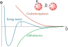
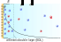
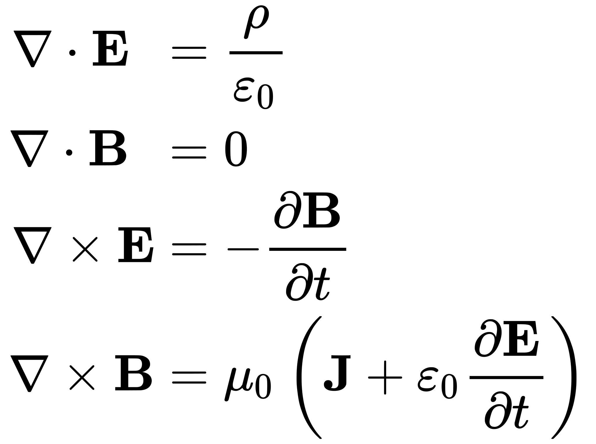
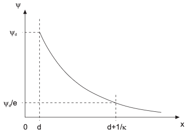
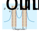

::: {.content-visible when-format="html" unless-format="revealjs"}

::: {.callout-note}
- Slides 👉  [Open presentation🗒️](./slides.html)
- PDF version of course note  👉 [Open in pdf](./L19.pdf)
- Handwritten notes 👉 [Open in pdf](./public/L19_annotated.pdf)
:::

:::


## Learning outcomes {.center}

After this lecture, you will be able to:

- Explain why a thermodynamically unstable colloid may still remain dispersed
- Describe the physical origin of van der Waals attraction and double-layer repulsion
- Use the Poisson-Boltzmann equation and its boundary conditions for a charged interface
- Recall the Debye length and the role of ionic strength
- State the DLVO interaction potential and interpret the barrier height
- Connect DLVO theory to the RLCA picture from last lecture


## Recap: why did RLCA become slow?

Last lecture, we introduced a kinetic barrier through the external potential $V_T$:

```{=tex}
\begin{align}
F
=
4\pi r^2 D_{11}
\left(
\frac{dN}{dr}
+
\frac{N}{k_B T}\frac{dV_T}{dr}
\right)
\end{align}
```

and the Fuchs stability ratio

```{=tex}
\begin{align}
W
=
\frac{\beta_{11}^{\mathrm{DLCA}}}{\beta_{11}^{\mathrm{RLCA}}}
\end{align}
```

## The missing question

When we introduce the external potential $V_T$ (and $W$) we show the RLCA rate is slower, but why?

- what determines $V_T(r)$?
- why does a barrier appear?
- how can salt destroy the barrier?

## Today: physical origin of kinetic stability

**D**erjaguin, **L**andau, **V**erwey, and **O**verbeek (DLVO) theory:
  For charged colloids, the total interaction potential comes from two
  competing effects:

- attractive van der Waals interaction
- repulsive electrostatic double-layer interaction

DLVO theory combines them into one total potential.

\begin{align}
V_T(h)
=
V_{\mathrm{vdW}}(h)
+
V_{\mathrm{el}}(h)
\end{align}

where $h$ is the surface-to-surface separation.

## Stability statement revisited

From [Lecture 18](../L18), a **lyophobic** colloid remains only
metastable. The dispersed state has higher free energy than the
aggregated state, but aggregation may be delayed if particles must
overcome a barrier.

:::{.columns}
:::{.column width=“50%”}

Key idea:

- thermodynamics favors aggregation
- kinetics may prevent close contact
- barrier height should be compared with $k_B T$

:::

:::{.column width=“50%”}


:::
:::

## What should the DLVO curve look like?

A typical interaction curve contains (how do they come)?

- a deep primary minimum at very short range
- a repulsive maximum at intermediate separation
- sometimes a shallow secondary minimum at larger separation



## Topic 1: electrostatic double layer around a charged particle

A charged solid surface in electrolyte attracts counterions and repels
coions. This creates the electrical double layer:




## Electrostatic potential from Poisson equation

The potential field $\psi$ in a dielectric medium satisfies Poisson equation (one of Maxwell's equations)

:::{.columns}
:::{.column width="50%"}

```{=tex}
\begin{align}
\nabla^2 \psi
=
-\frac{\rho}{\varepsilon_r \varepsilon_0}
\end{align}
```


- $\rho$: local charge density
- $\varepsilon_r \varepsilon_0$: permittivity of the liquid

:::

:::{.column width="50%"}

{width="450px"}
:::

:::


## Ion distribution from Boltzmann statistics

For ion species $i$ with valence $z_i$, the equilibrium concentration follows

```{=tex}
\begin{align}
n_i
=
n_{i,\infty}
\exp
\left(
-\frac{z_i e \psi}{k_B T}
\right)
\end{align}
```

Hence the charge density $\rho$ in Poisson equation is

```{=tex}
\begin{align}
\rho
=
\sum_i z_i e n_i
=
\sum_i z_i e n_{i,\infty}
\exp
\left(
-\frac{z_i e \psi}{k_B T}
\right)
\end{align}
```

Linking this to the Poisson equation gives the Poisson-Boltzmann (PB) equation


## Poisson-Boltzmann equation

Combining Poisson and Boltzmann gives the nonlinear PB equation

```{=tex}
\begin{align}
\nabla^2 \psi
=
-\frac{1}{\varepsilon_r \varepsilon_0}
\sum_i z_i e n_{i,\infty}
\exp
\left(
-\frac{z_i e \psi}{k_B T}
\right)
\end{align}
```

For a symmetric electrolyte and planar geometry, this becomes the standard 1D form.

## Solution to the PB Equation: Planar geometry and boundary conditions

Take $x$ normal to a flat charged surface. Far from the surface, the solution must recover bulk electroneutrality:

```{=tex}
\begin{align}
\psi(x \rightarrow \infty) &= 0 \\
\frac{d\psi}{dx}(x \rightarrow \infty) &= 0
\end{align}
```

At the surface, two common boundary conditions are used.

## Boundary condition 1: constant surface potential 

If the surface potential can be predetermined (like zeta-potential
measurements), then

```{=tex}
\begin{align}
\psi(0) = \psi_0
\end{align}
```

This is often used when adsorption or surface chemistry keeps the
interfacial potential nearly fixed.

## Boundary condition 2: constant surface charge

Using Gauss law, the electric field at the surface satisfies

```{=tex}
\begin{align}
\sigma
=
-\varepsilon_r \varepsilon_0
\frac{d\psi}{dx}\Big|_{x=0}
\end{align}
```

This is the constant-charge description, applicable to:

- more natural if surface groups are fixed (e.g. chemically modified)
- important when particle approach changes the local field

## Solution to Poisson-Boltzmann: Debye-Hückel linearization

If the potential is not too large,

```{=tex}
\begin{align}
\left|
\frac{z_i e \psi}{k_B T}
\right|
\ll 1
\end{align}
```

then the PB equation can be linearized, often called the Debye-Hückel (DH) approximation

```{=tex}
\begin{align}
\exp
\left(
-\frac{z_i e \psi}{k_B T}
\right)
\approx
1
-
\frac{z_i e \psi}{k_B T}
\end{align}
```


## Potential Profile in Debye-Hückel Approximation

The linearized equation in DH approximation becomes

```{=tex}
\begin{align}
\frac{d^2 \psi}{dx^2}
=
\kappa^2 \psi
\end{align}
```

We know from the diffusion concepts it is like a steady-state Fick's second law, but with external potential. The solution is a nice exponential decay of potential $\psi$

```{=tex}
\begin{align}
\psi(x)
=
\psi_0 e^{-\kappa x}
\end{align}
```

## Debye-Hückel Approximation: Screening Length

One consequence of the DH approximation is that the electrostatic
screening is related with the charge concentrations in the liquid:

```{=tex}
\begin{align}
\kappa^{-1}
&=
\left(
\frac{\varepsilon_r \varepsilon_0 k_B T}
{e^2 \sum n_{i, 0} z_i^2}
\right)^{1/2} \\
&=
\left(
\frac{\varepsilon_r \varepsilon_0 k_B T}
{2 e^2 N_a I}
\right)^{1/2}
\end{align}
```

where $N_a$ is the Avogadro number, and $I = 1/2 \sum_{i} z_{i}^{2}
c_{i, 0}$ is the ionic strength.

- high ionic strength $I$ $\rightarrow$ shorter screening length
- low ionic strength $I$ $\rightarrow$ longer-range repulsion

## In-Depth View of The Screening Length

From the Debye-Hückel Approximation, we typically can use the following handy rule:

$$
\kappa = 3.29 \sqrt{I} = 3.29 \sqrt{\frac{1}{2}\sum c_{i, 0} z_i^2}\qquad \text{[nm]}^{-1}
$$

when the solute concentration $c_{i, 0}$ is in mol/L. For
example, for a $10^{−3}$ M,  1:1 electrolyte, $1/\kappa = 9.6$ nm.

## Shape of Debye-Hückel Approximation

Where can I find the screening length $\kappa^{-1}$?



## Poisson-Boltzmann in High Potential Regime: Guy-Chapman Equation

The Debye–Hückel approximation assumes small potential

```{=tex}
\begin{align}
\left|\frac{ze\psi}{k_B T}\right| \ll 1
\end{align}
```

For a higher surface potential, the Gouy-Chapman (GC) equation is more accurate (exact solution for symmetric electrolyte.

```{=tex}
\begin{align}
\frac{d^{2} \psi}{dx^{2}} &= -\frac{zc_{0}e}{\varepsilon_{o} \varepsilon_{r}} 
                              \left[ \exp(-\frac{ze\psi}{k_{\mathrm{B}}T}) - \exp(\frac{ze\psi}{k_{\mathrm{B}}T})\right]\\
                          &= \frac{2zc_{0}e}{\varepsilon_{o} \varepsilon_{r}} \sinh\left(\frac{ze\psi}{k_{\mathrm{B}}T}\right)
\end{align}
```

Solution to the GC equation is:

$$
\frac{\tanh(ze\psi/4k_{\mathrm{B}}T)}{\tanh(ze\psi_{0}/4k_{\mathrm{B}}T)} = \exp(-\kappa x)
$$


## Repulsion between two charged plates

When two charged surfaces approach, their diffuse layers overlap. You
can imagine the charge-redistribution occurs between the two
surfaces. Let's first assume the charged surfaces are flat surfaces,
the overlay will cause **osmotic pressure**.



## The osmotic pressure

In an ideal electrolyte solution, the local osmotic pressure follows the Donnan equation

$$
P_{\mathrm{osmotic}}(x) = k_B T \left(c_{+}(x) + c_{-}(x)\right)
$$


## Force balance inside the double layer

Consider a differential volume element $dV$ located at position $x$.

The differential osmotic force acting on the element is

```{=tex}
\begin{align}
dF_{\mathrm{osmotic}}
=
\frac{dP_{\mathrm{osmotic}}}{dx} dV
\end{align}
```

## Solving the parallel charge plate: osmotic pressure

The equilibrium requires the electrostatic force and osmotic force
must balance at every position.

```{=tex}
\begin{align}
\frac{dP_{\mathrm{osmotic}}}{dx}
&=
\varepsilon_0\varepsilon_r
\frac{d^2\psi}{dx^2}
\frac{d\psi}{dx}
\\
&=
\frac{\varepsilon_0\varepsilon_r}{2}
\frac{d}{dx}
\left[
\left(\frac{d\psi}{dx}\right)^2
\right]
\end{align}
```

Since we know the solution to the Poisson-Boltzmann equation, integrating this will give us the total interaction energy.

## Repulsion between charged planes: final result

The repulsive potential energy $W_{\mathrm{R}}$ per unit area
between two charged particles at distance $h$ is then calculated as:

```{=tex}
\begin{align}
W_{\mathrm{R}}(h) &= -\int_{\infty}^{h} \frac{F_{\mathrm{R}}}{A} \mathrm{d} h' \\
                  &= 64 k T c_{0} \kappa^{-1} \Lambda_{0}^{2} e^{-\kappa h}
\end{align}
```

where $\Lambda_{0} = \tanh(\frac{z e \psi_{0}}{4k_{\mathrm{B}}T})$. Note we need to adjust for the particle
curvature if they are spheres.


## Why do we care about curvature?

The plate result is not yet the particle result. Real colloids are
spherical, so we must convert planar interaction into curved-particle
interaction. Derjaguin approximation calculates the electrostatic
repulsion between sphere particles by:

```{=tex}
\begin{align}
V(h)
=
2\pi R_{\mathrm{eff}} W(h)
\end{align}
```

where $W(h)$ is the interaction free energy per unit area between plates. This is our final solution 

## Effective curvature radius

For two particles of radii $a_1$ and $a_2$,

```{=tex}
\begin{align}
R_{\mathrm{eff}}
=
\frac{a_1 a_2}{a_1+a_2}
\end{align}
```

For equal particles, $a_1=a_2=a$:

```{=tex}
\begin{align}
R_{\mathrm{eff}} = \frac{a}{2}
\end{align}
```

- large particles have stronger total interaction
- curvature links plate theory to colloid kinetics

## Topic 1: final form

The repulsion between two spherical particles separated by $h$ under the Derjarguin approximation is

$$
V_{\mathrm{R}}^{\mathrm{ss}}(h)
= 64 \pi k_B T c_{0} R \kappa^{-2} \Lambda_{0}^{2} e^{-\kappa h}
$$

Such approximation is valid when:

- $R \gg h$, i.e. near the junction the surfaces from two particles are still considered as planar.
- $h \gg \kappa^{-1}$, i.e. small overlap between EDLs.

## Topic 2: van der Waals attraction

The attractive branch comes from fluctuating dipoles. At the molecular level, we have interaction between two particles following the $r^{-6}$ rule

```{=tex}
\begin{align}
u(r)
=
-\frac{C}{r^6}
\end{align}
```

Summing over all pair interactions between two bodies gives the macroscopic van der Waals interaction. The material dependence is collected into the Hamaker constant $A_H$.

## Simple van der Waals result for curved particles

For two spheres at small separation $h \ll a_1, a_2$,

```{=tex}
\begin{align}
V_{\mathrm{vdW}}(h)
=
-\frac{A_H R_{\mathrm{eff}}}{6h}
\end{align}
```

For equal particles with radius $a$,

```{=tex}
\begin{align}
V_{\mathrm{vdW}}(h)
=
-\frac{A_H a}{12h}
\end{align}
```

- attraction becomes very strong at small $h$
- this is the origin of the primary minimum

## DLVO total interaction potential

Putting both parts from repulsive electrostatics and attractive vdW
together gives the central DLVO expression:

```{=tex}
\begin{align}
V_T(h)
=
-\frac{A_H R_{\mathrm{eff}}}{6h}
+
B R_{\mathrm{eff}} e^{-\kappa h}
\end{align}
```

## DLVO kinetic barrier

This single curve explains both stabilization and aggregation.


## Barrier criterion for kinetic stability

The key quantity is the maximum barrier height $V_{T,\max}$ in the DLVO curve.

- Stable regime

```{=tex}
\begin{align}
V_{T,\max} \gg k_B T
\end{align}
```

particle collisions usually do not lead to sticking.

- Unstable regime
```{=tex}
\begin{align}
V_{T,\max} \lesssim k_B T
\end{align}
```

then particles can cross the barrier and aggregate.

This is the physical origin of RLCA.

## Salt effect and critical coagulation concentration

Increasing salt compresses the double layer:

```{=tex}
\begin{align}
\kappa \propto I^{1/2}
\end{align}
```

Consequences:

- repulsion becomes shorter-ranged
- barrier height decreases
- aggregation rate increases

At a sufficiently high salt level, the barrier vanishes. This defines
the critical coagulation concentration.

## DLVO theory in the language of last lecture

In [Lecture 18](../L18) we wrote

```{=tex}
\begin{align}
\beta_{11}^{\mathrm{RLCA}}
=
\frac{\beta_{11}^{\mathrm{DLCA}}}{W}
\end{align}
```

and

```{=tex}
\begin{align}
W
\approx
\frac{1}{2\kappa a}
\exp
\left(
\frac{V_{T,\max}}{k_B T}
\right)
\end{align}
```

Now we can interpret this clearly:

- DLVO gives the potential $V_T(h)$
- the barrier maximum controls $W$
- $W$ then controls the slowdown from DLCA to RLCA


## What DLVO theory captures well

- electrostatic stabilization of lyophobic colloids
- salt-induced destabilization
- barrier-controlled transition from stable to aggregating
- connection between interparticle forces and kinetic rate constants

It is the simplest quantitative framework for charged colloidal stability.

## What is not included in simple DLVO?

DLVO is powerful, but not complete. Missing effects include:

- steric stabilization by adsorbed polymers
- hydration forces at very short range
- charge regulation during particle approach
- non-spherical rough particles
- specific ion effects

These extensions are often needed in real polymer and ceramic systems.

## Summary

- A colloid may be thermodynamically unstable but kinetically stable
- DLVO theory combines attraction and repulsion
- van der Waals attraction scales roughly as $-1/D$
- double-layer repulsion decays as $e^{-\kappa D}$
- the barrier height relative to $k_B T$ determines whether aggregation is DLCA-like or RLCA-like
- increasing salt lowers the barrier and promotes coagulation
