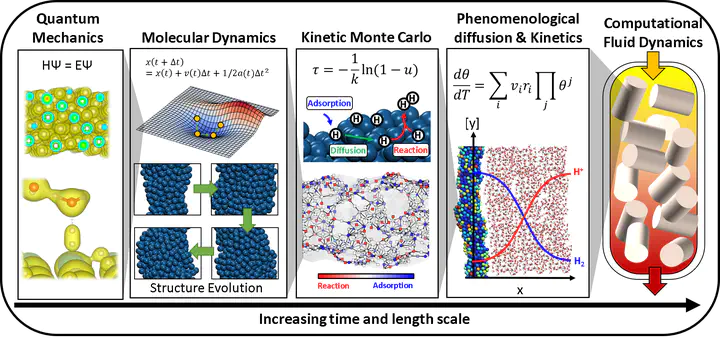
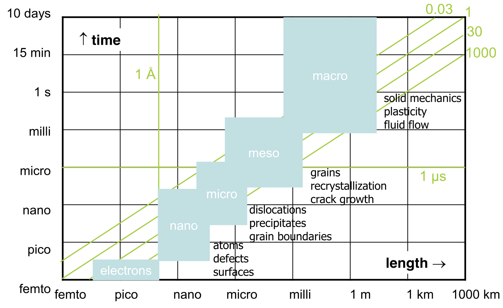
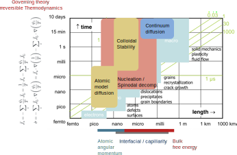
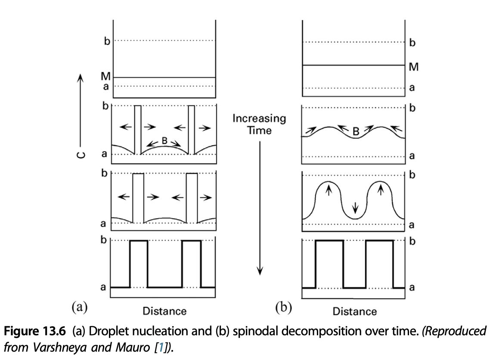
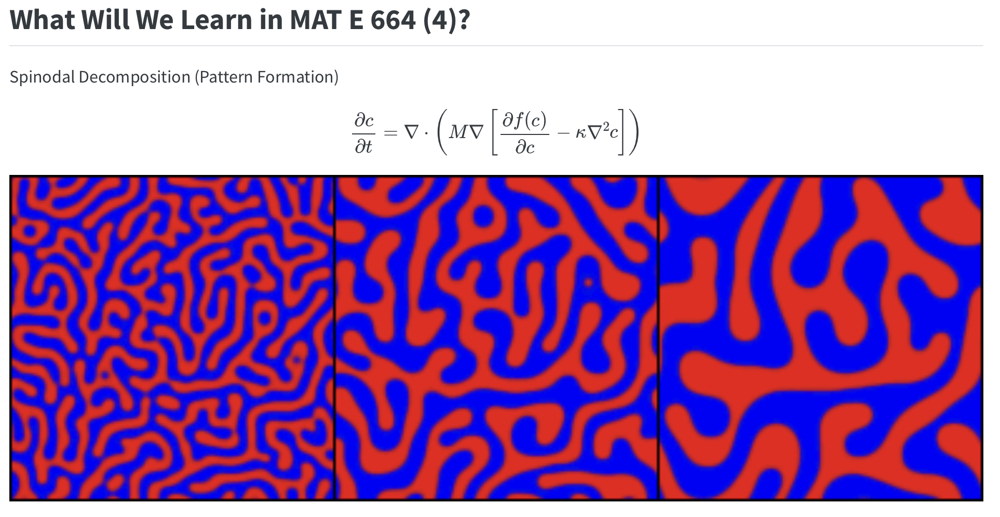
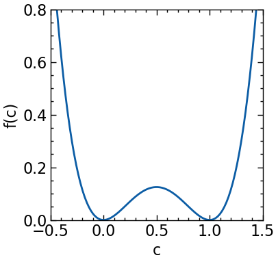
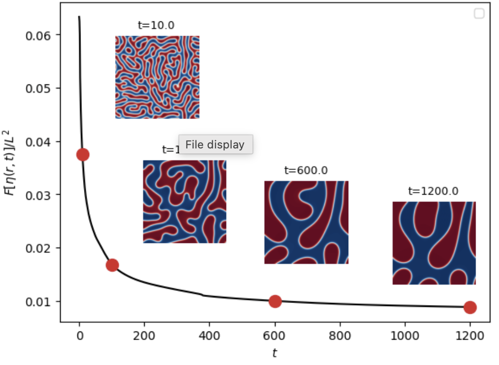
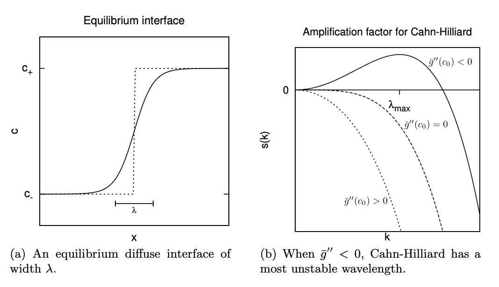
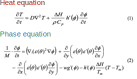

::: {.content-visible when-format="html" unless-format="revealjs"}

::: {.callout-note}
- Slides 👉  [Open presentation🗒️](./slides.html)
- PDF version of course note  👉 [Open in pdf](./L20.pdf)
- Handwritten notes 👉 [Open in pdf](./public/L20_annotated.pdf)
:::

:::

## Learning outcomes {.center}

After this lecture, you will be able to:

- **Recall** the basic idea of continuum modelling in materials kinetics
- **Identify** the main ingredients of the Cahn-Hilliard and phase-field frameworks
- **Describe** how free energy, mobility, and gradient penalty enter a continuum model
- **Interpret** what phase-field simulations can predict for microstructure evolution


## Why do we need material simulation?

- Modelling: how do we simplify the complex physical system?
- Simulation: how can the governing equation in a model evolve / be solved?


## Multiscale modelling of materials

How do simulation methods differ at length scales?



## Multiscale view in spatial and temporal domains



## Multiscale simulation in the context of kinetics



# Topic 1: Continuum Modelling -- Phase Field Method

## What are we talking about in continuum modelling?

- Macroscopic diffusion -- phenological diffusivity $D$ is known
- Phase transformation -- free energy of mixture system is known

Core equation: generalized Fick's second law

$$
\frac{\partial \xi}{\partial t} = - \nabla \cdot \vec{J}_\xi(f, \xi)
$$

## Case study: spinodal decomposition & nucleation

From [Lecture 16](../L16) we know that the nucleation and spinodal
decomposition of A-B mixture follows the same bulk free energy
landscape while the time dependent evolution is different. How do we model it?



## Target results

Review back to what we proposed in [Lecture 1](../L01). _Does this kind of image make sense?_



## Modelling step 1: check the governing equation

Problems suitable for continuum modelling typically have a clear
governing equation, with a few parameters determined at bulk level or
can be obtained from shorter-length scale simulations.

Can we identify the components for Cahn-Hilliard equation ([L16](../L16))?

```{=tex}
\begin{align}
\frac{\partial c_B}{\partial t} = M_0 \left[
\frac{\partial^2 f^{\text{homo}}}{\partial c_B^2}
\nabla^2 c_B
- 2 \kappa \nabla^4 c_B
\right]
\end{align}
```

## CH equation analysis

```{=tex}
\begin{align}
\frac{\partial c_B}{\partial t} = M_0 \left[
\frac{\partial^2 f^{\text{homo}}}{\partial c_B^2}
\nabla^2 c_B
- 2 \kappa \nabla^4 c_B
\right]
\end{align}
```

- $f^{\text{homo}}$ is the homogeneous Helmholtz free energy
- $M_0$ is the (non-negative) mobility under chemical potential driving force
- $\kappa$: interfacial penalty
- Total concentration $c_B$ and $c_A$ should be conserved

## Step 2: where do we get the free energy?

An easy choice of (homogeneous) Helmholtz free energy is the double well potential

```{=tex}
\begin{align}
f^{\text{homo}}(c_B) = W c_B^2 (1-c_B)^2
\end{align}
```

- two minima: two preferred equilibrium compositions $c_B=0$ and $c_B=1$
- barrier height set by $W$

## Free energy and spinodal regions

Can you locate:

- Spinodal decomposition regime?
- Nucleation region?



## From homogeneous to local free energy

In the Cahn-Hilliard equation the local free energy is defined

```{=tex}
\begin{align}
F(c_B) = \int_V \left[
f^{\text{homo}}(c_B) + \kappa |\nabla c_B|^2
\right] \mathrm{d}V
\end{align}
```

and subsequently we have a local chemical potential

```{=tex}
\begin{align}
\mu_B = \frac{\delta F}{\delta c_B}
=
\frac{\partial f^{\text{homo}}}{\partial c_B}
- 2\kappa \nabla^2 c_B
\end{align}
```

The CH equation is just a diffusion equation with $\nabla F(c_B)$ as the driving force.

## What are the empirical parameters?

```{=tex}
\begin{align}
\frac{\partial c_B}{\partial t} = M_0 \left[
\frac{\partial^2 f^{\text{homo}}}{\partial c_B^2}
\nabla^2 c_B
- 2 \kappa \nabla^4 c_B
\right]
\end{align}
```

For the simplest Cahn-Hilliard model, the key parameters are:

- $W$: height of the double-well free energy barrier
- $M_0$: mobility under chemical potential gradient
- $\kappa$: gradient-energy coefficient

If the form of $f^{\text{homo}}$ is fixed, this becomes a minimal 3-parameter model.

## How do we set up the simulation?

The Cahn-Hilliard equation can be regarded as a showcase PDE problem
in kinetics. In order to evolve the $c_B$ field, we can use

Real space method:

- Finite different (FD): as in [Lecture 8](../L08)
- Finite element / finite volume: different ways to discretize the spatial grid

Fourier space method:

- Pseudo-spectral method: convert the real-space modes into Fourier space 

## Real space approach (high level)

A practical form is to split the equation into concentration and chemical potential:

```{=tex}
\begin{align}
\frac{\partial c_B}{\partial t} &= \nabla \cdot \left(M \nabla \mu_B \right) \\
\mu_B &= \frac{\partial f^{\text{homo}}}{\partial c_B} - 2\kappa \nabla^2 c_B
\end{align}
```

- the general form is just to solve the Fick's second law with varying chemical potential space
- can use our existing FD code to update!

## Fourier space strategy (high level)

Instead of solving the spatial derivatives directly in real space, we
expand the concentration field into Fourier modes (the
separation-of-variable method in [Lecture 8](../L08)). Note the
notation $c$ just means $c_B$ in our previous case

```{=tex}
\begin{align}
c(\mathbf{r},t) = \sum_{\mathbf{k}} \hat{c}_{\mathbf{k}}(t)e^{i\mathbf{k}\cdot\mathbf{r}}
\end{align}
```

and the Fourier transform of the CH equation follows

```{=tex}
\begin{align}
\frac{\partial \hat{c}_{\mathbf{k}}}{\partial t} = M \left[
-k^2 \text{FT}[\frac{\partial f}{\partial c}] - \kappa k^4 \hat{c}_{\mathbf{k}}
\right]
\end{align}
```


- $\hat{c}_{\mathbf{k}}$  is the Fourier transformed $c$
- Benefit of F.T.: the $\nabla^2$ and $\nabla^4$ becomes just computing $k^2$ and $k^4$


::: {.content-visible when-format="html"}

## Example in action (1)

Adapted from [`PyCahnHilliard`](https://github.com/elvissoares/PyCahnHilliard/tree/master). Let's see how the parameters change the result?

- At spinodal top


## Example in action (2)


- More A phase


## Example in action (3)

- More B phase


:::

## Evolution over time

Under the same free energy profile, how does the pattern evolve? And why?



## Interactive tool to play with the CH equation

Can you identify the following phenomena from the CH equation simulation?

- Nucleation
- Spinodal decomposition
- Coarsening
- Aggregation / sintering


## Side note: CH equation interfacial thickness

The consequence of the CH equation is to have a **diffuse interface**,
characterized by the width $\lambda$:



## Side note: classical interfacial energy $\gamma$ from CH picture

- The interfacial width $\lambda$ is given by

$$
\lambda = \Delta c \sqrt{\frac{\kappa}{W}}
$$

where $W$ is the magnitude of the potential barrier

- The classical interfacial energy $\gamma$ follows

```{=tex}
\begin{align}
\gamma &= \kappa \frac{(\Delta  c)^2}{\lambda} \\
&= \Delta c \sqrt{\kappa W}
\end{align}
```

## What is the key message from Cahn-Hilliard?

- Thermodynamics enters through free energy $f^{\text{homo}}$ (controlled by $W$)
- Kinetics enters through mobility $M$
- Interface cost enters through gradient penalty ($\kappa |\nabla c|^2$)
- Morphology evolves **without explicitly setting interface**

This is the core idea behind the **phase field method**.

## From Cahn-Hilliard to phase field method

Cahn-Hilliard is one example of phase field modelling. General phase
field strategy:

- choose a field variable $\phi$ (the order parameter in [Lecture 13](../L13))
- write a total free energy functional $F(\phi, \cdots)$
- obtain a driving force from variational derivative
- evolve the field with suitable dynamics


## Why is phase field useful beyond this toy model?

- Moving interfaces do not need explicit tracking
- Morphology can be coupled to diffusion, stress, heat, or electrochemistry
- Suitable for realistic microstructure evolution problems

## Example of solidification process in phase field modelling

See  _J. Braz. Soc. Mech. Sci. & Eng._ 2011, 33, 125_.

- Heat transfer + phase transformation



## What are the results?

Phase field simulation results [yt video](https://www.youtube.com/watch?v=jYlUHtlk9pA)

## Examples of phase field applications

- spinodal decomposition in alloys
- precipitate growth and coarsening
- dendritic solidification
- grain growth
- stress-coupled phase separation
- lithium concentration evolution in battery particles

## Where to go next

The mathematical CH model does have a few parameters to be studied

- Free energy form?
- Free energy scale height?
- Molecular meaning of $\kappa$?
- Mobility $M_0$?

Not all continuum parameters can be predetermined --> get from simulations at other scales!


## Summary

- Continuum modelling uses field variables and governing equations to describe kinetic evolution
- The Cahn-Hilliard equation combines bulk free energy, mobility, and interfacial penalty
- Phase-field methods extend this idea to simulate evolving microstructures without explicit interface tracking
