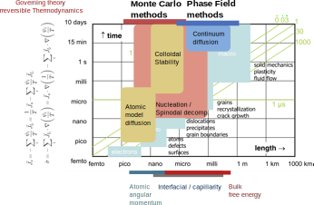
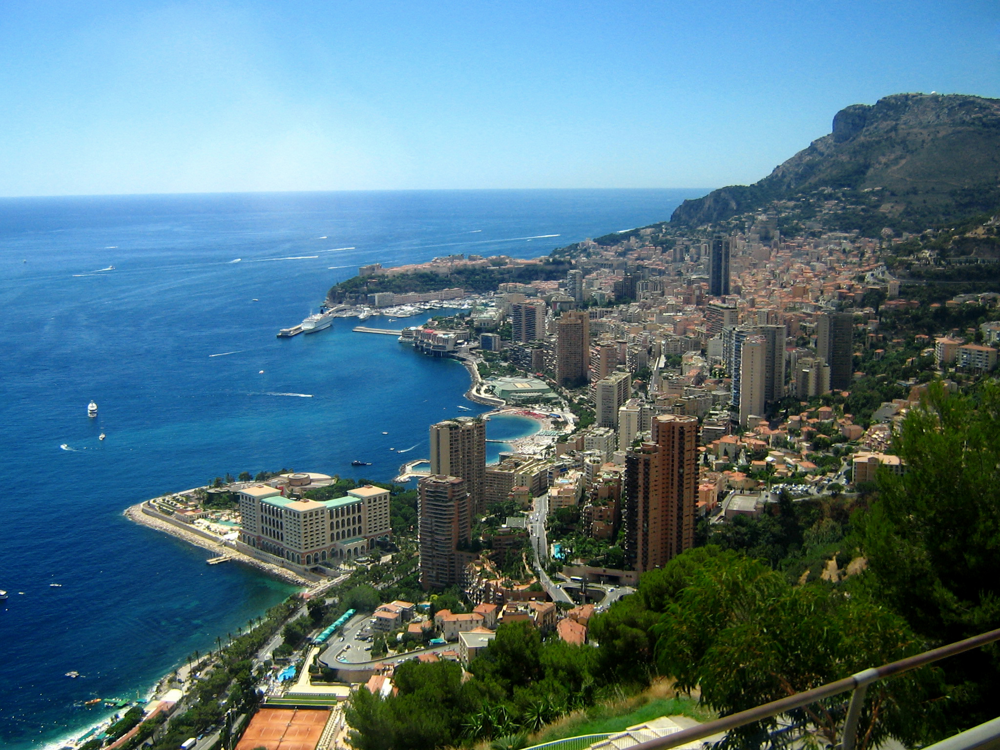
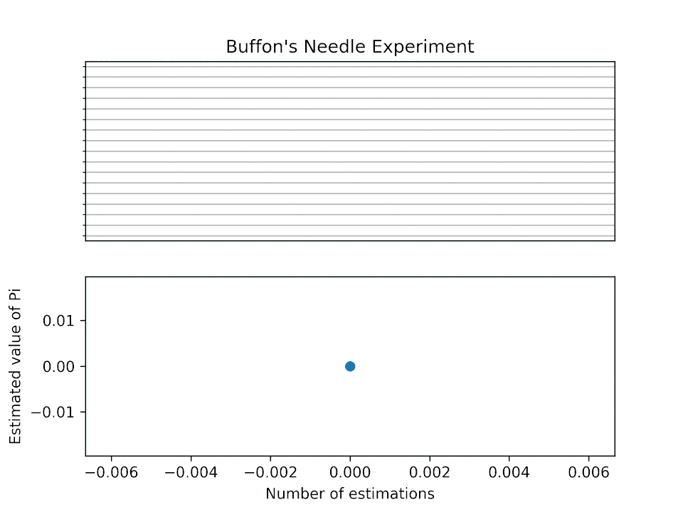
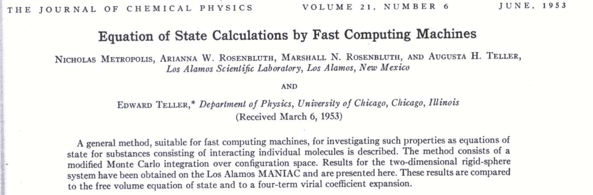
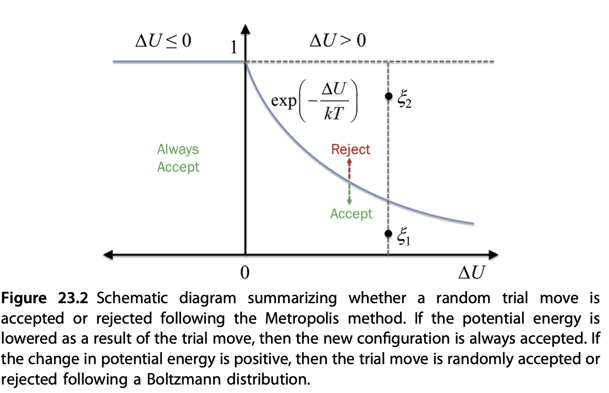
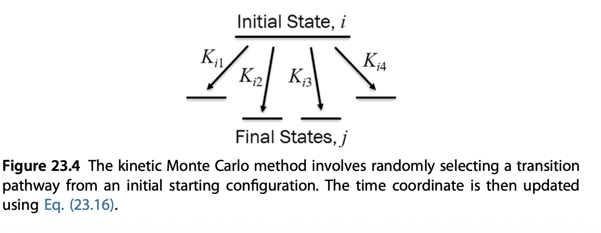
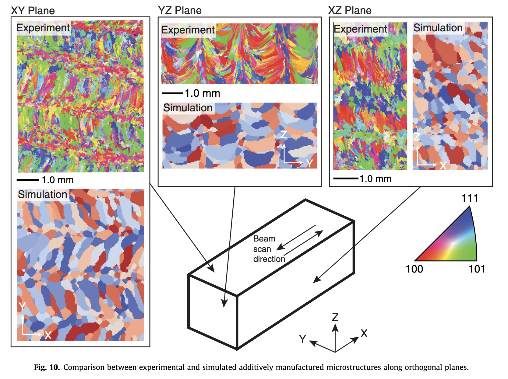

::: {.content-visible when-format="html" unless-format="revealjs"}

::: {.callout-note}
- Slides 👉  [Open presentation🗒️](./slides.html)
- PDF version of course note  👉 [Open in pdf](./L21.pdf)
- Handwritten notes 👉 [Open in pdf](./public/L21_annotated.pdf)
:::

:::

## Learning outcomes {.center}

After this lecture, you will be able to:

- **Recall** the basic idea behind Monte Carlo methods in materials science
- **Describe** how Metropolis Monte Carlo samples equilibrium configurations
- **Identify** the main steps in a kinetic Monte Carlo algorithm
- **Interpret** when Monte Carlo methods are useful compared with continuum and molecular dynamics approaches


## Recap: two ways for modelling large-scale motion in materials

- Continuum modelling / phase-field method: described by governing diffusion (Cahn-Hilliard type) equations
  - Example: derivation of Einstein relation of diffusivity
- Discrete / event-based method: describe system as discrete steps
  - Example: random walk model for diffusion
- Distinction:
  - Do we have a continuum description of properties?
  - Is probability easier to calculate?

## Recap: comparison between scales



## What is Monte Carlo method, anyway?

Monte Carlo (MC) methods describes a large set of stochastic methods
to perform sampling in a (usually) high-dimensional space.

:::{.columns}
:::{.column width="50%"}

- Monte Carlo is part of the Principality of Monaco renowned for casino, luxurious hotels etc 👉 statistical mechanism _was_ historically associated with gambling!
- First coined by von Neumann, Ulam, and Metropolis in Los Alamos to study neutron diffusion
- MC methods work surprisingly well for distribution in high-dimensional space, coupled with Bayesian statistics

:::

:::{.column width="50%"}

:::

:::

## Historical background for sampling-based method: Buffon's needle problem

[Buffon's needle problem](https://en.wikipedia.org/wiki/Buffon%27s_needle_problem) is one of the earliest demonstrations to estimate an unknown quantity (here $\pi$) via sampling. The probability of a needle with length $l$ intersecting parallel lines spaced at $d$ is:

$$
p = \frac{2}{\pi} \frac{l}{d}
$$

- How does the estimation work?
- Recently proposed method for finding $\pi$ using just [coin-flip](https://arxiv.org/abs/2602.14487)

::: {.content-visible when-format="html"}


## Buffon's needle problem: visualization

- How fast do the MC sampling converge?
- Can such integration be distributed over different systems?



:::

## Have we already seen a Monte Carlo simulation in our previous lectures?

Yes. The vacancy-mediated diffusion process ([Lecture 9](../L09) & [Assignment 2](../../scripts/EX02-demo-kirkendall.html)) shows this approach. We know that the macroscopic diffusion must follow the Fick's equation

$$
J_A = -\tilde{D}\nabla c_A
$$

and we can simulate the process (i.e. not knowing $\tilde{D}$) while
only caring about the probabilities that a vacancy exchanges with a
certain type of atom.

- Why are the probability picture and diffusion the same thing? 👉 See answers to Assignment 2

## What do Monte Carlo simulations solve?

The following are taken from Landau and Binder, _A Guide to Monte Carlo Simulations in Statistical Physics_, (Cambridge U. Press, Cambridge U.K., 2000).

> In a Monte Carlo simulation, we attempt to follow the ‘time
dependence’ of a model for which change, or growth, does not
proceed in some rigorously predefined fashion (e.g., according to
Newton’s equations of motion) but rather in a stochastic manner
which depends on a sequence of random numbers which is
generated during the simulation.

## Monte Carlo method vs molecular dynamics

The Monte Carlo (MD) method and Molecular Dynamics (MD) are both
simulation techniques in material science but can be easily confused.

**Similarity**

- Use of potential energy / force field: the energy difference in MC and MD may be coming from similar or even the same potential energy equations
- Molecular representation: both MC and MD may be used to study exact atomic positions (explicit atom models) or coarse-grained models (groups of atoms)
- Ensemble: can be used in both cases

**Difference**

- MD simulations follow Newton's equation
  - (Usually) fixed time steps
  - Calculation of forces (= gradient in energy) needed

- MC simulations use the probability between transitions
  - Can advance in varied time steps (kinetic MC)
  - Don't need to calculate momenta / forces

## Where does the probability come?

One main topic in the kinetics course is how to link the probability
of a system to a certain energy scale. For a property $A$ of interest,
in the canonical (NVT) ensemble of system, such distribution follows
the Boltzmann distribution

$$
\frac{p(A_i)}{p(A_j)} = \exp(- \frac{U_i - U_j}{k_B T})
$$

To estimate the expectation of $A$ in NVT ensemble, we are required to calculate:

$$
\langle A \rangle_{NVT} = \frac{\int_\Omega A \exp(- \frac{U}{k_B T}) d\mathrm{r}}
{\int_\Omega \exp(- \frac{U}{k_B T}) d\mathrm{r}}
$$

How do we compute the integrals?


## Mathematical form of Monte Carlo integration (I)

In the center of Monte Carlo methods, we are dealing with the integral
of some (presummably) high-dimensional function $f(\mathbf{x})$ on a
domain $\Omega=\{x_1, x_2, \cdots, x_n\}$, which can be transformed by
another probability density function $\rho(\mathbf{x})$

```{=tex}
\begin{align}
F &= \int_{\Omega} f(\mathbf{x}) d \mathbf{x} \\
  &= \int_{\Omega} \frac{f(\mathbf{x})}{\rho(\mathbf{x})} \rho(\mathbf{x}) d \mathbf{x}
\end{align}
```

and

$$
\rho(\mathbf{x}) \ge 0,
\qquad
\int_{\Omega} \rho(\mathbf{x})\, d\mathbf{x} = 1.
$$

## Mathematical form of Monte Carlo integration (II)

The integration problem for $F$ now effectively becomes to find the expection for $f / \rho$, when we draw samples $x$ from the distribution $\rho(x)$:

```{=tex}
\begin{align}
F &= \int_{\Omega} \frac{f(\mathbf{x})}{\rho(\mathbf{x})} \rho(\mathbf{x}) d \mathbf{x} \\
  &= E\left[ \frac{f(\xi)}{\rho(\xi)} \right]
\end{align}
```

When the distribution $\rho(x)$ is uniform, then we have

```{=tex}
\begin{align}
F \approx \frac{\Pi_{j=1}^{n} L_j }{N_{\text{trial}}} \sum_{i=1}^{N_{\text{trial}}} f(\xi_i)
\end{align}
```

where $L_i$ is the domain size in dimension $j$.

## Mathematical form of Monte Carlo integration (III)

Why does the Monte Carlo method work? Compare the two ways to calculate $F$

- $F$ by integration $F = \int_{\Omega} f(\mathbf{x}) d \mathbf{x}$
  - Requires at least $\text{npt}^n$ data points
  - Intractable in high-dimensional space

- $F$ by Monte Carlo sampling $F \approx \frac{\Pi_{j=1}^{n} L_j }{N_{\text{trial}}} \sum_{i=1}^{N_{\text{trial}}} f(\xi_i)$
  - Requiring ${N_{\text{trial}}}$ sampling steps
  - No exponential expansion with dimension (but may require convergence check)
  - Performance differ by the choice of $\rho$

## Statistical mechanics from MC perspective

The expectation value for $A$ in a statistical mechanics system using
a uniform sampling strategy is now:

$$
\langle A \rangle_{NVT} = \frac{\sum_i^{N_\text{trial}} A(\xi_i) \exp(- \frac{U(\xi_i)}{k_B T})}
{sum_{i}^{N_\text{trial}} \exp(- \frac{U(\xi_i)}{k_B T})}
$$

This is a powerful conclusion! Every single thermodynamic quantity in
the current ensemble can be estimated by random sampling. A long-enough MC simulation will eventually reveal the property.

Is this good enough?
](./public/monkey-type.jpg){width="300px" .absolute bottom=15 right=15}

## Problem with uniform-sampling Monte Carlo in materials simulations

The uniform-sampling MC method is not a feasible approach. There are a
very large number of configurations that would be randomly generated
that have effectively **zero Boltzmann weight** due to high-energy
overlaps between the particles.

- Most points in the phase space: high-energy configurations 👉 extremely low probability
- Low energy configurations: physically observed states 👉 extremely low phase-space density

The solution: importance sampling / Metropolis-Hastings algorithm

## The Metropolis-Hastings algorithm (I)

Originally proposed by Metropolis et al. in 1953 paper [Equation of
State Calculations by Fast Computing
Machines](https://pubs.aip.org/aip/jcp/article-abstract/21/6/1087/202680/Equation-of-State-Calculations-by-Fast-Computing?redirectedFrom=fulltext). This
is the basis of (almost) all MC sampling up to date:



## The Metropolis-Hastings algorithm (II)

Let's review the integral question again. Do we really need to use a
uniform probability distribution $\rho$, in systems that has Boltzmann
behavious?

$$
F = \int_{\Omega} \frac{f(\mathbf{x})}{\rho(\mathbf{x})} \rho(\mathbf{x}) d \mathbf{x}
$$

- Key idea: if $\rho(\mathbf{x})$ is close to the actual $f(\mathbf{x})$, the observed quantity during each sampling, $\frac{f(\mathbf{x})}{\rho(\mathbf{x})}$ has little variance
- Problem: we don't know what shape function $f$ looks like, so can just guess.
- The best guess we could have is just the Boltzmann distribution

$$
\frac{p(A_i)}{p(A_j)} = \exp(- \frac{U_i - U_j}{k_B T})
$$

## The Metropolis-Hastings algorithm (III)

Implementation of a Metropolis MC algorithm (in material science)

1. Choose a random configuration `old` $(x, y, z)$ coordinates of atoms
2. Generate a new configuration `new` by either moving randoml distance or shift by lattice grids
3. Generate a uniq random number $RN$
4. Calculate both potential energy $U_{\text{old}}$ and $U_{\text{new}}$
5. Accept the change if 

$$
RN < \exp(-\frac{U_{\text{new}} - U_{\text{old}}}{k_B T})
$$
6. Goto step 2 and repeat

## Metropolis MC: acceptance criteria



## The Metropolis-Hastings algorithm: implications

- States with lower energy are always picked
- States with higher energy will be sampled up to a probability

The example belows shows the Metropolic MC 1D random walk. Observe its behaviour when inside the probability "peaks" (potential wells)

:::{.content-visible when-format="html" }

:::

## Metropolis MC: finding equilibrium state

- The previous example shows that metropolis MC is able to find the
equilibrium state of a system, even if we started away from that.

- In contrast, standard molecular dynamics simulations are often hard to find other equilibria, if without proper biased sampling techniques

- Have we seen something similar in the lecture notes before?

## Metropolis MC demo: phase transformation simulation

Course materials from [Lecture 12](../L12), _Copyright: Vilas Winstein (UC Berkeley)_ [Demo link](https://vilas.us/simulations/liquidvapor/). [Youtube link](https://www.youtube.com/watch?v=itRV2jEtV8Q)

::: {.content-visible when-format="html" unless-format="revealjs"}
```{=html}
<iframe width="100%" height="500"
		src="https://vilas.us/simulations/liquidvapor/" title="Webpage example"></iframe>
```
:::

- Probability follow Boltzmann distribution $p \propto \exp\left(-\frac{E + C N}{T}\right)$
- Scaled potential / entropy $C = T \mu = T \partial S/\partial N$
- A modified grand canonincal Monte Carlo (GCMC) simulation: atoms can be inserted / removed to a reservoir with chemical potential $C$

## Metropolis MC: the Potts model for polycrystalline materials

Potts model (similar to the Icing model in solid-state physics) is a
widely used technique to simulate the spatial composition domains in
polycrystalline materials using the Monte Carlo method.

- Interested in:crystalline orientation $q_i$ in each domain & how large the domains are
- Mathematical formulation:

$$
H = \sum_{\langle i,j\rangle} J \left(1 - \delta_{q_i,q_j}\right)
$$

- $\langle i,j\rangle$: neighboring lattice sites (up to 3rd- or 4-th neighbours)
- $\delta_{q_i,q_j}=1$ if $q_i=q_j$, otherwise $0$: penalty for creating a grain boundary
- Different neighbors increase the energy $\Rightarrow$ grain boundary energy

## Potts model simulation

In a Metropolis MC simulation using the Potts model, Monte Carlo algorithm updates

- randomly choose a lattice site
- propose changing its state
- accept or reject using the Metropolis criterion

](./public/potts-polycrystal.png)

## Monte Carlo in temporal domain: kinetic Monte Carlo (KMC)

From our previous examples we clearly see the (Metropolis) MC method
is a powerful tool to reveal equilibrium composition, but what about
systems that evolve over time?

Solution: Kinetic Monte Carlo (KMC)

- Provides much longer time scale than MD
- Probability comes from energy barrier / transition states
- Fundamentals from the Markov Chain (MC) process

## KMC in a nutshell

The KMC modelling is a special case of Markov-Chain Monte Carlo
(MCMC), which tries to answer the question: how fast can I move from
states to the other other.

- From each state $i$, there are multiple states $j$ that it can move to
- The rate of $i \to j$ depends on the kinetic energy barrier between them
- From $i \to j$, the most probable state is picked by considering all possible paths
- Time $t$ is not explicitly used in the evolution but as a "process tracker"



## KMC algorithm

We will introduce the direct method of KMC

1. Initialize the system at $t=0$.
2. Find all possible transition paths for current state $i$ either by:

   - Eigenvector-following method
   - Nudged-elastic band method
   
3. For each path, identify the end state $k$
4. Calculate individual rate $k_{ij} = k_0 \exp(-\frac{E_{ij}^a}{k_B T})$ and total transition rates $K = \sum_j k_{ij}$
5. Pick a random number $RN_1$, select the transition pathway $i \to j_k$ that follows

$$
\sum_{j=1}^{j_k - 1} k_{ij} < RN_1 \cdot K < \sum_{j=1}^{j_k} k_{ij}
$$
6. Move the system to state $j_k$, and repeat step 2

## Time handling in KMC simulation

If time needs to be tracked instead of the simulation steps, after
selecting the pathway, the system time advances by

$$
\Delta t = -\frac{1}{K} \ln RN_2
$$

where $RN_2$ is a second independent random number.

This is because for **ANY** of the first-order $i \to j$ process to
happen, the time scale is $\frac{1}{K}$, while less likely events
scales exponentially.

- First random number $RN_1$: which process to happen?
- Second random number $RN_2$: how long does it take to happen?

## KMC simulation: additive manufacturing example

KMC simulation can handle much large length and timescales than MD.




## KMC example 2: deposition on graphene (previous [Lecture 11](../L11))

- See Vagli and Tian et al. _Nat Commun_ 2025, 16, 7726.
- Diffusivity change on free graphene surface can be probed by deposition geometry!


## Deposition on Graphene - theoretical simulations

- Kinetic Monte Carlo (kMC) assuming different diffusion barrier on imperfections
- Faster diffusion direction --> lower density


## Deposition on Graphene - theoretical simulations

- Kinetic Monte Carlo (kMC) assuming different diffusion barrier on imperfections
- Faster diffusion direction --> lower density


## Deposition on Graphene - KMC vs experiments


## Summary

- Monte Carlo methods use stochastic sampling to study materials problems that are difficult to solve deterministically
- Metropolis Monte Carlo targets equilibrium sampling, while kinetic Monte Carlo tracks rare events over time
- KMC links transition rates, pathway selection, and elapsed time in a discrete-event framework


  
