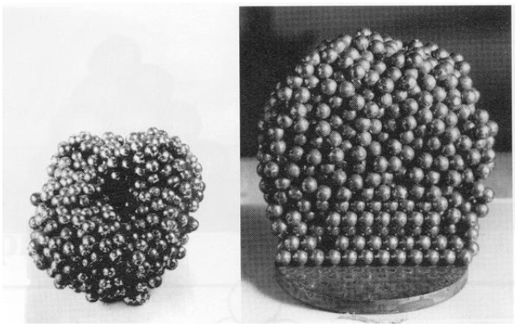
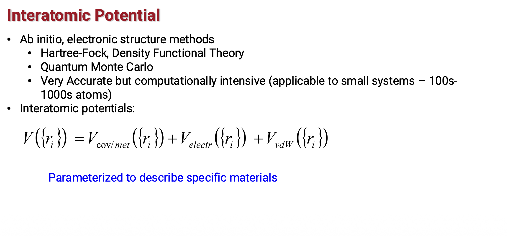
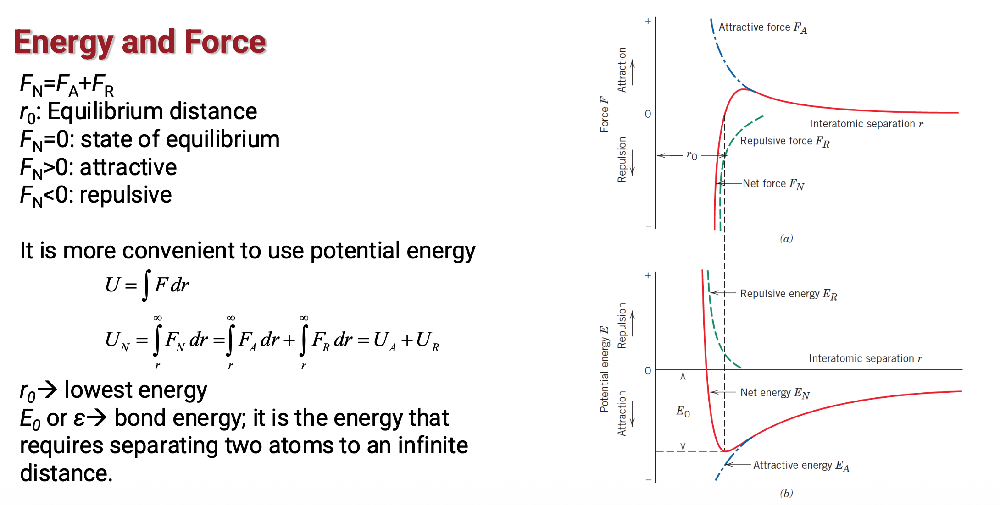
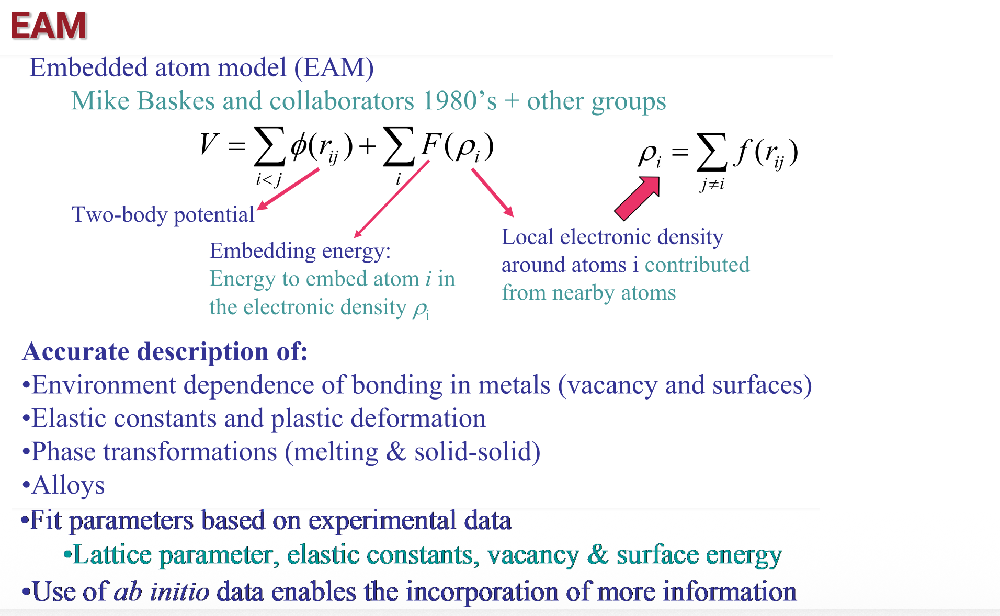
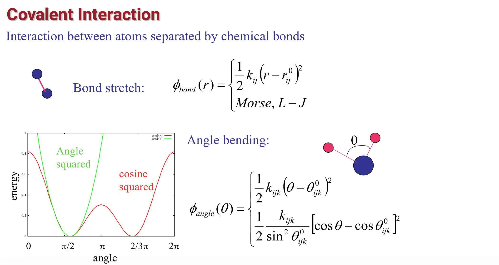
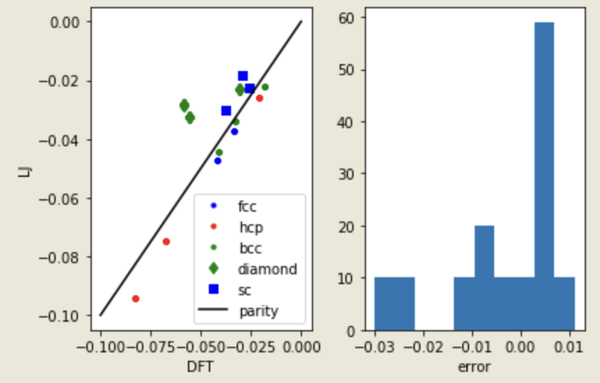
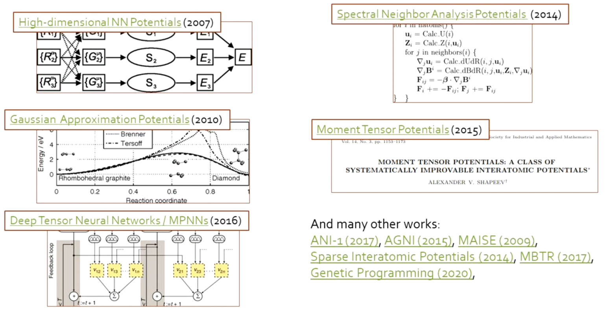

::: {.content-visible when-format="html" unless-format="revealjs"}

::: {.callout-note}
- Slides 👉  [Open presentation🗒️](./slides.html)
- PDF version of course note  👉 [Open in pdf](./L22.pdf)
- Handwritten notes 👉 [Open in pdf](./public/L22_annotated.pdf)
:::

:::

## Learning outcomes {.center}

After this lecture, you will be able to:

- **Recall** the basic idea of molecular dynamics as time integration of atomic motion
- **Identify** the main components of an MD simulation, including forces, integrators, and ensembles
- **Describe** how thermostats and timesteps affect MD simulations
- **Interpret** the role of interatomic potentials in molecular dynamics


## Announcement: class presentation

- **Date**: April 8 14:00 - 17:30
- **Location**: HC 2-14 (same classroom)
- **Format**: slide presentation or your choice of media. Pre-recorded video allowed if unable to attend
- **Length**: 10 min presentation + 2 min questions


## Recap: Monte Carlo (MC) and Kinetic Monte Carlo (KMC) methods

- (Metropolis) MC: sampling equilibrium configuration
- KMC: sampling configuration change over (pseudo) time scale
- Major assumption: average / integral of states can be performed by random sampling
- Probability ratio (NVT)

```{=tex}
\begin{align}
p_i \propto e^{-E_i/k_B T}
\end{align}
```

## Recap: potential energy comparison in MC

The central parameter in MC / KMC simulations is the estimation of
probability, or equivalent the potential energy $E_i$ (or $U_i$).

Remaining questions:

- where do we get these energy values?
- if we do need to calculate force $- \dfrac{\partial E}{\partial x}$, what can we get?
- can we get continuous motion instead of discrete states "hopping"?


## Historical review: atomic hypothesis

Excerpt from [Richard Feymann's physics lecture at Caltech](https://www.feynmanlectures.caltech.edu/FLP_Lecture_1_Transcript.pdf#:~:text=I%20believe%20it%20is%20the%20hyp–%20atomic,a%20little%20imagination%20and%20thinking%20is%20applied.)

> I believe it is the atomic hypothesis (or the atomic fact, or whatever you want to
call it) that all things are made out of atoms -- little particles that move around, are in
perpetual motion, attract each other when they are some distance apart, but repel being
squeezed into one another. In that one sentence you’ll see there’s an enormous amount
of information about the world if just a little imagination and thinking is applied.


## Representing large system with small domain

Pioneered by Bernal (UCL) in the 1950s, use ball bearing to study the
liquid-solid phase transformation.



## Hard-sphere models for materials simulations

Simulating defects with ball bearings!



## Another way down the road: molecular dynamics (MD)

Instead of studying the systems in configuration space
($\{\mathbf{r}_i, \cdot \}$), MD studies materials in a phase space
($(\{\mathbf{r}_i, \mathbf{p}_i), \cdot \}$), more naturally
representing the Newton's equation

```{=tex}
\begin{align}
\frac{d \mathbf{r}_i}{dt} &= \frac{\mathbf{p}_i}{m_i} \\
\frac{d \mathbf{p}_i}{dt} &=  - \nabla_{r_i} U(\mathbf{r})= \mathbf{F}_i
\end{align}
```

Time dependency now appears!


## MD = Energy + Dynamics

::: {.columns}
::: {.column width=“50%”}

**Energy**

- potential energy surface (PES)
- bonding physics
- force evaluation
- material specificity

:::

::: {.column width=“50%”}

**Dynamics**

- Newton’s equations
- time integrator
- thermostat / barostat
- trajectory sampling

:::

:::

- no MD without both parts
- wrong energy or wrong dynamics both lead to wrong physics (butterfly effect)

## Dissecting the MD method

- **Deterministic** method: state of the system at any future time can be predicted from its
current state (with caution)

- MD cycle for one step:
  - Force acting on each atom is assumed to be constant during the time interval
  - Forces on the atoms are computed and combined with the current positions and
velocities to generate new positions and velocities a short time ahead

- MD simulations provide a molecular level picture of structure and dynamics →
structure-property relationships (**SPR**)

## Timescale in MD

:::{.columns}
:::{.column width="50%}

**Physical world**

- Bond vibrations - 1 fs
- Collective vibrations - 1 ps
- Conformational transitions - ps or longer
- Enzyme catalysis - microsecond/millisecond
- Ligand Binding - micro/millisecond
- Protein Folding - millisecond/second

:::

:::{.column width="50%"}

**MD Simulation**

- Integration time step - 1 femtosecond
- Set by fastest varying force
- Accessible timescale about **10 nanoseconds**

:::

:::

## Topic 1: the dynamics

We wanted to talk about the "control" part of the MD

- how do we turn forces into trajectories?
- how do we know the simulation system represents the set ensemble?
- how to get quantities from MD simulation?


## A bit of statistical mechanics: averaging quantity in MD

In MD simulation a macroscopic quantity is averaged over time

```{=tex}
\begin{align}
\langle A \rangle_{\text{time}}
=
\frac{1}{\tau}\int_0^\tau A(t)\,dt
\end{align}
```

The ergodic assumption gives that for an infinitely long enough
simulation, every configuration in the phase space should eventually
be visited. (Like MC, but we evolve continuously in time)

```{=tex}
\begin{align}
\langle A \rangle_{\text{ens}}
=
\int d\mathbf r^N d\mathbf p^N \, A(\mathbf r^N,\mathbf p^N)\,\rho(\mathbf r^N,\mathbf p^N)
\end{align}
```

**Time average** = **Ensemble average**

## What quantities are we interested in MD?

What quantities are we interested in MD?

::: {.columns}
::: {.column width=“33%”}

Thermodynamic

- temperature $T$
- pressure $P$
- energy $E$

:::

::: {.column width=“33%”}

Structural

- radial distribution function $g(r)$
- coordination number $N_c$
- defect structure / order parameter $c_i(\mathbf r)$
:::

::: {.column width=“33%”}

**Kinetic**

- **diffusivity** $D$
- viscosity $\eta$
- relaxation time $\tau$
- conductivity $\mu$

:::
:::


## Ensembles: how to describe your system?

In a MD setup, we usually want to fix a few macroscopic quantities
while let others to give our statistical average

Relate to thermodynamic relations

$$
dU = T\,dS - P\,dV + \mu\,dN
$$

- common MD ensembles:

  - NVE (micro-canonical)
  - NVT (canonical)
  - NPT (isothermal- isobaric)

## Comparison between ensembles

::: {.columns}
::: {.column width=“33%”}

NVE

- isolated system
- fixed $N,V,E$
- Probability $\rho_{NVE} \propto \delta(H-E)$

:::

::: {.column width=“33%”}

NVT

- heat bath
- fixed $N,V,T$
- $\rho_{NVT} \propto e^{-H/k_B T}$
:::

::: {.column width=“33%”}

NPT

- heat + pressure bath
- fixed $N,P,T$
- $\rho_{NPT} \propto e^{-(H+PV)/k_B T}$


:::
:::

## MD: how to advance in time?

Just solve the coupled dynamic equations

```{=tex}
\begin{align}
\dot{\mathbf r}_i &= \mathbf v_i \\
m_i \dot{\mathbf v}_i &= \mathbf F_i
\end{align}
```

At each time step:

1. compute forces
2. update positions and velocities
3. apply ensemble control if needed
4. collect observables

## The Verlet algorithm

We can of course use $t \to t + \Delta t$ (the forward Euler) method, but maybe not so stable.

Verlet algorithm: use Taylor expansion

```{=tex}
\begin{align}
\mathbf r_i(t+\Delta t)
=
2\mathbf r_i(t)-\mathbf r_i(t-\Delta t)
+\mathbf a_i(t)\Delta t^2 + O(\Delta t^4)
\end{align}
```

Requires 2 time steps to advance

```{=tex}
\begin{align}
\mathbf v_i(t)
=
\frac{\mathbf r_i(t+\Delta t)-\mathbf r_i(t-\Delta t)}{2\Delta t}
\end{align}
```

Can now go back in time!

## Velocity Verlet: most common practical form

```{=tex}
\begin{align}
\mathbf r_i(t+\Delta t)
&=
\mathbf r_i(t)+\mathbf v_i(t)\Delta t+\frac{1}{2}\mathbf a_i(t)\Delta t^2 \\
\mathbf v_i\!\left(t+\frac{\Delta t}{2}\right)
&=
\mathbf v_i(t)+\frac{1}{2}\mathbf a_i(t)\Delta t \\
\mathbf a_i(t+\Delta t)
&=
\frac{\mathbf F_i(t+\Delta t)}{m_i} \\
\mathbf v_i(t+\Delta t)
&=
\mathbf v_i\!\left(t+\frac{\Delta t}{2}\right)+\frac{1}{2}\mathbf a_i(t+\Delta t)\Delta t
\end{align}
```

## MD: choice timestep

$\Delta t$ must resolve the fastest motion

**too large**:

- unstable integration
- broken energy conservation

**too small**:

- too expensive

## MD: typical values for timesteps

- metal MD: $\sim 1$ fs
- molecules with constrained bonds: $\sim 2$ fs
- coarse motion / rigid modes: up to $\sim 10$ fs
- _ab initio_ MD: often smaller than 1 fs

## MD: how to maintain ensemble?

- **NVE**: integrate Newton’s law only
- **NVT**: add thermostat
- **NPT**: thermostat + barostat

Ideas for thermo- and barostats:

- thermostat controls kinetic energy
- barostat allows box size / shape to fluctuate

## Comparison between thermostats

::: {.columns}
::: {.column width=“33%”}

Berendsen

- fast equilibration
- weakly rescales velocities
- does not generate exact canonical ensemble

:::

::: {.column width=“33%”}

Nosé-Hoover

- extended dynamical system
- samples canonical ensemble better
- may oscillate if poorly tuned

:::

::: {.column width=“33%”}

Langevin

- friction + random force
- good temperature control
- can distort dynamics if damping is too strong

:::
:::

## Topic 2: the energy

- How do you get the energy and forces?
- Which energy form is good?
- Can we get energy from data?

## Potential energy in MD (1)



## Potential eenrgy in MD (2)



## Potential energy in MD (3)



## Potential energy in MD (4)




## More about the atomic hypothesis

Still from Feynman:

> If, in some cataclysm, all of scientific knowledge were to be destroyed, and
only one sentence passed onto the next generations of creatures, what sentence would contain
the most information in the fewest words? I believe it is the atomic hypothesis that all things are
made of atoms – little particles that move around in perpetual motion, attracting each other
when they are a little distance apart, but repelling upon squeezed into one another. In that
sentence, you will see, there is enormous amount of information about the world, if just a little
imagination and thinking are applied

## Example of data-driven potential

Can we use data to train potential? Examples from [John Kitchin (CMU)](https://kitchingroup.cheme.cmu.edu/blog/2017/11/19/Training-the-ASE-Lennard-Jones-potential-to-DFT-calculations/)

- Atomic Simulation Environment (ASE) as a easy python wrapper over the atomistic calculator
- Bulk argon energies calculated in different lattice type, volume etc.
- Fit the polynomial LJ potential using the DFT dataset!



## Interatomic potentials: from polynomials to machine learning



## Summary

- Molecular dynamics evolves atomic positions and momenta using Newton’s equations
- MD simulations require interatomic forces, numerical integration, and ensemble control
- The choice of potential strongly affects what material behavior an MD model can represent


